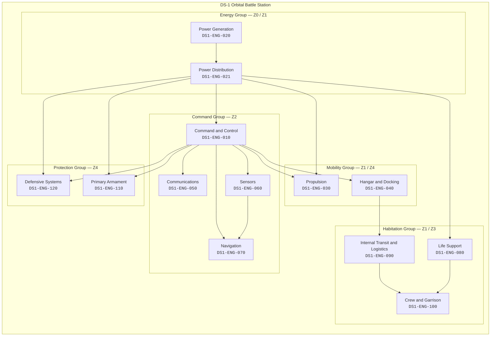
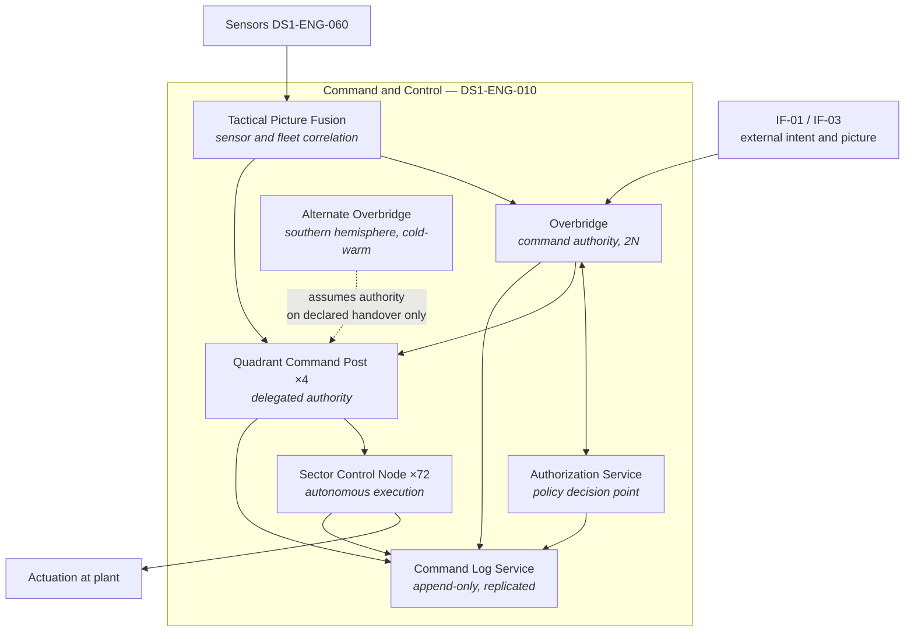
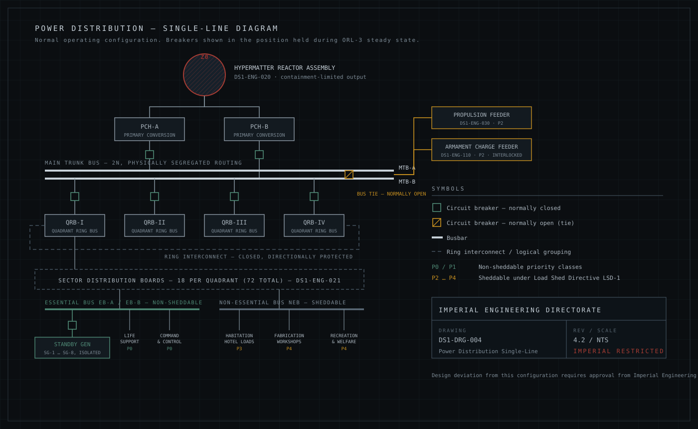
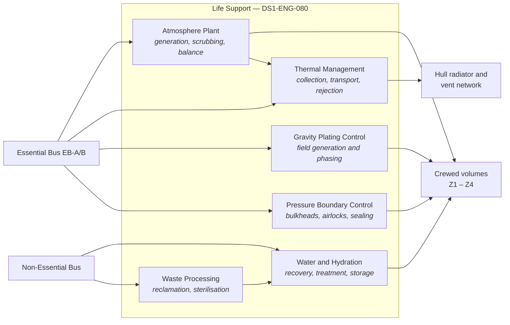
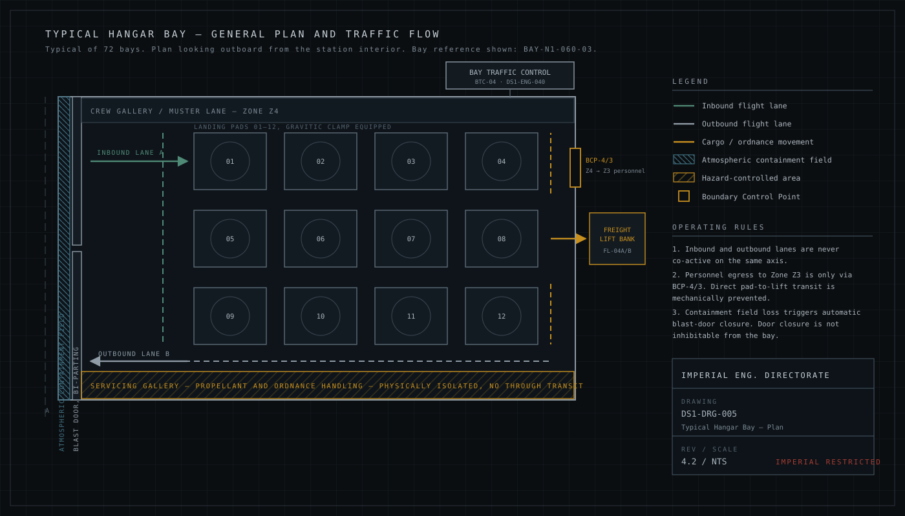

| Document ID | Classification | System | Document Owner | Status |
|---|---|---|---|---|
| `DS1-ARCH-006` | IMPERIAL RESTRICTED | DS-1 Orbital Battle Station | Imperial Engineering Directorate — Architecture Authority | Operational / Controlled Document |

ACCESS: AUTHORIZED ENGINEERING PERSONNEL ONLY &middot; Unauthorized access will be logged and escalated to Sector Security Command.

# 5. Building Block View

Static decomposition of the platform. Level 1 partitions DS-1 into eight system
groups; level 2 decomposes the four groups with the greatest architectural
significance; level 3 is held in the individual
[Systems volume](../systems/index.md) pages.

Every block below names its **System Authority** — the unit accountable for its
internal design — and its **zone allocation**.

## 5.1 Level 1 — Platform Decomposition

### Level 1 Register

| Block | ID | System Authority | Zone | Criticality |
|---|---|---|---|---|
| [Command and Control](../systems/command-and-control.md) | `DS1-ENG-010` | Control Systems Authority | Z2 | Critical |
| [Power Generation](../systems/power-generation.md) | `DS1-ENG-020` | Reactor Systems Authority | Z0 | Critical |
| [Power Distribution](../systems/power-distribution.md) | `DS1-ENG-021` | Power Systems Authority | Z1 | Critical |
| [Propulsion](../systems/propulsion.md) | `DS1-ENG-030` | Propulsion Systems Authority | Z1 | High |
| [Hangar and Docking](../systems/hangar-and-docking.md) | `DS1-ENG-040` | Flight Operations Authority | Z4 | High |
| [Communications](../systems/communications.md) | `DS1-ENG-050` | Control Systems Authority | Z2 | High |
| [Sensors](../systems/sensors.md) | `DS1-ENG-060` | Control Systems Authority | Z2 | High |
| [Navigation](../systems/navigation.md) | `DS1-ENG-070` | Propulsion Systems Authority | Z2 | High |
| [Life Support](../systems/life-support.md) | `DS1-ENG-080` | Facilities and Habitation Authority | Z1 | Critical |
| [Internal Transit and Logistics](../systems/internal-transit.md) | `DS1-ENG-090` | Facilities and Habitation Authority | Z3 | Medium |
| [Crew and Garrison](../systems/crew-and-garrison.md) | `DS1-ENG-100` | Facilities and Habitation Authority | Z3 | Medium |
| [Primary Armament](../systems/primary-armament.md) | `DS1-ENG-110` | Ordnance Systems Authority | Z1 / Z4 | Critical |
| [Defensive Systems](../systems/defensive-systems.md) | `DS1-ENG-120` | Ordnance Systems Authority | Z4 | High |

## 5.2 Level 2 — Command and Control (`DS1-ENG-010`)

| Block | Responsibility | Not responsible for |
|---|---|---|
| Overbridge | Holding command authority; issuing authorized directives | Executing them; it has no direct actuation path |
| Alternate Overbridge | Assuming authority on a *declared* handover | Automatic failover — see note below |
| Authorization Service | Deciding whether a directive is permitted | Deciding whether it is wise |
| Quadrant Command Post | Delegating and aggregating within one quadrant | Cross-quadrant coordination; that is Overbridge work |
| Sector Control Node | Executing within one sector; safe autonomous degradation | Authorizing anything not pre-authorized |
| Tactical Picture Fusion | Producing one agreed picture from many sources | Any control action whatsoever |
| Command Log Service | Recording every directive, decision and refusal | Enforcement |

!!! warning "The Alternate Overbridge does not fail over automatically"

    Automatic transfer of command authority was rejected: a fault that makes the
    Overbridge appear unreachable is more often a communications fault than a
    loss of the Overbridge, and an automatic transfer in that case produces two
    simultaneous command authorities. Handover is therefore a declared, logged,
    two-party action. The cost is a handover interval; the alternative is a split
    command, which is worse. Recorded as `TD-05` because the handover interval
    exceeds its target.

## 5.3 Level 2 — Power Distribution (`DS1-ENG-021`)

<figure class="blueprint" markdown>

<figcaption>DS1-DRG-004 &middot; Power Distribution Single-Line Diagram &middot; Rev 4.2</figcaption>
</figure>

| Block | Function | Redundancy |
|---|---|---|
| Primary Conversion Halls `PCH-A/B` | Convert reactor output to distributable form | 2N |
| Main Trunk Bus `MTB-A/B` | Platform-wide distribution, physically segregated routes | 2N, tie normally open |
| Quadrant Ring Bus `QRB-I…IV` | Quadrant distribution, closed ring | Closed ring, directionally protected |
| Sector Distribution Boards | 18 per quadrant, sector-level supply | N+1 per sector |
| Essential Bus `EB-A/B` | Life support, C2, and their dependencies | 2N plus independent standby generation |
| Non-Essential Bus `NEB` | Habitation, fabrication, welfare | N, sheddable |
| Dedicated feeders | Propulsion and armament charging, bypassing the ring | N, interlocked |

Full description: [Power Distribution](../systems/power-distribution.md).

## 5.4 Level 2 — Life Support (`DS1-ENG-080`)

Gravity plating is classified as life support, not as a facility service. A
plating fault at the wrong moment is a mass-casualty event; the classification
follows the consequence. See [Life Support](../systems/life-support.md).

## 5.5 Level 2 — Hangar and Docking (`DS1-ENG-040`)

<figure class="blueprint" markdown>

<figcaption>DS1-DRG-005 &middot; Typical Hangar Bay, General Plan and Traffic Flow &middot; Rev 4.2</figcaption>
</figure>

| Block | Function |
|---|---|
| Bay Traffic Control `BTC-01…72` | Approach sequencing, lane allocation, pad assignment |
| Containment Field Plant | Atmospheric retention at the bay mouth |
| Blast Door Assemblies | Physical closure; automatic on containment loss, not inhibitable from the bay |
| Landing Pads and Gravitic Clamps | Craft securing and servicing |
| Servicing Galleries | Propellant and ordnance handling, physically isolated from transit |
| Freight Lift Banks | Cargo movement into the internal logistics network |
| Boundary Control Points `BCP-4/3` | The only personnel route from `Z4` to `Z3` |

Full description: [Hangar and Docking](../systems/hangar-and-docking.md).

## 5.6 Interface Summary Across Level 1

| From | To | Interface | Nature | Direction |
|---|---|---|---|---|
| Power Distribution | All systems | `IX-PWR` | Electrical supply plus supply-state telemetry | Bidirectional (supply out, telemetry in) |
| Command and Control | All systems | `IX-CMD` | Authorized directives | Outbound only |
| All systems | Command and Control | `IX-TLM` | Telemetry and state | Inbound only |
| Power Generation | Power Distribution | `IX-GEN` | Converted output | Outbound only |
| Command and Control | Power Generation | `IX-CORE` | Setpoint requests via data diode | **Unidirectional, no return path** |
| Sensors | Command and Control | `IX-PIC` | Track and contact data | Inbound only |
| Hangar | Internal Transit | `IX-LOG` | Cargo and personnel handover at `BCP-4/3` | Bidirectional |
| Life Support | All crewed volumes | `IX-ENV` | Atmosphere, thermal, gravity, pressure | Outbound with local sensing |

The `IX-CORE` row is the architecturally significant one: **command intent
reaches the reactor, and nothing reaches back over the same path.** Reactor
telemetry returns over a separate, physically distinct diode in the opposite
direction. See [Network Segmentation](../security/network-segmentation.md).
