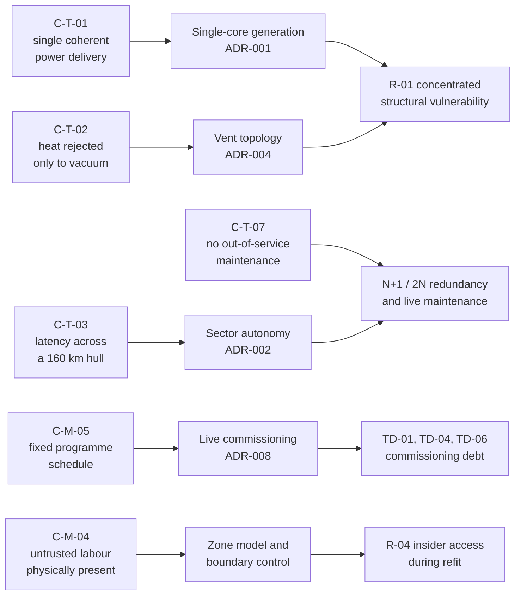

| Document ID | Classification | System | Document Owner | Status |
|---|---|---|---|---|
| `DS1-ARCH-003` | IMPERIAL RESTRICTED | DS-1 Orbital Battle Station | Imperial Engineering Directorate — Architecture Authority | Operational / Controlled Document |

ACCESS: AUTHORIZED ENGINEERING PERSONNEL ONLY &middot; Unauthorized access will be logged and escalated to Sector Security Command.

# 2. Architecture Constraints

A constraint is a boundary the architecture may not cross. It is distinct from a
decision: a decision could have been made differently, a constraint could not.
Each constraint below names the authority that imposes it and the mechanism by
which conformance is checked.

## 2.1 Mandated Constraints

Imposed by authority outside the Directorate. Not negotiable at the Architecture
Review Board.

| ID | Constraint | Imposed by | Conformance check |
|---|---|---|---|
| `C-M-01` | The platform operates under a single accountable Station Commander. No system may accept a command that bypasses that authority. | Imperial High Command | Authorization audit, quarterly |
| `C-M-02` | Programme existence, capability and location are classified. Documentation, telemetry and logistics must not disclose them outside cleared channels. | Imperial Security Directive 1138 | Emission survey; supply-chain audit |
| `C-M-03` | All Imperial platforms share a common identity and clearance model. DS-1 may extend it but may not replace it. | Imperial Identity Authority | Identity federation conformance test |
| `C-M-04` | Construction and refit are performed by contracted labour under Imperial supervision. The architecture must remain safe with untrusted personnel physically present. | Imperial Engineering Command | Zone-boundary penetration exercise |
| `C-M-05` | Programme schedule is fixed by Imperial High Command. Capability may be phased; the delivery date may not move. | Imperial High Command | Commissioning gate review |
| `C-M-06` | Reactor and armament constructional detail is compartmented away from the general engineering population. | Directorate Classification Authority | Classification audit |

!!! warning "Consequence of C-M-05"

    The fixed schedule is the origin of most technical debt on this platform. It
    forced [ADR-008 (Live Commissioning)](../decisions/adr-008-live-commissioning.md)
    — commissioning systems into an occupied, operational hull rather than a
    quiescent one. Items `TD-01`, `TD-04` and `TD-06` in the
    [Technical Debt Register](../risks/technical-debt.md) trace directly to it.
    This is recorded, not concealed.

## 2.2 Technical Constraints

Imposed by physics, by the platform's scale, or by systems already built.

| ID | Constraint | Origin | Architectural consequence |
|---|---|---|---|
| `C-T-01` | The primary armament requires a single coherent power delivery. It cannot be fed from independent generation sources. | Ordnance Systems Authority | Forces single-core generation; see [ADR-001](../decisions/adr-001-single-core-reactor.md) |
| `C-T-02` | Waste heat must be rejected to vacuum. There is no thermal sink of any other kind. | Physics | Drives the venting topology and hence [ADR-004](../decisions/adr-004-exhaust-venting-topology.md) |
| `C-T-03` | Signal latency across a 160 km hull is operationally significant for closed-loop control. | Scale | Forbids centralised real-time control; forces sector autonomy, [ADR-002](../decisions/adr-002-sector-autonomy.md) |
| `C-T-04` | Structural mass at this diameter requires artificial gravity generation throughout; there is no spin solution. | Structures Authority | Gravity plating is a life-safety system, not a convenience; see [Life Support](../systems/life-support.md) |
| `C-T-05` | Hyperspace transit requires the platform to be structurally and electrically quiescent in defined respects. | Propulsion Systems Authority | Transit is an operating mode with its own readiness level, not a background activity |
| `C-T-06` | Sensor and communications apertures must penetrate the hull. Every aperture is a structural and security discontinuity. | Physics | Aperture count is a governed budget; see [Sensors](../systems/sensors.md) |
| `C-T-07` | The station cannot be taken out of service for maintenance. All maintenance is performed on a live platform. | Operational | Drives redundancy topology and the maintenance window model |

## 2.3 Organisational Constraints

| ID | Constraint | Consequence |
|---|---|---|
| `C-O-01` | Design authority is split between an Architecture Authority (across systems) and System Authorities (within systems). | Any change visible at a system interface requires an ADR, regardless of how small it is internally |
| `C-O-02` | Operations, engineering and security report through three separate chains that meet only at the Station Commander. | Cross-chain escalation must be designed explicitly; it does not happen informally. See [Incident Response](../operations/incident-response.md) |
| `C-O-03` | Contractor personnel hold time-boxed, sector-scoped clearances. | Access control must be attribute-based, not role-based alone. See [Access Control Model](../security/access-control-model.md) |
| `C-O-04` | The complement rotates on a fixed cycle. Institutional knowledge does not persist in people. | Documentation is a load-bearing control, not an accessory. This library is itself a control |
| `C-O-05` | Engineering documentation is published in English (Imperial Basic) and in no other language. | A translation, if ever issued, is reference only and may not be cited by a work packet. This library is English-only |

## 2.4 Conventions

| ID | Convention | Scope |
|---|---|---|
| `C-C-01` | Spatial addressing uses the zone and sector scheme exclusively. Free-text location is rejected by work-order intake. | All work orders, incidents, alerts |
| `C-C-02` | All identifiers follow the scheme in [DS1-REF-020](../reference/identifier-scheme.md). | All controlled documents |
| `C-C-03` | Times are Imperial Time, 24-hour, Coruscant Central reference. | All logs, all reports |
| `C-C-04` | Diagrams are authored as text (Mermaid) or as reproducible vector drawings. Raster images are not accepted into the controlled library. | All documentation |
| `C-C-05` | Severity is expressed on the five-point Directorate scale; local scales are not permitted. | Risks, incidents, defects |

## 2.5 Constraint Interaction

Several constraints pull against each other. The diagram records where, so that
proposals which appear to resolve one constraint can be checked against the
others they would violate.

The two constraints `C-T-01` and `C-T-02` converge on the same risk. That
convergence is the single most consequential fact in this architecture and is
treated at length in [ADR-001](../decisions/adr-001-single-core-reactor.md),
[ADR-004](../decisions/adr-004-exhaust-venting-topology.md) and
[R-01](../risks/risk-register.md).
