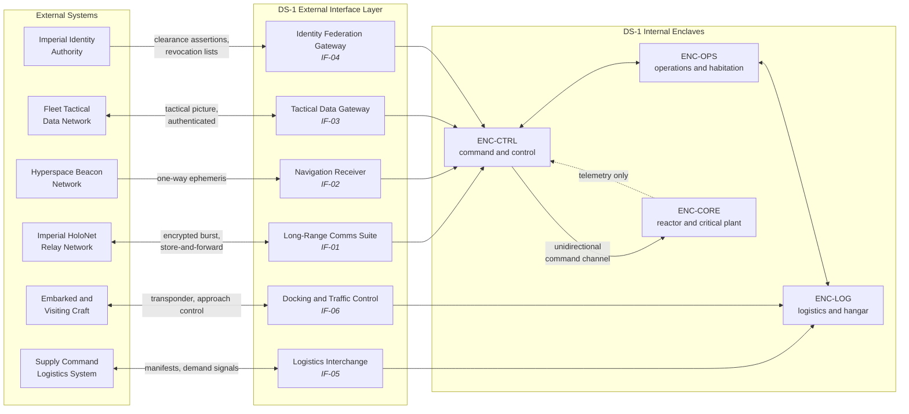

| Document ID | Classification | System | Document Owner | Status |
|---|---|---|---|---|
| `DS1-ARCH-004` | IMPERIAL RESTRICTED | DS-1 Orbital Battle Station | Imperial Engineering Directorate — Architecture Authority | Operational / Controlled Document |

ACCESS: AUTHORIZED ENGINEERING PERSONNEL ONLY &middot; Unauthorized access will be logged and escalated to Sector Security Command.

# 3. Context and Scope

This chapter fixes the system boundary. Anything inside it is the Directorate's
design responsibility; anything outside is an external actor reached through a
declared interface. Interfaces are catalogued in the
[Interface Register](../reference/interface-register.md).

## 3.1 System Boundary

**Inside the boundary:** the hull and its structure; all embedded systems listed
in the [Systems volume](../systems/index.md); the internal networks; the
embarked craft while berthed; the complement while aboard.

**Outside the boundary:** Imperial Command and its networks; attached fleet
units; embarked craft in flight; planetary and orbital infrastructure; the
Imperial supply chain; contractor organisations.

**Deliberately excluded:** anything that would make the platform dependent on a
fixed installation. DS-1 has no permanent home port, no ground-based control
segment and no external system on which continued operation depends. This is a
requirement, not an observation, and every proposed external dependency is
tested against it at the Architecture Review Board.

## 3.2 Business Context

```mermaid
flowchart TB
    subgraph EXT_CMD["Command Authority"]
        HC["Imperial High Command<br/><i>strategic tasking, capability release</i>"]
        FC["Fleet Command, Sector<br/><i>operational tasking, readiness reporting</i>"]
        ISC["Sector Security Command<br/><i>security policy, vetting, investigation</i>"]
    end

    subgraph BOUNDARY["DS-1 Orbital Battle Station"]
        SC["Station Command<br/><i>accountable authority aboard</i>"]
        ENG["Station Engineering<br/><i>system operation and maintenance</i>"]
        GAR["Embarked Garrison<br/><i>internal security, boarding, landing forces</i>"]
    end

    subgraph EXT_FORCE["Attached and Embarked Forces"]
        SD["Star Destroyer Group<br/><i>escort, picket, force projection</i>"]
        SQN["Embarked Fighter Wings<br/><i>patrol, interception</i>"]
        TR["Troop and Cargo Lift<br/><i>surface deployment, transfer</i>"]
    end

    subgraph EXT_SUP["Sustainment and Civil"]
        SUP["Imperial Supply Command<br/><i>consumables, spares, propellant</i>"]
        CON["Contracted Industry<br/><i>construction, refit, specialist labour</i>"]
        GOV["Planetary Governors<br/><i>compliance reporting, local liaison</i>"]
    end

    ADV["Rebel Alliance<br/><i>hostile actor — no interface,<br/>assumed to observe all of the above</i>"]

    HC -->|"strategic directive<br/>capability release authority"| SC
    FC -->|"operational tasking"| SC
    SC -->|"readiness and position reporting"| FC
    ISC -->|"security policy, clearance decisions"| SC
    SC -->|"security event escalation"| ISC

    SC --> ENG
    SC --> GAR
    ENG -->|"platform state"| SC

    SC -->|"tasking"| SD
    SC -->|"launch and recovery control"| SQN
    SC -->|"lift tasking"| TR
    SD -->|"picket and sensor contribution"| SC

    SUP -->|"scheduled replenishment"| ENG
    ENG -->|"demand forecast, defect returns"| SUP
    CON -->|"refit work, specialist labour"| ENG
    ENG -->|"bounded work packets, escorted access"| CON
    GOV -->|"compliance returns, local intelligence"| SC

    ADV -.->|"reconnaissance, infiltration,<br/>supply-chain interdiction"| CON
    ADV -.->|"attack"| SD
```

!!! note "On the dotted edges"

    The adversary has no *interface*, but it has *reach* — most credibly through
    contracted industry and through attached units, not through the hull. The
    architecture treats the contractor path as the highest-likelihood
    infiltration route and controls it accordingly; see
    [R-04](../risks/risk-register.md) and
    [Access Control Model](../security/access-control-model.md).

## 3.3 Technical Context

External technical interfaces only. Internal interfaces are described in the
[Building Block View](building-block-view.md).

### External Interface Summary

| ID | Interface | Direction | Protection | Behaviour if lost |
|---|---|---|---|---|
| `IF-01` | HoloNet long-range comms | Bidirectional | Encrypted, authenticated, store-and-forward | Platform continues autonomously; strategic tasking queues |
| `IF-02` | Hyperspace beacon ephemeris | Inbound only | Signed, multi-source cross-checked | Falls back to inertial and stellar navigation, reduced transit confidence |
| `IF-03` | Fleet tactical data | Bidirectional | Authenticated, rate-limited, schema-validated | Local sensor picture only; attached units revert to independent action |
| `IF-04` | Imperial identity federation | Inbound only | Signed assertions, cached with expiry | Cached clearances honoured to expiry, then local fallback authority; see [ADR-007](../decisions/adr-007-identity-federation.md) |
| `IF-05` | Supply Command logistics | Bidirectional | Authenticated, manifest-signed | Consumption continues against held stock; forecast degrades |
| `IF-06` | Docking and traffic control | Bidirectional | Transponder challenge, visual confirmation | Bay closure; no unverified approach is accepted |

**No external interface is required for the platform to remain safe.** Every one
of them may be lost, individually or together, without a loss of life-safety or
of control authority aboard. This is verified at each readiness exercise and is
the subject of quality scenario [QS-02](quality-requirements.md#qs-02-command-authorization-under-degraded-comms).

## 3.4 Scope Boundaries That Are Frequently Misread

| Frequently assumed | Actual position |
|---|---|
| "Imperial Command controls the station's systems directly." | It does not. Command issues *intent* over `IF-01`. Every system action is taken by station authority. There is no external actuation path. |
| "Embarked craft are part of the system." | Only while berthed and connected. In flight they are external actors reached over `IF-06`. |
| "The tactical data network is a control channel." | It is a *picture* channel. It carries no authorization and cannot initiate any station action. |
| "Identity is resolved centrally at Coruscant." | Assertions originate there; the decision is always made aboard, against a locally held policy. See [ADR-007](../decisions/adr-007-identity-federation.md). |
