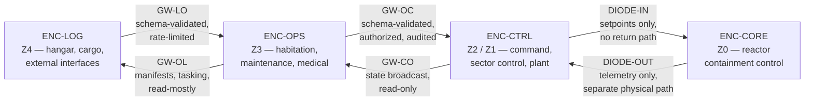

| Document ID | Classification | System | Document Owner | Status |
|---|---|---|---|---|
| `DS1-ARCH-009` | IMPERIAL RESTRICTED | DS-1 Orbital Battle Station | Imperial Engineering Directorate — Architecture Authority | Operational / Controlled Document |

ACCESS: AUTHORIZED ENGINEERING PERSONNEL ONLY &middot; Unauthorized access will be logged and escalated to Sector Security Command.

# 8. Cross-Cutting Concepts

Concepts binding on every system regardless of System Authority. A system that
does not implement these is non-conformant, and the non-conformance is raised
against its System Authority.

Each concept states what it **requires**, how conformance is **verified**, and
what happens on **violation**.

---

## CC-1 — Identity and Authorization

**Requires.** Every action taken on this platform — by a person, a droid or a
system — is attributable to an identity, evaluated against policy at a single
decision point, and recorded.

| Element | Rule |
|---|---|
| Identity | Every actor holds exactly one identity. Shared credentials do not exist. Droid and service identities are held to the same standard as personnel. |
| Decision point | Exactly one logical Authorization Service. Systems do not make their own authorization decisions. |
| Enforcement point | Local to the system. Enforcement points hold no policy and cannot be locally reconfigured. |
| Default | Deny. Absence of a decision is a denial, never a permission. |
| Scope | Every permission is scoped to a zone, a sector, a task reference and a time window. Unbounded permissions do not exist. |

**Verified by.** Quarterly authorization audit; replay of a sample of decisions
against current policy; reconciliation of enforcement-point logs against
decision-point logs. A decision in one log and not the other is an incident.

**On violation.** Class-2 security event. The affected enforcement point is
isolated pending investigation.

Detail: [Authentication and Authorization](../security/authentication-and-authorization.md).

---

## CC-2 — Segmentation and Least Connectivity

**Requires.** No connection exists unless a declared interface requires it. Every
connection is between exactly two named enclaves and is enumerated in the
[Interface Register](../reference/interface-register.md).

**Verified by.** Continuous flow monitoring against the declared interface set.
Any observed flow not in the register is an anomaly by definition — there is no
"probably benign" category.

**On violation.** The undeclared flow is blocked automatically and a Class-2
security event is raised. Blocking first, investigating second, is deliberate.

Detail: [Network Segmentation](../security/network-segmentation.md).

---

## CC-3 — Degradation Behaviour

**Requires.** Every system defines its behaviour under partial failure *before*
it is commissioned. Undefined degradation is a commissioning blocker.

| Degradation state | Required properties |
|---|---|
| `NOMINAL` | Full function |
| `DEGRADED` | Reduced function, correctly reported, no loss of safety property |
| `SAFE` | Minimum function preserving life and containment; accepts only recovery actions |
| `FAILED` | Function absent, absence detected and reported within the system's declared detection time |

**Three invariants across all systems:**

1. **Degradation never increases authority.** No system gains a capability by
   failing. This is the property that makes autonomy safe.
2. **Silent degradation is a defect.** A system that degrades without reporting
   it is treated as failed, not as degraded.
3. **`SAFE` is not self-exiting.** Recovery from `SAFE` is always an authorized
   action taken by a person.

**Verified by.** Degradation exercise at each readiness cycle; injected-fault
testing at `PREPROD`.

---

## CC-4 — Observability

**Requires.** Every system emits three classes of signal, and the classes are not
interchangeable.

| Class | Content | Destination | Retention |
|---|---|---|---|
| **State** | What the system currently is | Sector Control Node, then Quadrant Command Post | Current value plus 90 days of history |
| **Event** | What changed and why | Command Log Service, append-only | Life of the programme |
| **Measurement** | Continuous quantities for trending | Quadrant telemetry store | 2 years at full resolution, then aggregated |

**Rules.**

- State is *pull*; events are *push*. A system that pushes state floods the
  network on a bad day, which is exactly the day it must not.
- Every event carries: identity, zone, sector, time, causing directive
  reference. An event without a causing directive reference is itself
  significant and is flagged.
- Absence of signal is a signal. Every emitter has a declared heartbeat interval;
  silence beyond it is an event.

**Verified by.** Signal completeness audit; deliberate emitter silencing during
degradation exercises.

Detail: [Observability and Monitoring](../operations/observability.md).

---

## CC-5 — Redundancy and Failure Domains

**Requires.** Redundancy is allocated by consequence of loss (strategy `S-3`),
and redundant elements do not share a failure domain.

| A redundant pair may not share | Because |
|---|---|
| A ring bus | A bus fault takes both |
| A structural compartment | One structural event takes both |
| A life support group | Atmosphere loss takes both crews |
| A network gateway | A gateway fault isolates both |
| A maintenance window | Concurrent work takes both |
| A software configuration version | A bad change takes both — hence canary propagation, §7.3 |

The last row is the one most often overlooked and is the reason change
propagation is sequential rather than parallel.

**Verified by.** Failure-domain analysis at each design review; the analysis is a
mandatory artefact, not an optional one.

---

## CC-6 — Time and Ordering

**Requires.** A single platform time reference, and a total ordering of events
that does not depend on it.

- Platform time is Imperial Time, distributed from the Overbridge with a
  quadrant-level holdover of 72 hours.
- Every event additionally carries a **logical sequence** from its emitter. When
  time and sequence disagree, sequence wins for causality and time is treated as
  advisory.
- A node in `DETACHED` continues to sequence locally; reconciliation on
  reattachment merges by sequence, not by timestamp.

**Why.** After a link loss, timestamps from a detached node cannot be trusted for
ordering, but its own sequence can. This is what makes the reconciliation in
[RV-5](runtime-view.md#rv-5-sector-link-loss-and-autonomous-degradation) sound.

---

## CC-7 — Human Factors and Command Ergonomics

**Requires.** The architecture assumes fatigued operators on a long watch, not
alert ones in an exercise.

| Rule | Rationale |
|---|---|
| Destructive and irreversible actions require two parties. | A single fatigued operator is a single point of failure. |
| Refusals state a reason code, not a generic denial. | An operator who cannot tell why a system refused will work around it. |
| Alert volume is governed. A sector may not emit more than a declared alert budget per watch. | Alert fatigue is a failure mode with a body count. |
| Any authorization that a person must grant more than 20 times per watch is a design defect and is raised as such. | Rubber-stamping is the predictable outcome. |
| Muster and egress routing is derived from the location designation, never from operator recall. | Recall fails under stress. |

**Verified by.** Watch-cycle alert budget review; refusal-reason completeness
audit; muster exercise timing.

---

## CC-8 — Documentation as a Control

**Requires.** Because the complement rotates on a fixed cycle (`C-O-04`),
institutional knowledge does not persist in people. It persists here or not at
all.

- No work order may cite an uncontrolled document.
- No system may be commissioned without its Systems volume entry at status
  `Operational / Controlled Document`.
- A divergence between this library and the as-built platform is a defect
  against the *library*, raised to its Document Owner, and tracked in the
  [Technical Debt Register](../risks/technical-debt.md).

**Verified by.** Documentation conformance sampling during maintenance windows:
a random work packet is checked against the as-built state and against this
library. Discrepancies are recorded against whichever is wrong.

---

## Concept Coverage Matrix

Which systems must demonstrate conformance to which concept.

| System | CC-1 | CC-2 | CC-3 | CC-4 | CC-5 | CC-6 | CC-7 | CC-8 |
|---|---|---|---|---|---|---|---|---|
| Command and Control | ● | ● | ● | ● | ● | ● | ● | ● |
| Power Generation | ● | ● | ● | ● | ○ | ● | ● | ● |
| Power Distribution | ● | ● | ● | ● | ● | ● | ● | ● |
| Propulsion | ● | ● | ● | ● | ● | ● | ● | ● |
| Hangar and Docking | ● | ● | ● | ● | ● | ● | ● | ● |
| Communications | ● | ● | ● | ● | ● | ● | ○ | ● |
| Sensors | ● | ● | ● | ● | ● | ● | ○ | ● |
| Navigation | ● | ● | ● | ● | ● | ● | ● | ● |
| Life Support | ● | ● | ● | ● | ● | ● | ● | ● |
| Internal Transit | ● | ● | ● | ● | ● | ○ | ● | ● |
| Crew and Garrison | ● | ● | ○ | ● | ○ | ○ | ● | ● |
| Primary Armament | ● | ● | ● | ● | ● | ● | ● | ● |
| Defensive Systems | ● | ● | ● | ● | ● | ● | ● | ● |

● full conformance required &nbsp;&nbsp; ○ conformance required in part; scope
recorded in the system's Systems volume entry.

The single `○` under CC-5 for Power Generation is the reactor assembly: it
cannot be made redundant (`C-T-01`) and the substitution of depth for redundancy
is recorded in [ADR-001](../decisions/adr-001-single-core-reactor.md).
