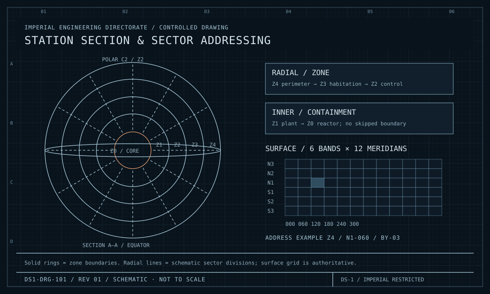
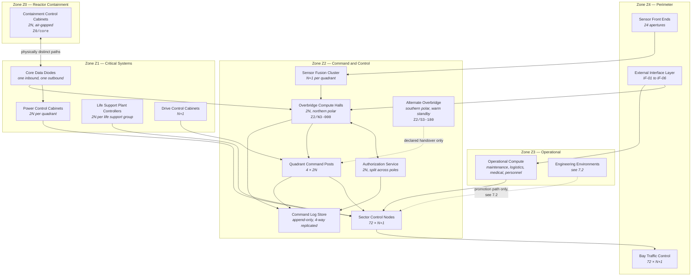
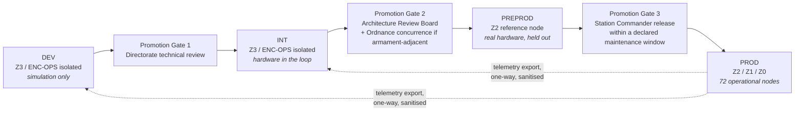
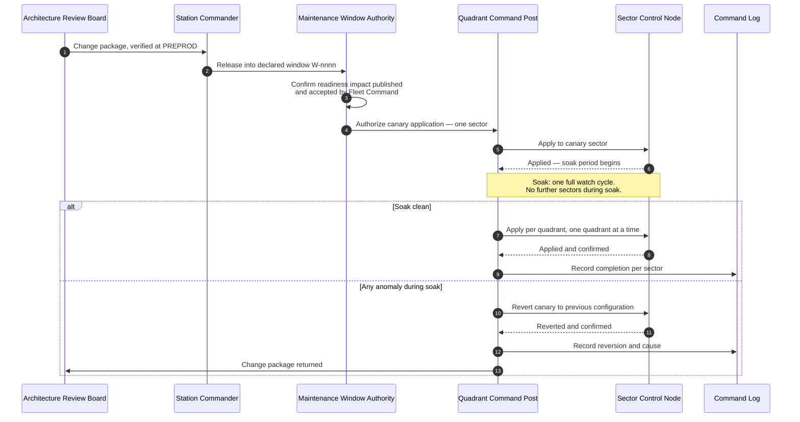

| Document ID | Classification | System | Document Owner | Status |
|---|---|---|---|---|
| `DS1-ARCH-008` | IMPERIAL RESTRICTED | DS-1 Orbital Battle Station | Imperial Engineering Directorate — Architecture Authority | Operational / Controlled Document |

ACCESS: AUTHORIZED ENGINEERING PERSONNEL ONLY &middot; Unauthorized access will be logged and escalated to Sector Security Command.

# 7. Deployment View

Allocation of logical building blocks to physical infrastructure. On a platform
that cannot be taken out of service (`C-T-07`), the deployment view also has to
describe how software and configuration reach a live, occupied, armed station —
which is the second half of this chapter.

## 7.1 Physical Allocation

<figure class="blueprint" markdown>

<figcaption>DS1-DRG-101 · Station section & sector addressing · Rev 01 · Schematic, not to scale</figcaption>
</figure>

Use the zone coordinate for physical placement and the sector coordinate for failure-domain assignment.

### Allocation Rules

| Rule | Rationale |
|---|---|
| No compute node serves two zones. | Zone invariant 4: no shared failure domain across a boundary. |
| Redundant pairs are separated by at least one quadrant and are supplied from different ring buses. | A single structural event may not take both halves of a 2N pair. |
| The Overbridge and the Alternate Overbridge are at opposite poles. | Maximum physical separation available within the hull. |
| The Authorization Service is split across both poles, not co-located with either bridge. | Loss of a bridge must not remove the ability to authorize. |
| The Command Log is replicated to all four Quadrant Command Posts. | An incident that destroys the Overbridge must not destroy the record of what it ordered. |
| `Z0` control cabinets have no network path out except the outbound diode. | Zone invariant 5. |

## 7.2 Engineering Environments on a Live Platform

There is no separate test platform. There is one hull, and it is occupied and
operational. Environment separation is therefore **logical, enforced, and
explicitly bounded** — and the boundaries are where the residual risk sits.

| Environment | Location | What it may reach | What it may never reach |
|---|---|---|---|
| `DEV` | `Z3`, isolated segment of `ENC-OPS` | Simulated plant models only | Any real actuator, any real telemetry, `ENC-CTRL`, `ENC-CORE` |
| `INT` | `Z3`, isolated segment of `ENC-OPS` | Hardware-in-the-loop rigs replicating one sector | Real sectors, `ENC-CTRL`, `ENC-CORE` |
| `PREPROD` | `Z2`, one designated reference sector node held out of the operational set | Real hardware of that one node, real telemetry read-only | Actuation outside its own node; `ENC-CORE` |
| `PROD` | `Z2` / `Z1` / `Z0` operational nodes | Everything within its zone allocation | `DEV` and `INT` segments — the path is one-way |

!!! danger "The reference-node compromise"

    `PREPROD` is a real operational sector node, temporarily removed from the
    operational set. While it is held out, that sector runs on its `N+1`
    partner with no further margin. The reference node is therefore rotated
    across sectors and may not be held out during a declared alert state.

    This is a genuine compromise forced by `C-T-07`, not a good arrangement. It
    is recorded as `TD-04` and reviewed at each Architecture Review Board.

## 7.3 Change Propagation to Production

Changes reach production only inside a declared maintenance window
([DS1-OPS-030](../operations/maintenance.md)), and only in the order below.

**Constraints on propagation.**

- One quadrant at a time. Never two. A change that has degraded two quadrants
  has degraded the platform.
- Every node must be able to revert to its previous configuration without an
  external dependency, including without the Overbridge.
- `Z0` containment control is **excluded from this path entirely.** It is changed
  only during a full reactor down-state, which has occurred twice since
  commissioning and requires Imperial Engineering Command approval in each case.

## 7.4 Infrastructure Register

| Infrastructure | Count | Zone | Redundancy | Supplied from |
|---|---|---|---|---|
| Overbridge compute halls | 2 | Z2 | 2N | `MTB-A` / `MTB-B` via `EB-A` / `EB-B` |
| Alternate Overbridge | 1 | Z2 | Warm standby | `EB-B` |
| Quadrant Command Posts | 4 | Z2 | 2N each | Own quadrant ring bus + cross-feed |
| Sector Control Nodes | 72 | Z2 | N+1 each | Own sector distribution board |
| Authorization Service instances | 2 | Z2 | 2N, pole-split | `EB-A` / `EB-B` |
| Command Log replicas | 4 | Z2 | 4-way | One per quadrant |
| Sensor fusion clusters | 4 | Z2 | N+1 each | Own quadrant ring bus |
| Core data diodes | 2 | Z1 | One per direction, no redundancy by design | `EB-A` (in), `EB-B` (out) |
| Bay traffic control units | 72 | Z4 | N+1 each | Own sector distribution board |
| External interface gateways | 6 &times; 2 | Z4 | 2N per interface | `QRB` per quadrant |
| Sensor apertures | 24 | Z4 | N+1 coverage overlap | Own sector distribution board |

!!! note "On the diodes having no redundancy"

    A redundant data diode is a second path, and a second path into `Z0` is
    exactly what the diode exists to prevent. Loss of the inbound diode means
    reactor setpoints cannot be changed remotely; the reactor continues at its
    last commanded setpoint and local `Z0` control assumes authority under the
    two-person rule. This is the intended behaviour, not a gap.
