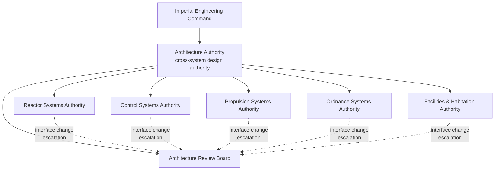

| Document ID | Classification | System | Document Owner | Status |
|---|---|---|---|---|
| `DS1-ARCH-001` | IMPERIAL RESTRICTED | DS-1 Orbital Battle Station | Imperial Engineering Directorate — Architecture Authority | Operational / Controlled Document |

ACCESS: AUTHORIZED ENGINEERING PERSONNEL ONLY &middot; Unauthorized access will be logged and escalated to Sector Security Command.

# Architecture Volume

The architectural core of the DS-1 library, structured to arc42. Chapter numbers
below are arc42 chapter numbers and are retained so that the library can be
audited against the template.

| arc42 | Document | ID | Purpose |
|---|---|---|---|
| 1 | [Introduction and Goals](introduction-and-goals.md) | `DS1-ARCH-002` | Mission, stakeholders, top quality goals |
| 2 | [Architecture Constraints](constraints.md) | `DS1-ARCH-003` | Mandated, technical and organisational constraints |
| 3 | [Context and Scope](context-and-scope.md) | `DS1-ARCH-004` | System boundary, external actors, technical interfaces |
| 4 | [Solution Strategy](solution-strategy.md) | `DS1-ARCH-005` | The governing structural decisions and why they hold |
| 5 | [Building Block View](building-block-view.md) | `DS1-ARCH-006` | Static decomposition, levels 1–3 |
| 6 | [Runtime View](runtime-view.md) | `DS1-ARCH-007` | Behavioural scenarios, nominal and degraded |
| 7 | [Deployment View](deployment-view.md) | `DS1-ARCH-008` | Physical and infrastructure allocation |
| 8 | [Cross-Cutting Concepts](crosscutting-concepts.md) | `DS1-ARCH-009` | Concepts binding on every system |
| 10 | [Quality Requirements](quality-requirements.md) | `DS1-ARCH-010` | Quality tree and measurable scenarios |
| — | [Zone and Sector Architecture](zone-and-sector-architecture.md) | `DS1-ARCH-011` | Extension: the spatial addressing model |

arc42 chapter 9 (Architecture Decisions) is held as a register in the
[Decisions volume](../decisions/index.md); arc42 chapter 11 (Risks and Technical
Debt) in the [Risks volume](../risks/index.md); arc42 chapter 12 (Glossary) in the
[Reference volume](../reference/index.md). The mapping is recorded in the
[arc42 Conformance Matrix](../reference/arc42-conformance.md).

## Architectural Authority

The Architecture Authority holds design authority across system boundaries. It
does not hold design authority *within* a system; that rests with the named
System Authority. Where a design choice inside one system changes the behaviour
observable at its interface, authority reverts to the Architecture Authority and
an ADR is required.

