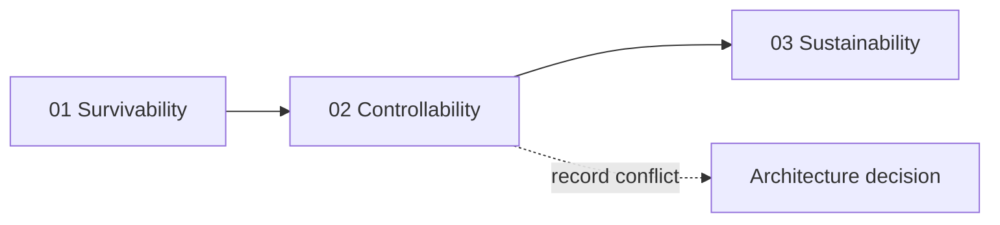

| Document ID | Classification | System | Document Owner | Status |
|---|---|---|---|---|
| `DS1-ARCH-002` | IMPERIAL RESTRICTED | DS-1 Orbital Battle Station | Imperial Engineering Directorate — Architecture Authority | Operational / Controlled Document |

ACCESS: AUTHORIZED ENGINEERING PERSONNEL ONLY &middot; Unauthorized access will be logged and escalated to Sector Security Command.

# 1. Introduction and Goals

## 1.1 Mission Statement

The DS-1 Orbital Battle Station exists to project sustained Imperial authority
into any sector of the galaxy without dependence on local infrastructure,
garrison strength or planetary consent.

Three properties follow from that statement and drive the entire architecture:

1. **Autonomy.** The platform must sustain its complement, its systems and its
   readiness without resupply for an extended deployment. Every architectural
   choice that trades autonomy for efficiency requires an ADR.
2. **Mobility.** Deterrent value is a function of arrival time. The platform must
   be repositionable between sectors on operational, not strategic, timescales.
3. **Concentration.** Capability that would otherwise be distributed across a
   fleet is concentrated into a single hull. This is the source of the
   platform's value and of its dominant risk (see
   [R-01](../risks/risk-register.md)).

## 1.2 Requirements Overview

The functional requirements are stated at platform level. System-level
requirements derive from these and are held by each System Authority.

| ID | Requirement | Verified by |
|---|---|---|
| `FR-01` | Sustain a complement of ~1.7 M for 3 standard years without resupply | Consumption modelling; annual sustainment audit |
| `FR-02` | Transit between any two charted sectors within a single operational cycle | Hyperdrive transit trials; navigation solution timing |
| `FR-03` | Maintain continuous command and control of embarked and attached forces | C2 availability measurement; ORL exercise |
| `FR-04` | Detect, classify and track objects across the full engagement envelope | Sensor coverage survey; tracking accuracy trials |
| `FR-05` | Launch, recover and service embarked craft at sustained sortie rate | Hangar throughput trials |
| `FR-06` | Deliver the primary armament effect against a designated target | Ordnance Systems Authority; out of scope for this library |
| `FR-07` | Survive and continue to operate after a defined level of hull damage | Damage-control exercise; zone isolation drill |
| `FR-08` | Provide habitable, survivable conditions in all crewed volumes | Life support audit; atmosphere assurance |

## 1.3 Quality Goals

**Priority drives the trade-off**

The ordering below resolves conflicting requirements; an ADR records the resulting compromise.

The three goals below are the ones against which architectural trade-offs are
settled. They are ordered; where two conflict, the higher-ranked goal prevails
and the trade is recorded as an ADR.

| Rank | Quality goal | Definition for DS-1 | Principal scenario |
|---|---|---|---|
| 1 | **Survivability** | The platform continues to fight, or at minimum continues to preserve life and withdraw, after damage or system loss | [QS-01](quality-requirements.md#qs-01-loss-of-a-quadrant-ring-bus), [QS-05](quality-requirements.md#qs-05-hull-breach-in-an-occupied-sector) |
| 2 | **Controllability** | Command intent reaches the acting system, correctly and only when authorized, under all readiness levels | [QS-02](quality-requirements.md#qs-02-command-authorization-under-degraded-comms), [QS-03](quality-requirements.md#qs-03-unauthorized-access-attempt-on-a-zone-boundary) |
| 3 | **Sustainability** | The platform maintains readiness over a multi-year deployment without external support | [QS-04](quality-requirements.md#qs-04-sustained-operation-without-resupply), [QS-06](quality-requirements.md#qs-06-scheduled-maintenance-without-readiness-loss) |

!!! note "On the absence of 'performance' as a top-level goal"

    Raw throughput is not a top-level quality goal. Every capability on this
    platform is over-provisioned relative to its duty cycle; the binding
    constraints are containment, control authority and heat rejection, not
    speed. Proposals justified solely by performance gain are refused at the
    Architecture Review Board unless they also improve a ranked goal.

## 1.4 Stakeholders

| Stakeholder | Role | What they require from this architecture | Consulted on |
|---|---|---|---|
| Imperial High Command | Sponsoring authority | Assurance that stated capability is real and sustainable | Goals, readiness model, risk register |
| Fleet Command, Sector | Operational commander | Predictable readiness, clear escalation, honest degradation reporting | Operating model, incident response |
| Station Commander | Accountable platform officer | Unambiguous control authority and a defensible chain of command | C2 architecture, authorization model |
| Imperial Engineering Command | Design authority of record | Conformance, traceability, deviation control | Everything; final approval |
| System Authorities | Owners of individual systems | Stable interfaces, clear boundaries of responsibility | Building block view, interface register |
| Sector Security Command | Security authority | Enforceable zones, complete audit, working detection | Zone model, access control, network segmentation |
| Garrison Command | Embarked ground forces | Habitability, muster routes, transit capacity | Crew and garrison, internal transit |
| Contractor Liaison Office | Construction and refit contractors | Work packets that are correct and access that is bounded | Deployment view, commissioning |
| Medical and Environmental Corps | Life support and habitability | Assured atmosphere, water, waste and thermal margin | Life support, quality scenarios |
| Rebel Alliance intelligence | **Adversary** — not consulted | *(Modelled as a threat actor with insider access; see [Threat Model](../security/index.md#threat-model))* | Nothing |

The last row is deliberate. The architecture assumes the adversary has read this
library. Controls that depend on the adversary's ignorance are not counted as
controls.

## 1.5 What This Library Does Not Cover

- **Constructional detail of the reactor assembly and the primary armament.**
  Held by the Reactor Systems Authority and the Ordnance Systems Authority
  respectively, under separate classification. This library describes only
  interfaces, control authority, failure modes and zone placement.
- **Force disposition and operational tasking.** Held by Fleet Command.
- **Personnel records and vetting outcomes.** Held by Sector Security Command.
- **Programme cost and schedule.** Held by Imperial Engineering Command.
