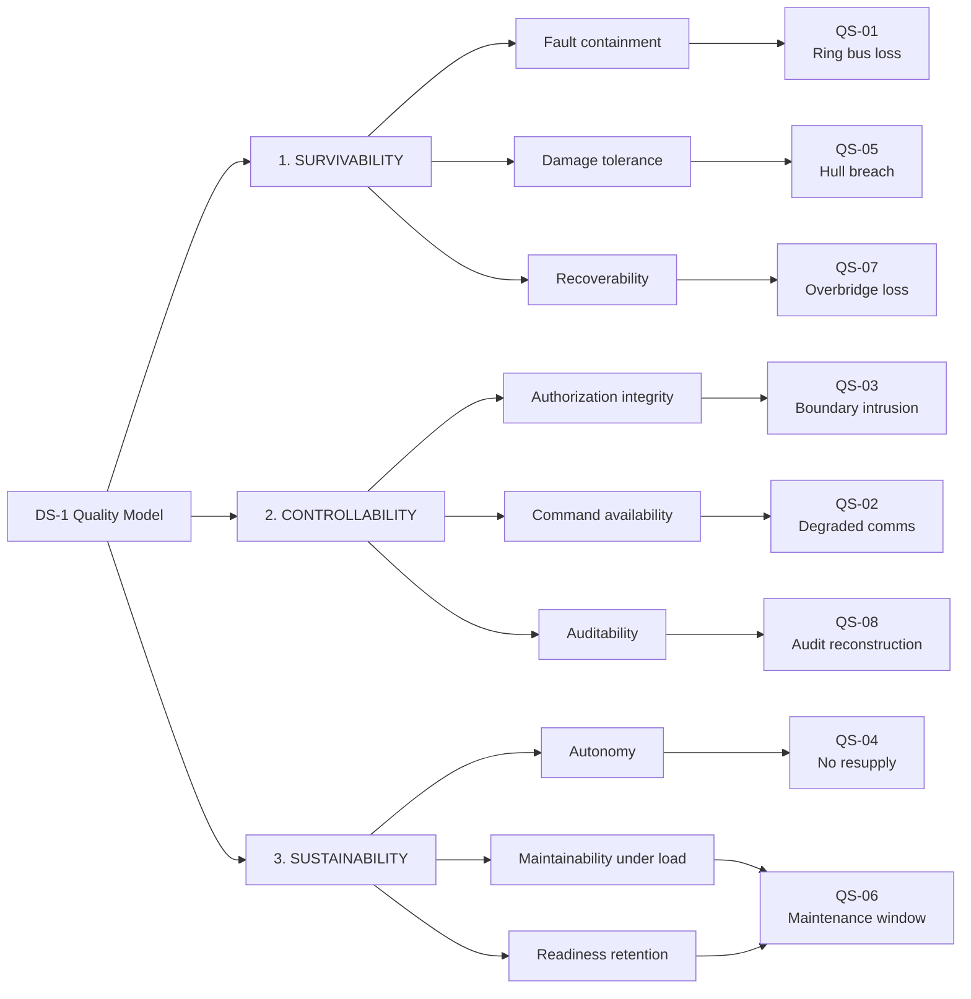
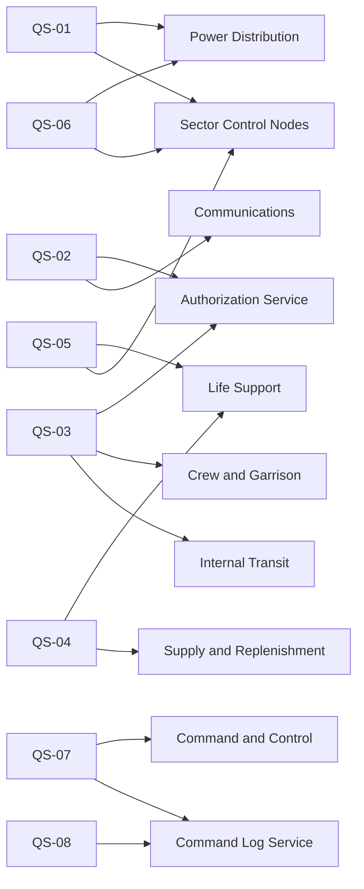

| Document ID | Classification | System | Document Owner | Status |
|---|---|---|---|---|
| `DS1-ARCH-010` | IMPERIAL RESTRICTED | DS-1 Orbital Battle Station | Imperial Engineering Directorate — Architecture Authority | Operational / Controlled Document |

ACCESS: AUTHORIZED ENGINEERING PERSONNEL ONLY &middot; Unauthorized access will be logged and escalated to Sector Security Command.

# 10. Quality Requirements

Quality goals from [chapter 1](introduction-and-goals.md#13-quality-goals),
refined into measurable scenarios. Each scenario states its stimulus, its
environment, the required response and the measure by which the response is
judged. A scenario without a measure is an aspiration and is not accepted into
this chapter.

## 10.1 Quality Tree

## 10.2 Quality Scenarios

### QS-01 — Loss of a Quadrant Ring Bus

| Field | Value |
|---|---|
| **Goal** | Survivability — fault containment |
| **Source** | Internal fault or localised damage |
| **Stimulus** | A quadrant ring bus faults and opens |
| **Environment** | ORL-3, all sectors crewed, no prior degradation |
| **Response** | Affected sectors transfer to cross-feed from the adjacent ring bus; non-essential load in the affected quadrant sheds automatically to P2; essential bus is unaffected throughout |
| **Measure** | No interruption of any P0 or P1 load. Transfer complete within 3 seconds. Load shed reported to the Overbridge within 10 seconds. No sector enters `SAFE`. |
| **Verified by** | Quarterly bus transfer exercise on one quadrant, rotating |
| **Current status** | Met — measured 1.8 s at last exercise |

### QS-02 — Command Authorization Under Degraded Comms

| Field | Value |
|---|---|
| **Goal** | Controllability — command availability |
| **Source** | External |
| **Stimulus** | `IF-01` and `IF-04` are both lost for an extended period |
| **Environment** | ORL-3, deployed, no contact with Imperial Command |
| **Response** | Cached identity assertions honoured to expiry; on expiry, local fallback authority under the Station Commander takes effect; all decisions logged for later reconciliation; no authorization posture becomes more permissive at any point |
| **Measure** | Zero authorizations granted that would have been refused with `IF-04` available. 100 per cent of fallback decisions reconciled on restoration. Platform remains fully controllable for **not less than 30 days**. |
| **Verified by** | Annual isolation exercise, minimum 72 hours; reconciliation audit |
| **Current status** | Met — 30-day model verified, 72-hour exercise clean |

### QS-03 — Unauthorized Access Attempt on a Zone Boundary

| Field | Value |
|---|---|
| **Goal** | Controllability — authorization integrity |
| **Source** | Insider or infiltrator with valid `Z4` credentials |
| **Stimulus** | Attempted transit to a zone for which no clearance is held, or a non-adjacent transit |
| **Environment** | Any readiness level, including maintenance windows with contractors aboard |
| **Response** | Boundary holds closed; refusal recorded with reason code; on a non-adjacent attempt or a clearance shortfall greater than one level, garrison response dispatched |
| **Measure** | 100 per cent of attempts refused and recorded. Garrison dispatch within 90 seconds of the qualifying refusal. Zero instances of a boundary opening on a failed decision. |
| **Verified by** | Continuous; monthly red-team boundary exercise conducted by Sector Security Command |
| **Current status** | Partially met — refusal and recording at 100 per cent; dispatch time in quadrant `Q-III` exceeds target because of `TD-07` |

### QS-04 — Sustained Operation Without Resupply

| Field | Value |
|---|---|
| **Goal** | Sustainability — autonomy |
| **Source** | Operational |
| **Stimulus** | No replenishment received |
| **Environment** | ORL-3, full complement, nominal consumption |
| **Response** | Consumption managed against held stock; consumables forecast maintained and reported; readiness reduced in a declared, planned sequence rather than by attrition |
| **Measure** | **3 standard years** at ORL-3 without external replenishment. Forecast accuracy within 5 per cent at 12 months. No unplanned readiness reduction. |
| **Verified by** | Annual sustainment audit; consumption model revalidation |
| **Current status** | At risk — forecast accuracy is 11 per cent at 12 months owing to `TD-06`; the 3-year figure is modelled, not demonstrated |

### QS-05 — Hull Breach in an Occupied Sector

| Field | Value |
|---|---|
| **Goal** | Survivability — damage tolerance |
| **Source** | Hostile action, collision or structural failure |
| **Stimulus** | Loss of pressure boundary in a crewed `Z4` sector |
| **Environment** | ORL-3 or above, sector occupied |
| **Response** | Automatic sector isolation on 2-of-3 sensor agreement; affected compartments sealed; adjacent sectors unaffected; damage control and medical dispatched; Class-1 incident declared |
| **Measure** | Boundary sealed within 8 seconds of detection. Propagation limited to the originating sector and no further. Class-1 declared within 30 seconds. Muster complete in adjacent sectors within 4 minutes. |
| **Verified by** | Semi-annual breach exercise, one sector, rotating |
| **Current status** | Met — 5.4 s seal, no propagation; muster 3 min 40 s except `Q-III` (see `TD-07`) |

### QS-06 — Scheduled Maintenance Without Readiness Loss

| Field | Value |
|---|---|
| **Goal** | Sustainability — maintainability under load |
| **Source** | Planned |
| **Stimulus** | A declared maintenance window opens on a critical system |
| **Environment** | ORL-3, platform operational throughout |
| **Response** | System isolated, worked, proved and restored while its redundant partner carries full load; readiness impact declared in advance and accepted by Fleet Command |
| **Measure** | Zero unplanned readiness reduction during the window. Restoration proved before the window closes. No window overruns its declared duration by more than 10 per cent. |
| **Verified by** | Window closure review, every window |
| **Current status** | Partially met — overrun rate 18 per cent, driven by reference-node contention (`TD-04`) |

### QS-07 — Loss of the Overbridge

| Field | Value |
|---|---|
| **Goal** | Survivability — recoverability |
| **Source** | Hostile action or catastrophic local failure |
| **Stimulus** | The Overbridge becomes unable to exercise command authority |
| **Environment** | Any |
| **Response** | Quadrant Command Posts continue on last authorized directives; sector nodes remain `LINKED` to their quadrant; declared handover to the Alternate Overbridge is initiated by the surviving senior officer; the Command Log survives in all four quadrant replicas |
| **Measure** | Zero loss of life-safety function at any point. Command authority re-established within **15 minutes**. Command Log complete and reconcilable across all four replicas. No automatic transfer occurs at any point. |
| **Verified by** | Annual command-handover exercise |
| **Current status** | Not met — measured handover 26 minutes; recorded as `TD-05` with an active remediation |

### QS-08 — Post-Incident Audit Reconstruction

| Field | Value |
|---|---|
| **Goal** | Controllability — auditability |
| **Source** | Investigation following any Class-1 incident |
| **Stimulus** | A demand to reconstruct the full decision chain for an incident |
| **Environment** | After the fact, possibly with equipment destroyed |
| **Response** | Every directive, authorization decision, refusal and actuation is reconstructed in causal order from the replicated Command Log, including from nodes that were `DETACHED` at the time |
| **Measure** | 100 per cent of directives reconstructed. Causal order established without reliance on timestamps. Reconstruction delivered within 48 hours of demand. |
| **Verified by** | Reconstruction drill after every Class-1 incident and once per quarter regardless |
| **Current status** | Met |

## 10.3 Scenario-to-System Traceability

## 10.4 Status Summary

| Scenario | Goal | Status | Blocking item |
|---|---|---|---|
| QS-01 | Survivability | Met | — |
| QS-02 | Controllability | Met | — |
| QS-03 | Controllability | Partial | `TD-07` |
| QS-04 | Sustainability | At risk | `TD-06` |
| QS-05 | Survivability | Met | — |
| QS-06 | Sustainability | Partial | `TD-04` |
| QS-07 | Survivability | Not met | `TD-05` |
| QS-08 | Controllability | Met | — |

Three of eight scenarios are not fully met. All three trace to entries in the
[Technical Debt Register](../risks/technical-debt.md), and all three have named
owners and target dates. **The Directorate does not report a scenario as met on
the strength of a design argument; it is met when it has been measured.**
