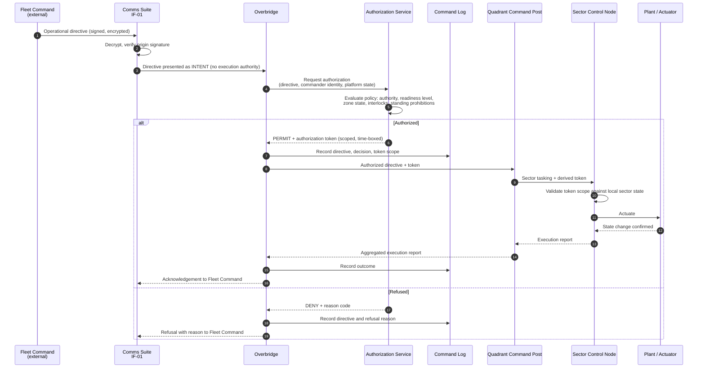
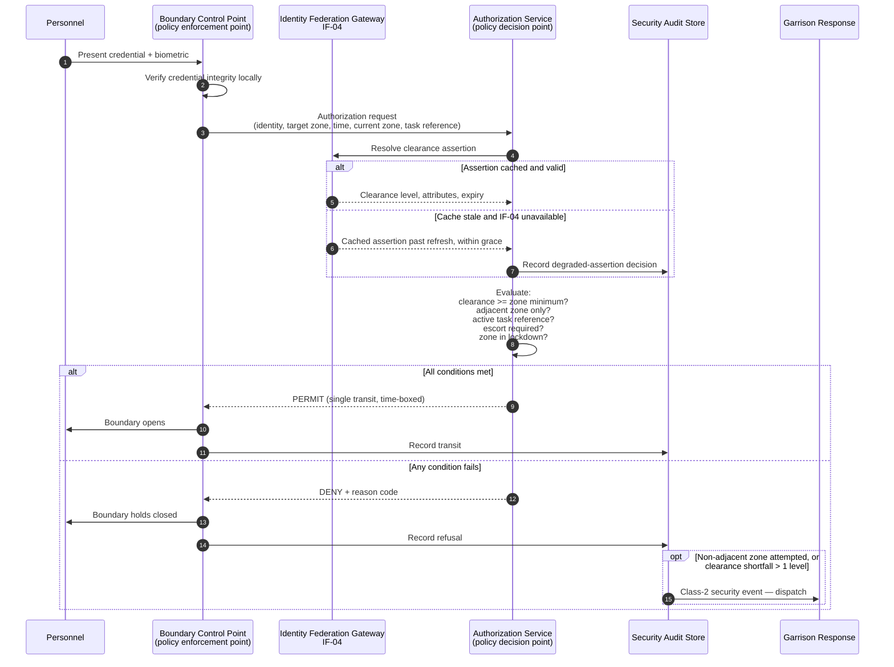
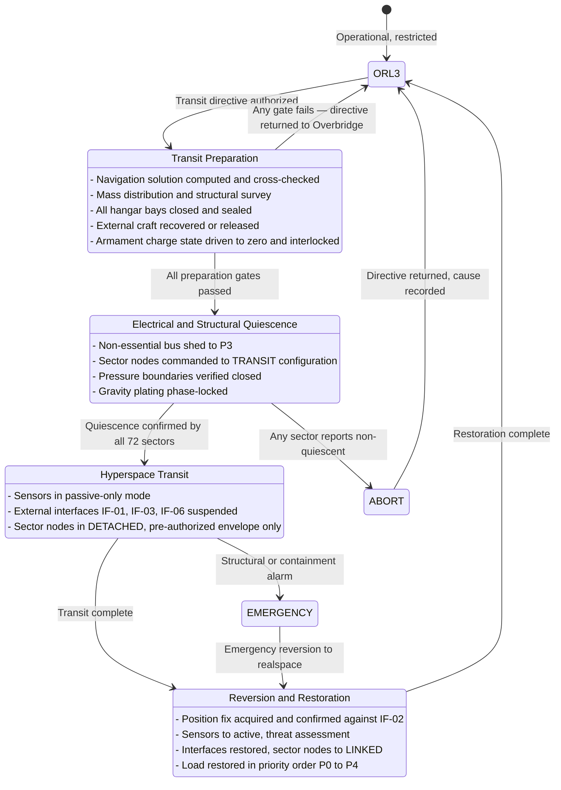
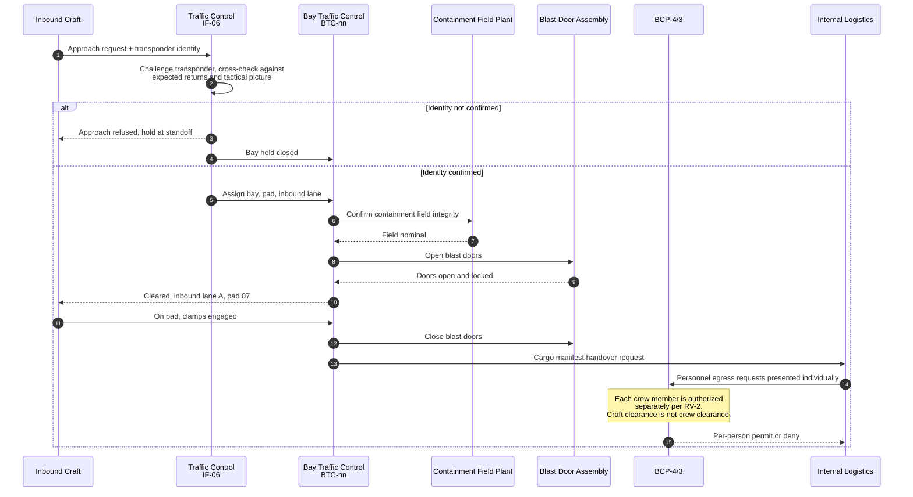
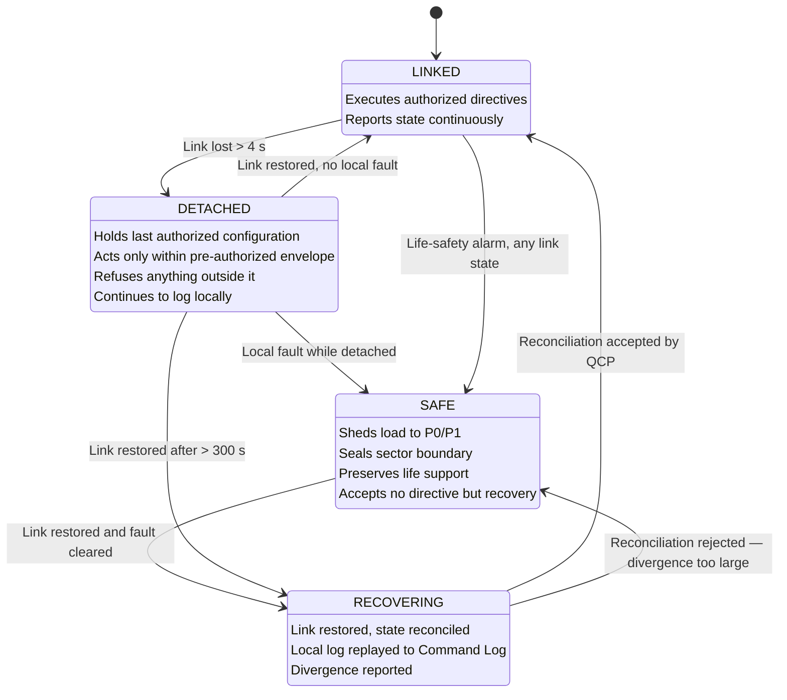
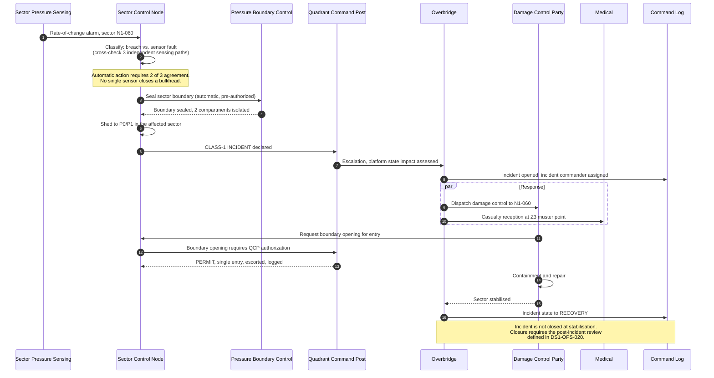
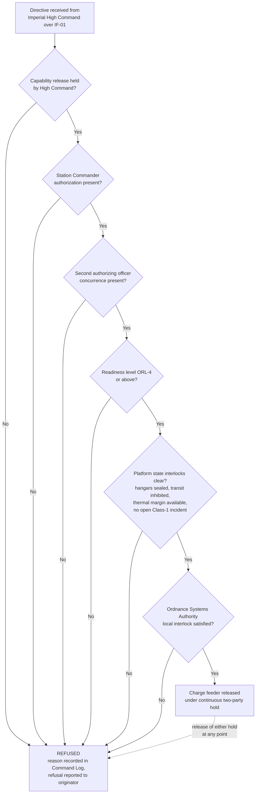

| Document ID | Classification | System | Document Owner | Status |
|---|---|---|---|---|
| `DS1-ARCH-007` | IMPERIAL RESTRICTED | DS-1 Orbital Battle Station | Imperial Engineering Directorate — Architecture Authority | Operational / Controlled Document |

ACCESS: AUTHORIZED ENGINEERING PERSONNEL ONLY &middot; Unauthorized access will be logged and escalated to Sector Security Command.

# 6. Runtime View

Behavioural scenarios that exercise the architecture. Each names its trigger, its
participating blocks, its failure handling and the quality scenario it verifies.
Nominal-path scenarios are given first; degradation and incident paths follow.

| # | Scenario | Verifies |
|---|---|---|
| [RV-1](#rv-1-operational-request-flow) | Operational request from tasking to execution | Controllability |
| [RV-2](#rv-2-authentication-and-authorization-at-a-zone-boundary) | Personnel transit across a zone boundary | Controllability |
| [RV-3](#rv-3-hyperspace-transit-preparation-and-execution) | Hyperspace transit | Sustainability |
| [RV-4](#rv-4-craft-recovery-cycle) | Craft recovery into a hangar bay | Sustainability |
| [RV-5](#rv-5-sector-link-loss-and-autonomous-degradation) | Loss of a sector's command link | Survivability |
| [RV-6](#rv-6-hull-breach-and-incident-escalation) | Hull breach in an occupied sector | Survivability |
| [RV-7](#rv-7-primary-armament-authorization-interlock-chain) | Armament authorization interlocks | Controllability |

---

## RV-1 — Operational Request Flow

**Trigger.** Fleet Command issues an operational directive over `IF-01`.

**Principle under test.** Intent arrives from outside; *authority* is always
exercised inside. No external actor can actuate anything.

**Failure handling.**

| Failure | Behaviour |
|---|---|
| Signature verification fails | Directive discarded at `IF-01`; security event Class 2 raised; no presentation to the Overbridge |
| Authorization Service unreachable | **Refuse.** There is no fail-open path. The Overbridge may invoke the two-officer manual authority procedure, which is itself logged |
| Token expires mid-execution | Sector Control Node halts at the next safe point and reports; it does not complete on a stale token |
| Sector Control Node unreachable | Quadrant Command Post reports partial execution; the directive is *not* silently marked complete |

---

## RV-2 — Authentication and Authorization at a Zone Boundary

**Trigger.** A rating attempts to transit from `Z3` into `Z2` at a Boundary
Control Point.

**Design notes.**

- The Boundary Control Point is an *enforcement* point only. It holds no policy
  and cannot be reconfigured locally. A compromised BCP cannot grant access.
- Transit is single-use and time-boxed. Holding a door for a colleague produces
  one authorized and one unauthorized transit; the second is detected.
- `IF-04` unavailability degrades to cached assertions within a grace window,
  then to local fallback authority. It never degrades to open. See
  [ADR-007](../decisions/adr-007-identity-federation.md).

---

## RV-3 — Hyperspace Transit Preparation and Execution

**Trigger.** Authorized reposition directive. Transit is an *operating mode*
with its own readiness level, not a background activity (`C-T-05`).

**Failure handling.** A single sector that cannot confirm quiescence aborts the
transit for the whole platform. This is deliberate: a partial-quiescence transit
is a structural risk, and 72 independent confirmations is the only honest way to
establish the platform's state. Aborts are common; they are recorded and trended
rather than treated as exceptional.

---

## RV-4 — Craft Recovery Cycle

**Trigger.** Inbound craft requests recovery on `IF-06`.

**Design note.** Craft identity and crew identity are separate decisions. A
confirmed craft carrying an unconfirmed person results in a berthed craft and a
person who does not leave `Z4`. This separation is the primary control against
the infiltration path modelled in [R-04](../risks/risk-register.md).

---

## RV-5 — Sector Link Loss and Autonomous Degradation

**Trigger.** A Sector Control Node loses its link to its Quadrant Command Post.

**Invariants that hold in every state.**

1. A node never gains authority by losing its link. `DETACHED` is strictly less
   capable than `LINKED`.
2. A node in `DETACHED` or `SAFE` cannot be commanded by a peer node.
3. Local logging continues in all states and is replayed on reconciliation. A
   gap in the log is itself an incident.
4. `SAFE` is not automatically exited. Recovery is an authorized action.

**Known weakness.** Reconciliation after a long detachment is slow and, in
sectors with heavy local state, occasionally rejected — forcing an unnecessary
`SAFE` transition. Recorded as `TD-03`.

---

## RV-6 — Hull Breach and Incident Escalation

**Trigger.** Pressure loss detected in an occupied `Z4` sector.

**Escalation classes** are defined in [Incident Response](../operations/incident-response.md).
The architectural point here is that **automatic protective action is
pre-authorized and immediate, while intervention is authorized and deliberate.**
Sealing a bulkhead does not wait for a human. Opening one always does.

---

## RV-7 — Primary Armament Authorization Interlock Chain

**Scope limitation.** This scenario describes the *authorization and interlock
architecture* only. It contains no armament design, energy, targeting or
sequencing detail. That material is held by the Ordnance Systems Authority under
separate classification.

**Architectural properties.**

- The chain is **conjunctive**: every gate must pass. There is no override, no
  quorum substitution and no emergency bypass. A gate that cannot be evaluated
  counts as failed.
- The charge feeder is held open by *continuous* two-party action, not by a
  single authorizing event. Release of either hold reverts the feeder.
- Interlocks are enforced by the Ordnance Systems Authority's own equipment as
  well as by the Authorization Service. Neither alone is sufficient.
- Every refusal is logged with its reason code and reported back to the
  originator. Refusals are trended; a rising refusal rate at a particular gate is
  treated as a defect indication, not as operator error.
