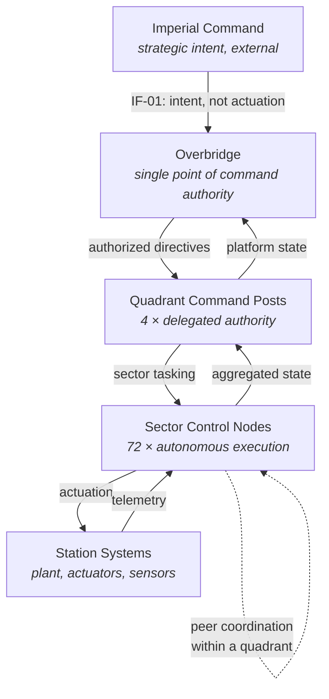
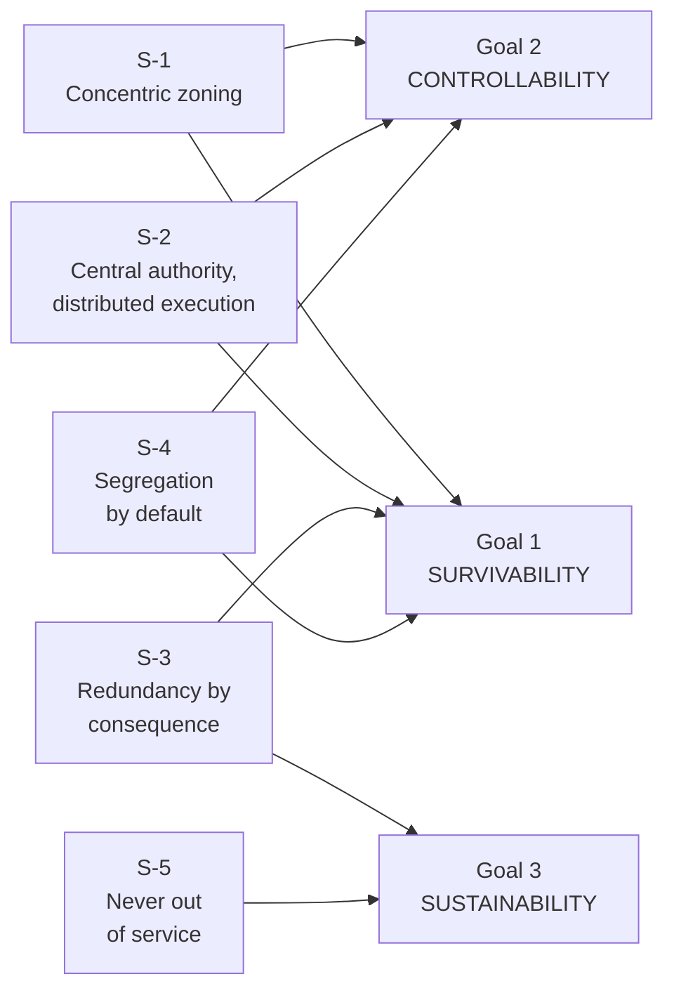

| Document ID | Classification | System | Document Owner | Status |
|---|---|---|---|---|
| `DS1-ARCH-005` | IMPERIAL RESTRICTED | DS-1 Orbital Battle Station | Imperial Engineering Directorate — Architecture Authority | Operational / Controlled Document |

ACCESS: AUTHORIZED ENGINEERING PERSONNEL ONLY &middot; Unauthorized access will be logged and escalated to Sector Security Command.

# 4. Solution Strategy

Five strategies carry this architecture. Each resolves a named constraint,
each has a stated cost, and each is realised by specific decisions recorded in
the [Decisions volume](../decisions/index.md). Nothing here is aspirational; if a
strategy is not implemented, that is recorded in the
[Technical Debt Register](../risks/technical-debt.md).

## S-1 — Concentric Zoning as the Organising Principle

The platform is organised as five concentric zones `Z0`–`Z4`, from the reactor
containment volume outward to the hangar and hull perimeter. Zoning is not a
security overlay applied to a physical layout; it **is** the physical layout.
Structure, power, atmosphere, network and access control all follow the same
boundaries.

| Property | Consequence |
|---|---|
| Criticality rises inward | The most exposed volumes contain nothing whose loss is unrecoverable |
| Traversal is one boundary at a time, inward only | Every transition is a control point; skipping is a detectable event |
| Isolation is possible at every boundary | Pressure, power and network can all be severed at the same line |

**Cost:** movement across the platform is slow by design. A transit from a
hangar bay to a Zone `Z1` plant room passes four control points. This is
accepted; see [Internal Transit](../systems/internal-transit.md) for the
mitigation.

Realised by: [Zone and Sector Architecture](zone-and-sector-architecture.md),
[Security Zones](../security/security-zones.md),
[ADR-003](../decisions/adr-003-network-segmentation.md).

## S-2 — Centralised Authority, Distributed Execution

Command *intent* is centralised at the Overbridge. Command *execution* is
distributed to 72 Sector Control Nodes, each of which holds enough autonomy to
run its sector safely without contact with the centre.

This is forced by `C-T-03`: at 160 km, closed-loop control from a single point
is not achievable at the response times life-safety requires.

Each node runs one of three modes:

| Mode | Trigger | Node behaviour |
|---|---|---|
| `LINKED` | Normal | Executes directives from its Quadrant Command Post; reports continuously |
| `DETACHED` | Loss of quadrant link | Holds last authorized configuration; may act autonomously within a pre-authorized envelope; refuses anything outside it |
| `SAFE` | Loss of link plus a local fault | Sheds non-essential load, seals its sector boundary, preserves life support, awaits recovery |

A node in `DETACHED` **cannot** be commanded from another node, and cannot
authorize anything the Overbridge had not already authorized. Autonomy is a
degradation path, never a privilege escalation path.

**Cost:** the pre-authorized envelope must be defined, reviewed and kept current
for all 72 nodes. This is expensive and is the origin of `TD-03`.

Realised by: [Command and Control](../systems/command-and-control.md),
[ADR-002](../decisions/adr-002-sector-autonomy.md).

## S-3 — Redundancy Proportional to Consequence, Not to Cost

Redundancy is allocated by what the loss does, not by what the component costs.

| Consequence of loss | Redundancy standard | Applied to |
|---|---|---|
| Loss of life within minutes | 2N, physically segregated, independently powered | Life support plant, essential bus, pressure boundary control |
| Loss of command authority | 2N with automatic failover, plus a manual fallback | Overbridge, Quadrant Command Posts, identity decision points |
| Loss of a capability | N+1 | Sensors, communications, hangar traffic control, transit spine |
| Loss of convenience | N | Habitation services, fabrication, recreation |
| **Loss of the platform** | **None available** | **Reactor assembly — see below** |

The final row is the honest one. The reactor assembly cannot be made redundant
because `C-T-01` forbids distributed generation. The architecture therefore
substitutes *depth* for *redundancy*: containment, physical isolation, network
one-way flow, and the standby generation set that keeps the essential bus alive
independently of the reactor. This substitution is not equivalent to redundancy
and is not claimed to be. See [R-01](../risks/risk-register.md).

Realised by: [Power Distribution](../systems/power-distribution.md),
[Disaster Recovery](../operations/disaster-recovery.md),
[ADR-001](../decisions/adr-001-single-core-reactor.md).

## S-4 — Segregation by Default, Connection by Exception

No two systems are connected unless a declared interface requires it. The
default network posture is deny; the default physical posture is a bulkhead;
the default authorization posture is refusal.

Four network enclaves — `ENC-CORE`, `ENC-CTRL`, `ENC-OPS`, `ENC-LOG` — map onto
the zone model. Traffic between enclaves crosses a controlled gateway; traffic
into `ENC-CORE` crosses a data diode and cannot return.

**Cost:** integration work is slow, and every new capability pays a gateway tax.
Accepted deliberately: the alternative is a flat platform in which a compromised
hangar terminal can reach reactor telemetry.

Realised by: [Network Segmentation](../security/network-segmentation.md),
[ADR-003](../decisions/adr-003-network-segmentation.md).

## S-5 — The Platform Is Never Taken Out of Service

`C-T-07` forbids a shutdown state. Every system is therefore designed for live
maintenance: isolate, work, prove, restore, with the platform operating
throughout. Maintenance is scheduled into declared windows in which a defined
readiness reduction is accepted and published in advance.

**Cost:** every maintainable item needs isolation points, proving arrangements
and a documented restoration sequence. This roughly doubles the design effort on
plant systems and is the reason maintenance access dominates the internal
layout.

Realised by: [Maintenance and Windows](../operations/maintenance.md),
[Operating Model](../operations/operating-model.md).

## Strategy-to-Goal Traceability

| Strategy | Resolves constraint | Realised by ADR | Residual risk |
|---|---|---|---|
| S-1 | `C-M-04`, `C-T-06` | ADR-003 | `R-04` insider access at zone boundaries |
| S-2 | `C-T-03` | ADR-002 | `R-05` divergent sector configuration |
| S-3 | `C-T-07` | ADR-001, ADR-006 | `R-01` concentrated structural vulnerability |
| S-4 | `C-M-02`, `C-M-04` | ADR-003, ADR-007 | `R-03` gateway as a chokepoint |
| S-5 | `C-T-07` | — | `R-06` readiness erosion through deferred work |
