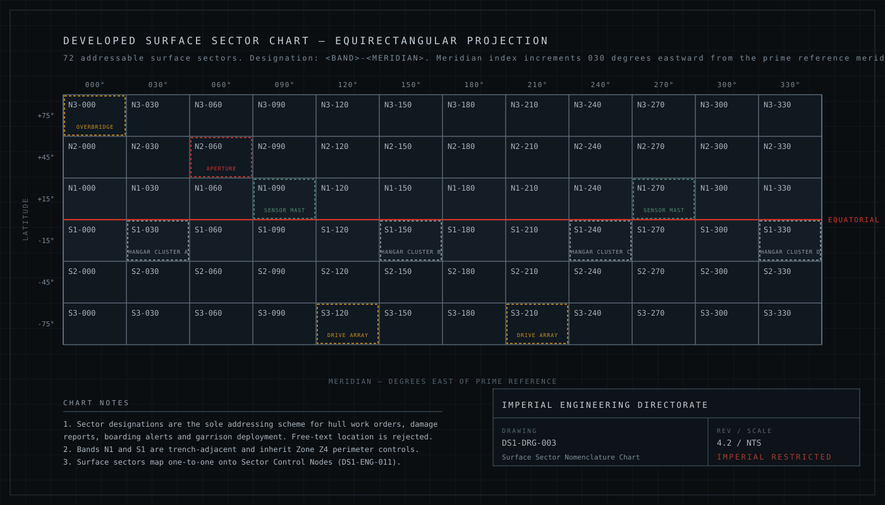
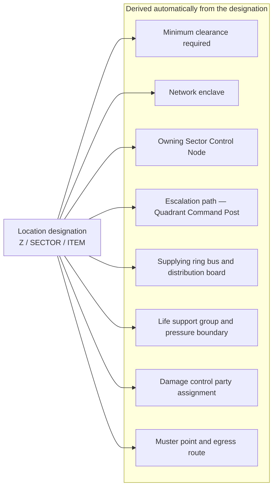

<div class="doc-control" markdown>

| Document ID | Classification | System | Document Owner | Status |
|---|---|---|---|---|
| `DS1-ARCH-011` | IMPERIAL RESTRICTED | DS-1 Orbital Battle Station | Imperial Engineering Directorate — Structures and Layout Section | Operational / Controlled Document |

ACCESS: AUTHORIZED ENGINEERING PERSONNEL ONLY &middot; Unauthorized access will be logged and escalated to Sector Security Command.
</div>

# Zone and Sector Architecture

The spatial model underlying every other document in this library. Two
orthogonal schemes are in use: **zones** (radial, depth-based) and **sectors**
(surface, address-based). Together they give every point in the platform a
single unambiguous designation.

!!! danger "Mandatory convention `C-C-01`"

    Free-text location descriptions are rejected by work-order intake, incident
    intake and alert routing. "The plant room near the third lift" is not an
    address. `Z1/N2-090/PL-04` is.

## 1. The Zone Model

Zones are concentric, radial and ordered by criticality. Criticality rises
inward; exposure falls inward.

<figure class="blueprint" markdown>

<figcaption>DS1-DRG-002 &middot; Containment and Security Zone Model &middot; Rev 4.2</figcaption>
</figure>

| Zone | Designation | Contains | Minimum clearance | Network enclave | Pressure regime |
|---|---|---|---|---|---|
| `Z0` | Reactor Containment | Reactor assembly, containment field control, fuel handling | IMP-5, two-person rule | `ENC-CORE` | Independently controlled, permanently isolated |
| `Z1` | Critical Systems | Power trunks, life support plant, drive control, armament charge path | IMP-4 | `ENC-CTRL` | Independent, cross-connected in pairs |
| `Z2` | Command and Sector Control | Overbridge, quadrant posts, sector nodes, sensor fusion | IMP-3 | `ENC-CTRL` | Independent |
| `Z3` | Operational and Habitation | Barracks, workshops, medical, transit spine, messing | IMP-2 | `ENC-OPS` | Common with sector isolation |
| `Z4` | Perimeter and Hangar Belt | Hangar bays, cargo handling, hull maintenance, docking | IMP-1 | `ENC-LOG` | Sector-isolated; bay volumes independently vented |

### Zone Invariants

These hold without exception. A design that violates one is refused at the
Architecture Review Board.

1. **Adjacency.** A transit crosses exactly one boundary. There is no route from
   `Z4` to `Z2` that does not pass through `Z3`.
2. **Directionality of trust.** A zone trusts assertions from zones inward of it
   and treats assertions from zones outward of it as untrusted input.
3. **Isolability.** Every boundary can sever pressure, power and network
   independently, and can do so without reference to any other zone.
4. **No shared failure domain across a boundary.** A single component failure may
   not disable services in two adjacent zones.
5. **`Z0` has no return path.** Command intent enters `Z0` through a data diode;
   telemetry leaves through a separate one. Nothing traverses in both directions
   over the same path.

### Boundary Control Points

Every zone boundary is crossed only at a Boundary Control Point (BCP), designated
`BCP-<outer>/<inner>` — for example `BCP-4/3` for the `Z4`→`Z3` boundary.

| Property | Rule |
|---|---|
| Policy location | Held centrally at the Authorization Service. A BCP holds no policy and cannot be locally reconfigured. |
| Decision | Per person, per transit, time-boxed, single-use. |
| Failure mode | Closed. A BCP that cannot reach the Authorization Service does not open. |
| Tailgating | Detected by count reconciliation; a mismatch is a Class-2 security event. |
| Emergency egress | Separate, one-way, alarmed, outward only. It cannot be used to move inward. |

The `Z1`→`Z0` boundary additionally enforces a two-person rule: two independently
authorized identities, both present, neither able to authorize the other.

## 2. The Sector Model

The hull surface is divided into 72 addressable sectors: six latitude bands by
twelve meridians. A sector designation is `<BAND>-<MERIDIAN>`.

<figure class="blueprint" markdown>

<figcaption>DS1-DRG-003 &middot; Surface Sector Nomenclature Chart &middot; Rev 4.2</figcaption>
</figure>

| Element | Values | Notes |
|---|---|---|
| Band | `N3` `N2` `N1` `S1` `S2` `S3` | `N` northern, `S` southern; index increases toward the pole |
| Meridian | `000` `030` … `330` | Degrees east of the prime reference meridian |
| Example | `N1-060` | Northern trench-adjacent band, 060° east |

### Sector Properties

- Each surface sector maps one-to-one onto a **Sector Control Node**
  (`DS1-ENG-011`). There are exactly 72 of each.
- Sectors are grouped into four **quadrants** by meridian range, each served by
  one Quadrant Command Post:

  | Quadrant | Meridians | Command post |
  |---|---|---|
  | `Q-I` | 000–060 | `QCP-I`, located `Z2/N2-030` |
  | `Q-II` | 090–150 | `QCP-II`, located `Z2/N2-120` |
  | `Q-III` | 180–240 | `QCP-III`, located `Z2/S2-210` |
  | `Q-IV` | 270–330 | `QCP-IV`, located `Z2/S2-300` |

- Bands `N1` and `S1` are **trench-adjacent** and inherit `Z4` perimeter controls
  in full, regardless of the depth at which work is being performed.

### Full Location Designation

A complete location combines zone, sector and a local item reference:

```
Z1 / N2-090 / PL-04
|      |        |
|      |        +-- Local item reference within the sector
|      |            (PL plant room, LB lift bank, BY hangar bay,
|      |             SN sector node, BC boundary control point)
|      +----------- Surface sector
+----------------- Zone
```

Examples in use across this library:

| Designation | Reads as |
|---|---|
| `Z2/N2-030/SN-01` | Sector Control Node 01, Zone 2, sector N2-030 |
| `Z4/N1-060/BY-03` | Hangar bay 03, Zone 4, sector N1-060 |
| `Z1/S2-210/PL-11` | Plant room 11, Zone 1, sector S2-210 |
| `Z3/N1-000/BC-4-3` | Boundary control point Z4→Z3, Zone 3 side, sector N1-000 |

## 3. Zone and Sector Interaction

A zone is a *depth*; a sector is an *azimuth*. Both are needed. The composite
addressing determines, automatically and without human judgement:



This is why the convention is mandatory rather than encouraged. A correctly
formed address routes a work order, allocates its power isolation, identifies the
authorizing command post, selects the damage control party and determines the
muster point — with no further lookup and no interpretation.

## 4. Known Deficiencies

| Ref | Deficiency | Consequence | Register |
|---|---|---|---|
| `TD-02` | Sixteen `Z1` plant rooms in the southern hemisphere were commissioned before the sector scheme was finalised and retain legacy references. | Work orders for these rooms require manual translation, which has produced misrouted isolations. | [Technical Debt](../risks/technical-debt.md) |
| `TD-07` | The `Z3`→`Z2` boundary in quadrant `Q-III` has four BCPs where the standard is six, a construction-phase economy. | Muster times in `Q-III` exceed the platform standard by roughly 40 per cent. | [Technical Debt](../risks/technical-debt.md) |
