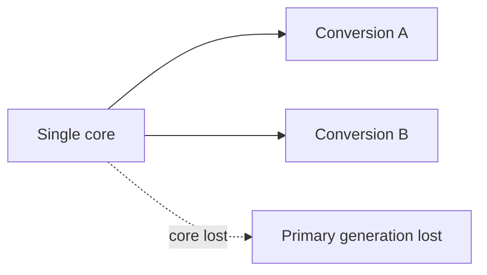

| Document ID | Classification | System | Document Owner | Status |
|---|---|---|---|---|
| `DS1-ADR-001` | IMPERIAL RESTRICTED | DS-1 Orbital Battle Station | Imperial Engineering Directorate — Architecture Authority | Accepted / Controlled Document |

ACCESS: AUTHORIZED ENGINEERING PERSONNEL ONLY &middot; Unauthorized access will be logged and escalated to Sector Security Command.

# ADR-001 — Single Core Reactor Assembly

| Field | Value |
|---|---|
| **Status** | Accepted — **forced by constraint, not chosen** |
| **Ruling authority** | Imperial High Command |
| **Date of ruling** | Programme Phase 0 |
| **Supersedes** | — |
| **Proposed again since** | 6 times |

## Context

The primary armament requires a single coherent power delivery (`C-T-01`). It
cannot be fed by summing the output of independent generation sources; the
Ordnance Systems Authority position on this is categorical and has been retested
twice.

Generation architecture therefore cannot be chosen on the usual grounds of
availability and maintainability. It is determined by the armament's input
requirement.

## Options Considered

### Option A — Distributed generation, N independent reactors

| | |
|---|---|
| **Availability** | Excellent. Loss of one unit is absorbed. |
| **Maintainability** | Excellent. Units taken out of service in rotation. |
| **Failure domain** | Excellent. No single structural target. |
| **Armament** | **Cannot deliver.** Fails `C-T-01`. |

Rejected. It resolves every architectural concern and fails the platform's
primary function.

### Option B — Distributed generation with a coherence stage

| | |
|---|---|
| **Availability** | Good for general load; the coherence stage is itself a single point |
| **Complexity** | Very high |
| **Assessment** | The coherence stage becomes the concentrated vulnerability, with the added complexity of N sources behind it |

Rejected. It relocates the single point of failure and adds a large amount of
new failure surface to do so. Assessed twice, at Phase 0 and at Phase 3.

### Option C — Single core assembly with defence in depth

| | |
|---|---|
| **Availability** | Poor. No redundancy is possible. |
| **Armament** | Satisfies `C-T-01`. |
| **Mitigation** | Containment, physical isolation, diode-only connectivity, independent standby generation for the essential bus |

**Selected.**

## Ruling

**Redundancy boundary**

Downstream duplication does not remove the single-source failure domain.

The reactor assembly is a **single, non-redundant unit** in Zone `Z0`.
Redundancy is substituted by defence in depth, and the substitution is
acknowledged as **not equivalent**.

Life-safety load is carried by an essential bus with independent standby
generation, so that reactor loss removes *capability* but not immediately
*survival*.

## Consequences

### Accepted

| Consequence | Detail |
|---|---|
| A single structural target exists | The platform's dominant risk, [R-01](../risks/risk-register.md) |
| No recovery from reactor loss with containment failure | [Disaster Recovery §5.1](../operations/disaster-recovery.md#51-loss-of-the-reactor-with-containment-failure) |
| Reactor maintenance requires a full down-state | Twice since commissioning |
| `CC-5` conformance is partial for Power Generation | The only `○` in the concept coverage matrix |

### Mitigations Implemented

| Mitigation | Reference |
|---|---|
| 2N containment field, powered independently of the reactor | [Power Generation](../systems/power-generation.md) |
| `Z0` boundary with a two-person rule | [Security Zones](../security/security-zones.md) |
| Diode-only connectivity, no return path | [ADR-003](adr-003-network-segmentation.md) |
| Standby generation on the essential bus, no shared dependency | [Power Distribution](../systems/power-distribution.md) |
| Thermal margin as the platform's leading indicator | [Observability](../operations/observability.md) |
| `SCRAM` not remotely commandable | [Power Generation](../systems/power-generation.md) |

### Explicitly Not Claimed

The mitigations above do not sum to redundancy. They reduce the probability of an
internally initiated loss and remove the remote and insider actuation paths. They
do not address a sufficient external kinetic insult, and no available measure
does.

This is stated in every risk review and is **accepted at Imperial High Command
level, not at Directorate level**. The Directorate does not have the authority to
accept a risk of this magnitude and has not attempted to.

## Revisit Conditions

This decision is revisited if, and only if:

1. The Ordnance Systems Authority withdraws or relaxes `C-T-01`; or
2. A coherence stage is demonstrated whose own failure probability is materially
   lower than that of the reactor assembly it would front; or
3. The primary armament requirement is withdrawn.

None has occurred. The decision has been proposed for reversal six times, most
recently at the last Architecture Review Board; each proposal was Option A or
Option B restated, and each was refused on the grounds above.
