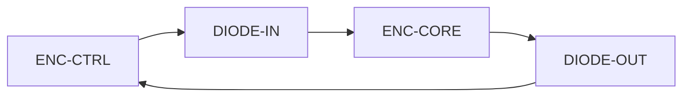

| Document ID | Classification | System | Document Owner | Status |
|---|---|---|---|---|
| `DS1-ADR-003` | IMPERIAL RESTRICTED | DS-1 Orbital Battle Station | Imperial Engineering Directorate — Architecture Authority | Accepted / Controlled Document |

ACCESS: AUTHORIZED ENGINEERING PERSONNEL ONLY &middot; Unauthorized access will be logged and escalated to Sector Security Command.

# ADR-003 — Four Enclaves Aligned to Zones, Diodes to `Z0`

| Field | Value |
|---|---|
| **Status** | Accepted |
| **Ruling authority** | Architecture Review Board, in concurrence with Sector Security Command |
| **Date of ruling** | Programme Phase 5 |
| **Proposed again since** | 4 times (three requesting a `Z0` return path) |

## Context

The platform carries 1.7 million people, tens of thousands of them contractors
with legitimate physical access (`C-M-04`), across a network that must also carry
reactor control. Some separation is obviously required. The question is what
shape it takes.

## Options Considered

### Option A — Flat network with host-level controls

Rejected immediately. A compromised hangar terminal reaching reactor telemetry is
not an acceptable failure mode, and host-level controls fail when the host is
compromised.

### Option B — Segmentation by system function

Enclaves per functional group: power, control, habitation, flight.

Rejected. Functional boundaries do not align with physical boundaries, so a
physical compromise crosses several functional enclaves at once. It also produces
boundaries that cannot be reasoned about while standing in front of them, which
is where most access decisions are actually made.

### Option C — Segmentation aligned to zones

Four enclaves mapped one-to-one onto the zone model.

**Selected.** A single boundary line severs pressure, power and network together.
An engineer at a bulkhead knows exactly what is on the other side of it in every
respect.

### `Z0` Connectivity — Sub-Decision

| Option | Assessment |
|---|---|
| Normal gateway, bidirectional, heavily controlled | Rejected. A gateway is a bidirectional path by construction, and reactor control is the one system where a return path has no acceptable use. |
| Air gap, no connectivity | Rejected. Reactor telemetry is the platform's leading indicator; losing it to gain isolation is a net loss of safety. |
| **Two unidirectional diodes on physically distinct paths** | **Selected.** Setpoints in; telemetry out; no path carries both. |

## Ruling

**No shared core session**

The outbound telemetry path is physically separate from the inbound setpoint path.

Four enclaves — `ENC-CORE`, `ENC-CTRL`, `ENC-OPS`, `ENC-LOG` — aligned exactly to
zones `Z0`–`Z4`, as specified in
[Network Segmentation](../security/network-segmentation.md).

`ENC-CORE` is reachable only through two unidirectional diodes on physically
distinct paths. **Neither diode is redundant**, because a redundant diode is a
second path into `Z0`.

Within `ENC-CTRL`, sector nodes are segmented per sector and **cannot address
each other**, enforcing [ADR-002](adr-002-sector-autonomy.md) invariant 2 in
topology as well as in policy.

## Consequences

### Accepted

| Consequence | Detail |
|---|---|
| Integration is slow; every new capability pays a gateway tax | Accepted deliberately |
| `IX-CORE` consumers must be written to a fire-and-observe contract | No request-response to the reactor |
| Loss of `DIODE-IN` puts the reactor in `HOLD` | Intended behaviour, not a gap |
| Loss of `DIODE-OUT` is a Class-1 condition | Operating a reactor that cannot be seen |
| `GW-OC` becomes the platform's most-controlled path | Every message authorized individually |

### The Three Rejected Return-Path Proposals

Three separate proposals have sought a return path from `ENC-CORE`, each to
acknowledge setpoint receipt and shorten the `HOLD` reconciliation time
(`TD-10`, currently ~40 minutes manual).

All three were refused. The reasoning is recorded because it will be proposed
again:

> A return path from `ENC-CORE` exists to carry an acknowledgement. An
> acknowledgement is a message whose content is controlled by the sender. The
> sender is inside the containment boundary. Accepting a message from inside that
> boundary, on a path that reaches control systems, reintroduces exactly the
> reachability the diode was installed to remove — in exchange for shortening a
> reconciliation that occurs roughly once a year.

The correct remedy for `TD-10` is to automate the reconciliation on the
`ENC-CTRL` side, which requires no return path. That work is in design, blocked
on `TD-04`.

## Revisit Conditions

The enclave model is revisited if the zone model changes. The diode arrangement
is not revisited; it is the mechanism by which
[ADR-001](adr-001-single-core-reactor.md)'s remote actuation path is removed, and
removing it would invalidate that decision's mitigation set.
