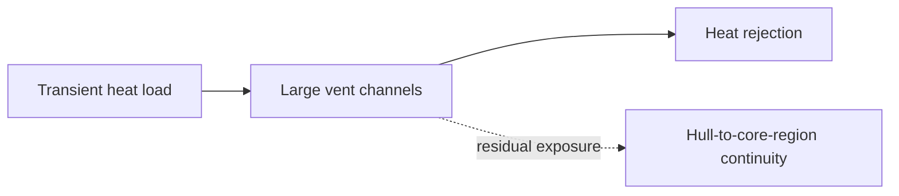

| Document ID | Classification | System | Document Owner | Status |
|---|---|---|---|---|
| `DS1-ADR-004` | IMPERIAL RESTRICTED | DS-1 Orbital Battle Station | Imperial Engineering Directorate — Architecture Authority | Accepted with recorded dissent / Controlled Document |

ACCESS: AUTHORIZED ENGINEERING PERSONNEL ONLY &middot; Unauthorized access will be logged and escalated to Sector Security Command.

# ADR-004 — Thermal Venting Topology

| Field | Value |
|---|---|
| **Status** | **Accepted with recorded dissent** |
| **Ruling authority** | Imperial Engineering Command (escalated from the Architecture Review Board, which did not reach concurrence) |
| **Date of ruling** | Programme Phase 3 |
| **Proposed again since** | 3 times |

!!! warning "Dissent is recorded, not resolved"

    The Architecture Review Board did not reach concurrence on this decision. It
    was escalated and ruled upon by Imperial Engineering Command. The dissenting
    position is recorded in §5 in full, because it remains the Directorate's
    technical assessment and because the residual risk is live.

## Context

Constraint `C-T-02`: waste heat must be rejected to vacuum. There is no other
sink. The reactor assembly produces the platform's dominant thermal load, and
that load must reach the hull.

Any thermal transport path from `Z0` to the hull is, by construction, a continuous
physical channel from the platform's most exposed surface to its most critical
volume. The design question is what shape that channel takes.

## Options Considered

### Option A — Many small distributed vents

| Property | Assessment |
|---|---|
| Thermal capacity | Adequate at steady state; **inadequate for armament charge transients** |
| Channel geometry | Many narrow paths; no single channel of significance |
| Structural | Many hull penetrations; each a discontinuity (`C-T-06`) |
| Verdict | Cannot absorb the transient load. Rejected on capacity. |

### Option B — Few large vents

| Property | Assessment |
|---|---|
| Thermal capacity | Adequate, including transients |
| Channel geometry | **Large continuous channels from hull to `Z0` region** |
| Structural | Few penetrations, each large |
| Verdict | Selected by Imperial Engineering Command |

### Option C — Intermediate thermal store with delayed rejection

| Property | Assessment |
|---|---|
| Thermal capacity | Adequate; absorbs transients, rejects at a controlled rate |
| Channel geometry | Small vents only; no large continuous channel |
| Mass and volume | **Substantial**; competes directly with `Z1` plant space |
| Programme impact | Estimated 14-month schedule extension |
| Verdict | Refused on schedule under `C-M-05` |

## Ruling

Option B. Thermal rejection is via a small number of large vent channels, with
capacity sized for armament charge transients.

## Consequences

**Thermal capacity and residual exposure**

The selected vent topology meets transient demand while retaining a physical exposure recorded in the dissent.

| Consequence | Detail |
|---|---|
| Transient thermal load is absorbed without a store | The requirement is met |
| Continuous channels exist between the hull and the `Z0` region | The dissent, §5 |
| Channel protection is by baffling, sensing and mechanical closure | Detection and delay, not prevention |
| Thermal rejection margin becomes a platform-level constraint | Gates propulsion and armament; on the permanent Overbridge picture |

## 5. Recorded Dissent (Imperial Engineering Directorate)

Reproduced from the Phase 3 Board minute:

> The Directorate's assessment is that Option B creates a continuous physical
> channel between the least protected surface of the platform and the volume
> containing its only generation source, and that the protective measures
> proposed — baffling, sensing, mechanical closure — are measures of detection
> and delay rather than of prevention.
>
> The Directorate accepts that Option A cannot meet the transient requirement.
> The Directorate does not accept that Option C was assessed on its technical
> merits; it was refused on programme schedule under `C-M-05`.
>
> The Directorate records that the residual risk arising from this decision is
> not, in its assessment, adequately characterised, and that it compounds
> directly with the residual risk of [ADR-001](adr-001-single-core-reactor.md).
> The two decisions share a single failure consequence.
>
> The Directorate requests that this dissent be carried forward into the risk
> register and reviewed at every readiness cycle rather than closed with this
> decision.

The request was granted. The dissent is carried in
[R-01](../risks/risk-register.md) and is reviewed at every readiness cycle. It has
been reviewed 11 times and has not been closed.

## Revisit Conditions

Revisited if:

1. A thermal store technology becomes available within the mass and volume budget
   (`C-T-04` structural allowance); or
2. The armament transient requirement is relaxed; or
3. Channel protection can be demonstrated to be preventive rather than
   detective — which the Directorate assesses as unlikely without Option C.

Three subsequent proposals have sought additional baffling. Each was accepted as
an improvement and each was recorded as not changing the dissent, because
additional baffling increases delay without changing the channel's existence.
