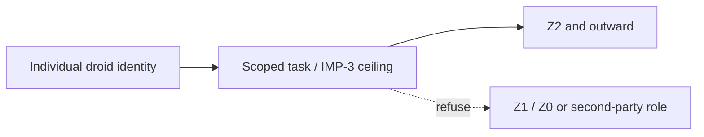

| Document ID | Classification | System | Document Owner | Status |
|---|---|---|---|---|
| `DS1-ADR-005` | IMPERIAL RESTRICTED | DS-1 Orbital Battle Station | Imperial Engineering Directorate — Architecture Authority | Accepted / Controlled Document |

ACCESS: AUTHORIZED ENGINEERING PERSONNEL ONLY &middot; Unauthorized access will be logged and escalated to Sector Security Command.

# ADR-005 — Droid Automation Boundary at IMP-3

| Field | Value |
|---|---|
| **Status** | Accepted |
| **Ruling authority** | Architecture Review Board, in concurrence with Sector Security Command |
| **Date of ruling** | Programme Phase 5 |
| **Proposed again since** | 5 times |

## Context

Droid labour is available in quantity and would materially reduce the
complement — with it, the life support load, the habitation volume, the
sustainment demand and the contractor exposure. The pressure to extend droid
authority is continuous and comes from every direction, including from within the
Directorate.

The question is not whether droids are capable. It is what a droid's action means
for attribution and for the two-person rule.

## Options Considered

### Option A — No clearance ceiling; droids are identities like any other

Rejected. It makes a droid class a single point of compromise across every zone
it can reach. A compromised droid class with `IMP-5` reaches `Z0`.

### Option B — Ceiling at `IMP-2`

Rejected as too restrictive. It excludes droids from sector control and sensor
operation, where they are demonstrably better than crew at sustained vigilance —
which is precisely the task humans perform worst on an eight-hour watch.

### Option C — Ceiling at `IMP-3`, with two further constraints

**Selected.**

## Ruling

**Automation ceiling**

A valid unit identity cannot substitute for an independent second human judgment.

| Rule | Detail |
|---|---|
| Clearance ceiling | `IMP-3`. Droids may reach `Z2`; they may not reach `Z1` or `Z0`. |
| Two-person rule | **A droid may never be the second party.** |
| Identity | One identity per unit. No class credentials. Individually and bulk revocable. |
| Attribution | Every droid action carries its causing directive reference, as for any actor. |
| Scope | Zone and sector scoped, exactly as for personnel. |

### Why a Droid Cannot Be the Second Party

The two-person rule does not require two credentials. It requires **two
independent judgements**, and its value is that the second party may refuse.

A droid executing a scripted concurrence is not a second judgement; it is the
first judgement, restated. Permitting it would convert every two-person control
on the platform into a one-person control while leaving the paperwork intact —
which is worse than removing the rule honestly, because the record would show a
control that was not operating.

This reasoning applies to `Z0` entry, armament charge holds, command handover and
both-side essential bus work.

## Consequences

| Consequence | Detail |
|---|---|
| Droids handle sustained vigilance tasks in `Z2` and outward | Sensor watch, sector monitoring, logistics tracking |
| `Z1` and `Z0` work is crewed | Full complement in critical plant; higher life support load |
| Two-person controls remain genuinely two-person | The decision's purpose |
| A compromised droid class is bounded to `Z2` and outward | The blast radius is defined |
| Complement cannot be reduced below the `Z1`/`Z0` crewing requirement | Sustainment cost is fixed by this decision |

## Revisit Conditions

Revisited if droid attestation reaches a standard at which a droid's refusal can
be demonstrated to be independent of its instruction — which is a claim about
the droid's construction, not about its behaviour, and is assessed by the
Directorate as not currently demonstrable.

Five proposals have sought to raise the ceiling, all citing complement reduction.
Each was refused on the two-person reasoning above, which the ceiling itself does
not address. **Note for future proposers:** a proposal that raises the ceiling
while preserving the two-person constraint would be assessed on its merits. None
of the five did.
