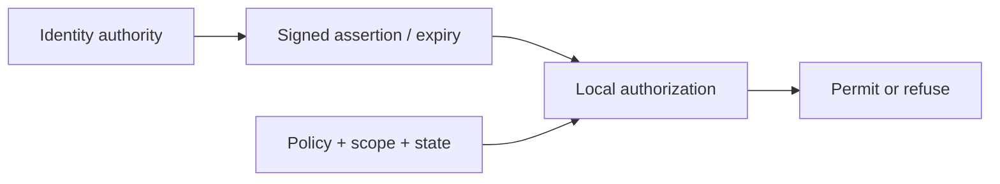

| Document ID | Classification | System | Document Owner | Status |
|---|---|---|---|---|
| `DS1-ADR-007` | IMPERIAL RESTRICTED | DS-1 Orbital Battle Station | Imperial Engineering Directorate — Architecture Authority | Accepted / Controlled Document |

ACCESS: AUTHORIZED ENGINEERING PERSONNEL ONLY &middot; Unauthorized access will be logged and escalated to Sector Security Command.

# ADR-007 — Identity Federation with Local Decision

| Field | Value |
|---|---|
| **Status** | Accepted |
| **Ruling authority** | Architecture Review Board, in concurrence with Sector Security Command |
| **Date of ruling** | Programme Phase 5 |
| **Proposed again since** | 2 times |

## Context

Constraint `C-M-03`: all Imperial platforms share a common identity and clearance
model. DS-1 may extend it; it may not replace it.

Requirement `FR-01`: the platform must be autonomous. It cannot depend on an
external system to function.

These pull against each other. Common identity implies an external authority;
autonomy forbids depending on one.

## Options Considered

### Option A — Fully local identity

DS-1 maintains its own identity and clearance store, unconnected.

Rejected. Violates `C-M-03`. It also means a clearance revoked Empire-wide is not
revoked aboard, which is the more serious problem in practice.

### Option B — Fully federated; decisions made externally

Every access decision is referred to the Imperial Identity Authority.

Rejected. Violates `FR-01` completely: the platform would be unable to authorize
anything without `IF-04`, including boundary transits, including during an
incident, including during transit when external interfaces are suspended by
design.

### Option C — Federated assertions, local decision

Clearance *assertions* originate externally and are cached; the *decision* is
always made aboard against locally held policy.

**Selected.**

## Ruling

**Assertions travel; decisions stay local**

Federated identity supplies evidence. Local authorization evaluates scope and platform state.

| Element | Location |
|---|---|
| Clearance assertions | Originate at the Imperial Identity Authority; delivered over `IF-04`, signed, inbound-only |
| Assertion cache | Aboard, with expiry |
| Authorization policy | Aboard, 2N, versioned and signed |
| **Decision** | **Always aboard.** Never referred externally. |
| Revocation | Externally issued, cached; **and locally issuable at any time by Sector Security Command** |

Degradation follows `FEDERATED` → `CACHED` → `LOCAL AUTHORITY` → `RECONCILING`,
as specified in
[Authentication and Authorization §5](../security/authentication-and-authorization.md#5-federation-and-degradation).

**At no point does the posture become more permissive.**

## Consequences

### Accepted

| Consequence | Detail |
|---|---|
| Platform authorizes fully without `IF-04` | `FR-01` satisfied; verified by the annual 72 h isolation exercise |
| Common Imperial identity model is honoured | `C-M-03` satisfied |
| Clearance elevation requires `IF-04` | Slow by design; no new grants are honoured in `CACHED` |
| Local suspension is always available | Restriction is fast, elevation is slow — the correct asymmetry |
| **A revocation issued externally during an outage does not reach the platform** | The residual, below |

### The Revocation Gap

If a clearance is revoked at Coruscant while `IF-04` is unavailable, the platform
does not learn of it until the interface is restored.

| Bound | Mechanism |
|---|---|
| Time | Assertion expiry. Cached assertions do not become permanent. |
| Scope | Sector Security Command may suspend any clearance aboard, immediately, on any local grounds. |
| Detection | Full reconciliation on `IF-04` restoration; every decision made in `CACHED` or `LOCAL` is replayed against the restored authority. |

The gap is **unclosable without a channel that does not exist**. It is bounded by
expiry, mitigated by local suspension, detected by reconciliation, and accepted.

### Realised Deficiencies

| Ref | Deficiency |
|---|---|
| `TD-35` | The two-officer manual authority procedure used in `NO-AUTH` is logged on paper, weakening [QS-08](../architecture/quality-requirements.md#qs-08-post-incident-audit-reconstruction) reconstruction for those periods |

## Revisit Conditions

Revisited if a channel becomes available that can deliver revocations under
`EMCON` and during transit, when `IF-04` is suspended by design rather than by
failure. No such channel exists, and one that did would itself be an external
dependency requiring assessment against `FR-01`.

Both subsequent proposals sought to shorten the assertion expiry to narrow the
revocation gap. Both were refused: a shorter expiry narrows the gap and
proportionally shortens the autonomous operating period, trading a bounded,
detected residual for an unbounded reduction in autonomy.
