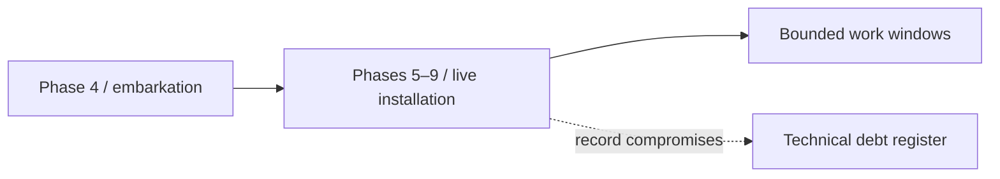

| Document ID | Classification | System | Document Owner | Status |
|---|---|---|---|---|
| `DS1-ADR-008` | IMPERIAL RESTRICTED | DS-1 Orbital Battle Station | Imperial Engineering Directorate — Programme Section | Accepted under recorded protest / Controlled Document |

ACCESS: AUTHORIZED ENGINEERING PERSONNEL ONLY &middot; Unauthorized access will be logged and escalated to Sector Security Command.

# ADR-008 — Live Commissioning from Phase 4

| Field | Value |
|---|---|
| **Status** | **Accepted under recorded protest** |
| **Ruling authority** | Imperial High Command |
| **Date of ruling** | Programme Phase 3 |
| **Consequences still open** | 11 technical debt items; 2 conditional commissioning gates |

## Context

Constraint `C-M-05`: the programme schedule is fixed by Imperial High Command.
Capability may be phased; the delivery date may not move.

Sequential commissioning — complete each phase, prove it, then admit crew —
was assessed by the Directorate at Phase 3 as requiring approximately 30 per
cent more elapsed time than the fixed schedule allowed.

## Options Considered

### Option A — Sequential commissioning

Complete all phases, prove each, embark crew at Phase 9.

| | |
|---|---|
| Technical quality | Highest. Every phase proved on a quiescent platform. |
| Schedule | **Exceeds the fixed date by approximately 30 per cent.** |
| Verdict | Refused under `C-M-05`. |

### Option B — Live commissioning from Phase 4

Embark crew once life support is proved; execute Phases 5–9 on an occupied,
progressively live platform.

| | |
|---|---|
| Schedule | Meets the fixed date |
| Technical quality | Compromised in specific, predictable ways |
| Verdict | **Ruled.** |

### Option C — Partial occupancy, critical phases quiescent

Embark crew at Phase 4 but execute Phases 5 and 6 with the platform quiescent
and the crew withdrawn.

| | |
|---|---|
| Schedule | Approximately 12 per cent over the fixed date |
| Technical quality | Substantially better than Option B |
| Verdict | Refused. The 12 per cent was not available. |

## Ruling

**Occupancy becomes a constraint**

Later installation work inherits the safety and access constraints of an occupied platform.

Option B. Crew embarked at Phase 4; Phases 5 through 9 executed on an occupied,
progressively live platform.

## Consequences

### What It Bought

| Benefit | Detail |
|---|---|
| Schedule met | The ruling's sole purpose |
| Habitability proved under real load | Life support faults found with people present to find them |
| Operational procedures developed against the real platform | `ORL-3` declared with a trained complement |

### What It Cost — All Still Open

| Debt | Consequence |
|---|---|
| `TD-01` | Trunk network diversity below specification |
| `TD-02` | Sixteen `Z1` plant rooms with legacy references; misrouted isolations |
| `TD-04` | No reference environment; `PREPROD` uses a live operational node |
| `TD-06` | Cultivation yield data gathered under non-representative conditions |
| `TD-11` | Six `Q-II` distribution boards without `N+1` partners |
| `TD-14` | Hyperdrive unit 4 on a temporary mounting |
| `TD-15` | Two stellar heads obscured by later structure |
| `TD-17` | Two long-range sensor heads sharing a distribution board |
| `TD-18` | Trunk rings 2 and 3 sharing a 4 km conduit run |
| `TD-20` | Eleven hangar bays with single-side containment |
| `TD-26` | `Q-III` medical capacity 18 per cent below standard |

Plus two commissioning gates closed with conditions that remain open: command
handover time (`TD-05`) and demonstrated sustainment (`TD-06`).

### The Pattern

**Every one of the eleven items is a redundancy or diversity compromise.**

Under schedule pressure, the second path is what gets cut, because a single path
passes its commissioning test on the day it is tested. The redundant path's value
is only realised later, by which time the programme has moved on and the omission
is a structural retrofit rather than an installation.

This is recorded as the programme's principal lesson in
[Deployment and Commissioning §6](../operations/deployment-and-commissioning.md#6-lessons-recorded).

## Recorded Protest (Imperial Engineering Directorate)

Reproduced from the Phase 3 programme minute:

> The Directorate accepts the authority of Imperial High Command to set the
> programme schedule and does not contest the ruling.
>
> The Directorate records that Option B will produce compromises in redundancy
> and diversity which will not be visible at commissioning, will not be visible
> at first operational service, and will become visible only under fault
> conditions after the programme has closed.
>
> The Directorate records that such compromises are structurally expensive to
> remedy after the fact, and that a programme which does not fund their remedy at
> the time of the ruling is unlikely to fund it later.
>
> The Directorate requests that a remediation budget be established at the time
> of this ruling rather than at the time of discovery.

**The remediation budget was not established.** Eleven of the resulting items
remain open, and four of them are blocked on `TD-04` — the absence of a reference
environment, which is itself one of the eleven.

## Revisit Conditions

The decision cannot be revisited; the platform is built. What remains open is the
remediation programme, which is reviewed at every Architecture Review Board and
reported to Imperial Engineering Command annually.

This record is retained at status `Accepted` rather than `Superseded`
specifically so that the protest and its outcome remain readable by future
programmes.
