| Document ID | Classification | System | Document Owner | Status |
|---|---|---|---|---|
| `DS1-ADR-000` | IMPERIAL RESTRICTED | DS-1 Orbital Battle Station | Imperial Engineering Directorate — Architecture Authority | Operational / Controlled Document |

ACCESS: AUTHORIZED ENGINEERING PERSONNEL ONLY &middot; Unauthorized access will be logged and escalated to Sector Security Command.

# Architecture Decision Records

arc42 chapter 9. Each record captures a decision that was binding, contested, or
both, in a fixed format: context, options considered, ruling, consequences,
and — where it applies — what would cause the decision to be revisited.

A decision is recorded here if reversing it would require structural work,
a change of authority, or a renegotiation with a body outside the Directorate.
Decisions that are merely detailed are held by the relevant System Authority.

## Register

| ID | Decision | Status | Ruling authority | Drives |
|---|---|---|---|---|
| [ADR-001](adr-001-single-core-reactor.md) | Single core reactor assembly | Accepted, forced | Imperial High Command | `S-3`, `R-01` |
| [ADR-002](adr-002-sector-autonomy.md) | Sector autonomy with bounded envelopes | Accepted | Architecture Review Board | `S-2` |
| [ADR-003](adr-003-network-segmentation.md) | Four enclaves aligned to zones; diodes to `Z0` | Accepted | Architecture Review Board | `S-1`, `S-4` |
| [ADR-004](adr-004-exhaust-venting-topology.md) | Thermal venting topology | Accepted with dissent | Imperial Engineering Command | `R-01` |
| [ADR-005](adr-005-droid-automation-boundary.md) | Droid automation boundary at IMP-3 | Accepted | Architecture Review Board | `CC-1` |
| [ADR-006](adr-006-hyperdrive-cluster.md) | Distributed hyperdrive cluster, 5-of-7 | Accepted | Architecture Review Board | `S-3` |
| [ADR-007](adr-007-identity-federation.md) | Identity federation with local decision | Accepted | Architecture Review Board | `S-4`, `QS-02` |
| [ADR-008](adr-008-live-commissioning.md) | Live commissioning from Phase 4 | Accepted under protest | Imperial High Command | 11 debt items |

## Decision Impact

```mermaid
flowchart LR
    A1["ADR-001<br/>Single core reactor"]
    A2["ADR-002<br/>Sector autonomy"]
    A3["ADR-003<br/>Enclaves and diodes"]
    A4["ADR-004<br/>Venting topology"]
    A5["ADR-005<br/>Droid boundary"]
    A6["ADR-006<br/>Hyperdrive 5-of-7"]
    A7["ADR-007<br/>Identity federation"]
    A8["ADR-008<br/>Live commissioning"]

    PG["Power Generation"]
    PD["Power Distribution"]
    CC["Command &amp; Control"]
    NET["Network Segmentation"]
    PRO["Propulsion"]
    ACC["Access Control"]
    ALL["Every system"]

    R1["R-01 concentrated<br/>vulnerability"]
    DEBT["11 technical<br/>debt items"]

    A1 --> PG
    A1 --> PD
    A1 --> R1
    A2 --> CC
    A3 --> NET
    A3 --> PG
    A4 --> PG
    A4 --> R1
    A5 --> ACC
    A6 --> PRO
    A7 --> ACC
    A7 --> CC
    A8 --> ALL
    A8 --> DEBT

    style R1 fill:#1a1010,stroke:#a83c33
    style DEBT fill:#1a1010,stroke:#a83c33
```

Two decisions converge on `R-01`, and one decision is the origin of eleven debt
items. Those three are the ones to read first.

## On the ADR Format

The Directorate adopted the Architecture Decision Record format because a
decision without its rejected alternatives is not a decision, it is an
instruction. An engineer who does not know what was considered and refused will
propose it again — and on an 18-month rotation cycle (`C-O-04`), will do so
roughly every 18 months.

Several records below include a **"Proposed again since"** count for this reason.
