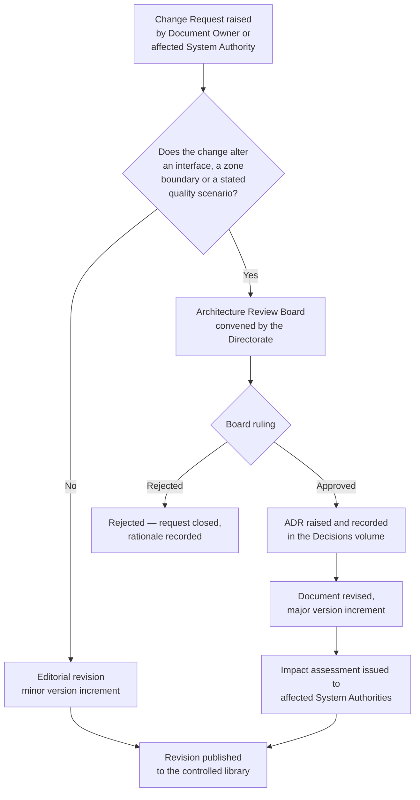

<div class="doc-control" markdown>

| Document ID | Classification | System | Document Owner | Status |
|---|---|---|---|---|
| `DS1-REF-001` | IMPERIAL RESTRICTED | DS-1 Orbital Battle Station | Imperial Engineering Directorate — Documentation Systems Section | Operational / Controlled Document |

ACCESS: AUTHORIZED ENGINEERING PERSONNEL ONLY &middot; Unauthorized access will be logged and escalated to Sector Security Command.
</div>

# Document Control

This page governs every other document in the DS-1 library. It defines
classification handling, document identity, revision control, ownership and the
approval path for change.

## 1. Classification Scheme

| Marking | Applies to | Handling |
|---|---|---|
| `IMPERIAL UNCLASSIFIED` | Nomenclature, unit conventions, non-attributable procedure | May be quoted in contractor-facing work packets |
| `IMPERIAL RESTRICTED` | The whole of this library unless otherwise marked | Authenticated Directorate identity required; access logged |
| `IMPERIAL SECRET` | As-built defect data, force disposition, cryptographic material | Not held in this library; referenced by pointer only |

Every page in this library is `IMPERIAL RESTRICTED` by default. A page may not be
downgraded by its author; downgrade requires a ruling from the Directorate
Classification Authority.

!!! danger "Handling obligation"

    Reproduction of any page in this library outside an authenticated Directorate
    session — including transcription, imaging, verbal dictation and paraphrase
    into an unclassified work packet — constitutes an unauthorized disclosure and
    is reportable under Imperial Security Directive 1138. Unauthorized access
    will be logged and escalated.

## 2. Document Identity

Identifiers are permanent. A document that is superseded retains its identifier;
the superseding document receives a new one and the old page is marked
`Superseded` rather than deleted.

```
DS1 - ARCH - 007
 |      |      |
 |      |      +-- Sequence, three digits, assigned by the Documentation Systems Section
 |      +--------- Volume code
 +---------------- Platform code, fixed
```

| Volume code | Volume | Example |
|---|---|---|
| `ARCH` | Architecture (arc42 core and extensions) | `DS1-ARCH-005` Building Block View |
| `ENG` | System engineering descriptions | `DS1-ENG-020` Power Generation |
| `OPS` | Operations, sustainment and readiness | `DS1-OPS-020` Incident Response |
| `SEC` | Security architecture and controls | `DS1-SEC-010` Access Control Model |
| `ADR` | Architecture Decision Records | `DS1-ADR-001` Single Core Reactor |
| `RSK` | Risk and technical debt registers | `DS1-RSK-001` Risk Register |
| `REF` | Reference material | `DS1-REF-010` Glossary |
| `DRG` | Controlled engineering drawings | `DS1-DRG-001` General Arrangement |

The complete allocation is held in the [Identifier Scheme](reference/identifier-scheme.md).

## 3. Ownership and Status

Each document names a **Document Owner** — an organisational unit, never an
individual. The owner is accountable for technical accuracy and for the review
cadence. Personnel change; ownership does not.

| Status | Meaning |
|---|---|
| `Draft` | Not binding. May not be cited in a work packet. |
| `In Review` | Content frozen, under Directorate review. |
| `Operational / Controlled Document` | Binding. Cited by work packets and audits. |
| `Superseded` | Retained for audit; carries a forward pointer to its replacement. |
| `Withdrawn` | Retained for audit; the described system no longer exists. |

## 4. Change Control Path

Any change to a controlled document follows the same path regardless of size.
There is no expedited route for editorial corrections.



**Design deviation requires approval from Imperial Engineering Command.** A
change implemented in the physical platform ahead of its documentation approval
is a non-conformance and is raised against the implementing System Authority,
not against the Directorate.

## 5. Review Cadence

| Volume | Scheduled review | Trigger review |
|---|---|---|
| Architecture | Annual | Any approved ADR |
| Systems | Annual | Modification order affecting the system |
| Operations | Semi-annual | Any Class-1 incident |
| Security | Quarterly | Any security event of Class 2 or above |
| Risks | Quarterly | Change in risk severity or the addition of a new risk |
| Reference | Annual | Introduction of a new volume code or interface |

## 6. Conventions Used Throughout

- **Zones** are written `Z0`–`Z4`; see [Security Zones](security/security-zones.md).
- **Surface sectors** are written `<BAND>-<MERIDIAN>`, e.g. `N1-060`; see [Zone and Sector Architecture](architecture/zone-and-sector-architecture.md).
- **Readiness** is written `ORL-0`–`ORL-5`; see [Operating Model](operations/operating-model.md).
- **Severity chips** appear as <span class="chip critical">Critical</span> <span class="chip high">High</span> <span class="chip medium">Medium</span> <span class="chip low">Low</span> <span class="chip nominal">Nominal</span>.
- Times are standard Imperial Time (IT), 24-hour, referenced to Coruscant Central.
- Quantities that would constitute constructional detail are given as design
  envelopes and system-level behaviour only. This is deliberate; see §7.

## 7. Scope Limitation on Reactor and Armament Content

This library describes the reactor assembly and the primary armament **only at
the architectural level**: their interfaces, control authority, failure modes,
zone placement, power relationships and operating constraints.

It contains no constructional detail, no material specification, no energy
formulation and no assembly or commissioning procedure for either system. That
material is held by the Reactor Systems Authority and the Ordnance Systems
Authority respectively, under separate classification and a separate access
path. Requests are made through your System Authority, never through this
library.
