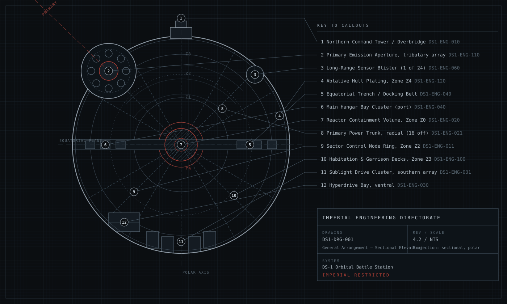

Galactic Empire &middot; Imperial Engineering Directorate
DS-1 Orbital Battle Station
Controlled Technical Documentation &middot; Master Library
Imperial Restricted
Unauthorized disclosure, duplication or dissemination is prohibited under Imperial Security Directive 1138. Access to this library is recorded against your service identity and retained for the operational life of the programme.

| Document ID | Classification | System | Document Owner | Status |
|---|---|---|---|---|
| `DS1-ARCH-000` | IMPERIAL RESTRICTED | DS-1 Orbital Battle Station | Imperial Engineering Directorate | Operational / Controlled Document |

ACCESS: AUTHORIZED ENGINEERING PERSONNEL ONLY &middot; Unauthorized access will be logged and escalated to Sector Security Command.

# Master Architecture Library

This library is the authoritative architectural description of the **DS-1 Orbital
Battle Station**: a self-sustaining, mobile, crewed military installation of
approximately 160 kilometres diameter, operated as a single integrated platform
under Imperial Fleet Command.

It is maintained by the Imperial Engineering Directorate and is binding on all
design, construction, commissioning, modification and operational activity
affecting the station. Where an implementation differs from this library, the
implementation is non-conformant until either the implementation is corrected or
a deviation is approved under [DS1-SEC-040](security/publication-and-access-control.md).

<figure class="blueprint" markdown>

<figcaption>DS1-DRG-001 &middot; General Arrangement &mdash; Sectional Elevation &middot; Rev 4.2</figcaption>
</figure>

## Platform Summary

<figure class="blueprint" markdown>

<figcaption>DS1-DRG-101 · Station section and sector addressing · Rev 01</figcaption>
</figure>

Read zone depth and surface sector as independent coordinates. Open the
[drawing register](reference/visual-language.md) for the subsystem plates,
line conventions and accessible descriptions.

| Attribute | Value | Notes |
|---|---|---|
| Designation | DS-1 Orbital Battle Station | Programme name *Ultimate Weapon* is deprecated in engineering documentation |
| Class | Deep Space Mobile Battle Station | Single unit; DS-2 is a separate programme |
| Nominal diameter | 160 km | Hull datum to hull datum through the polar axis |
| Habitable volume | Distributed across 5 concentric zones | See [Zone and Sector Architecture](architecture/zone-and-sector-architecture.md) |
| Complement | ~1.7 M crew, garrison, contractors and support | See [Crew and Garrison](systems/crew-and-garrison.md) |
| Addressable surface sectors | 72 | Designation `<BAND>-<MERIDIAN>`; see [DS1-DRG-003](architecture/zone-and-sector-architecture.md) |
| Mobility | Sub-light manoeuvring plus hyperdrive transit | See [Propulsion](systems/propulsion.md) |
| Sustainment | Autonomous for 3 standard years at ORL-3 | See [Supply and Replenishment](operations/supply-and-replenishment.md) |
| Current readiness | **ORL-3 — Operational, restricted** | See [Operating Model](operations/operating-model.md) |

## How This Library Is Organised

The library follows the arc42 template for its architectural core, extended with
the system, operations and security volumes required for a platform of this
scale. Every page carries a controlled document identifier.

### Architecture
The arc42 core: goals, constraints, context, strategy, structure, behaviour,
deployment, cross-cutting concepts and quality requirements.

[Open volume &rarr;](architecture/index.md)

### Systems
Per-system engineering descriptions: command and control, power, propulsion,
sensors, communications, hangars, transit, life support and defensive systems.

[Open volume &rarr;](systems/index.md)

### Operations
How the platform is run: operating model, observability, incident response,
maintenance windows, supply, disaster recovery and commissioning.

[Open volume &rarr;](operations/index.md)

### Security
Zone model, access control, authentication and authorization, network
segmentation, and the publication controls protecting this library.

[Open volume &rarr;](security/index.md)

### Decisions
Architecture Decision Records. Each records the context, options, ruling and
consequences of a binding design decision.

[Open volume &rarr;](decisions/index.md)

### Risks
The programme risk register and the technical debt register, with owners,
severities and review cadence.

[Open volume &rarr;](risks/index.md)

### Reference
Glossary, identifier scheme, external interface register and the arc42
conformance matrix.

[Open volume &rarr;](reference/index.md)

## Reading Order for New Engineering Personnel

1. [Document Control](document-control.md) — how this library is governed, and what the classifications oblige you to do.
2. [Introduction and Goals](architecture/introduction-and-goals.md) — what the platform is for and who it answers to.
3. [Zone and Sector Architecture](architecture/zone-and-sector-architecture.md) — the addressing scheme used by every other document.
4. [Building Block View](architecture/building-block-view.md) — the decomposition your assignment sits inside.
5. The [Systems](systems/index.md) volume entry for your assigned system.
6. [Incident Response](operations/incident-response.md) — before your first watch, not after.

!!! warning "Standing notice"

    Sections of this library describe the platform as designed, not as built.
    Divergences between design and as-built state are tracked in the
    [Technical Debt Register](risks/technical-debt.md). Personnel performing
    physical work must confirm as-built state against the sector work packet
    before commencing. **Design deviation requires approval from Imperial
    Engineering Command.**
