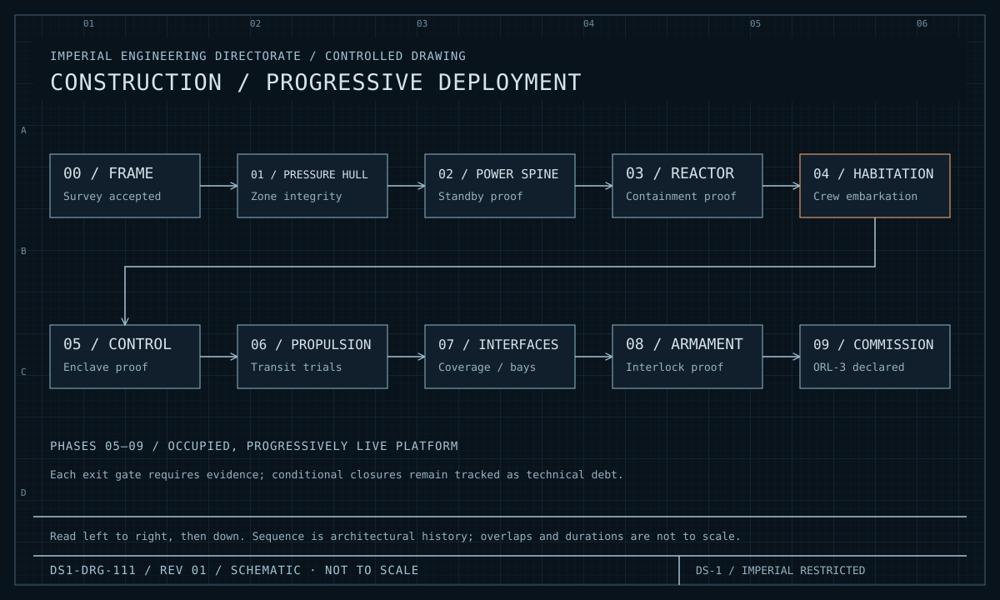
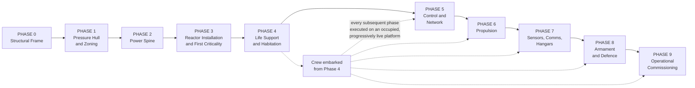

| Document ID | Classification | System | Document Owner | Status |
|---|---|---|---|---|
| `DS1-OPS-060` | IMPERIAL RESTRICTED | DS-1 Orbital Battle Station | Imperial Engineering Directorate — Programme Section | Operational / Controlled Document |

ACCESS: AUTHORIZED ENGINEERING PERSONNEL ONLY &middot; Unauthorized access will be logged and escalated to Sector Security Command.

# Deployment and Commissioning

## 1. Purpose

The construction and commissioning history of the platform, and — more usefully —
the specific consequences of that history that remain live in the architecture
today.

This is not a historical note. Eleven of the entries in the
[Technical Debt Register](../risks/technical-debt.md) trace directly to decisions
recorded here, and an engineer who does not know why a system is shaped the way
it is will propose changes that have already been refused.

## 2. Construction and Commissioning Phases

<figure class="blueprint" markdown>

<figcaption>DS1-DRG-111 · Construction / progressive deployment · Rev 01 · Schematic, not to scale</figcaption>
</figure>

Crew embarkation at Phase 4 changes the operating constraint for every subsequent phase. Exit gates remain evidence-based even where work overlaps.

### Phase Summary

| Phase | Content | Gate to exit |
|---|---|---|
| 0 | Structural frame, primary load paths | Structural survey accepted |
| 1 | Pressure hull, zone boundaries, bulkheads | Pressure integrity proved by zone |
| 2 | Trunk buses, ring buses, distribution boards, standby generation | Distribution proved on standby generation alone |
| 3 | Reactor installation, containment, first criticality | Containment proved; `Z0` boundary sealed and two-person rule in force |
| 4 | Life support plant, habitation, **crew embarkation begins** | Habitability proved per life support group |
| 5 | Control network, sector nodes, enclaves, gateways | Enclave segregation proved; `NO-AUTH` behaviour verified |
| 6 | Sub-light arrays, hyperdrive cluster, drive control | Transit trials |
| 7 | Sensor apertures, communications, hangar bays | Coverage survey; hangar throughput trials |
| 8 | Defensive systems, armament installation and interlocks | Interlock chain verified; refusal behaviour verified |
| 9 | Operational commissioning; readiness exercises | `ORL-3` declared |

## 3. The Live Commissioning Decision

Crew embarked at Phase 4. Every phase from 5 onward was executed on an occupied,
progressively live platform.

This was forced by `C-M-05` — a fixed programme schedule set by Imperial High
Command — and is recorded as
[ADR-008](../decisions/adr-008-live-commissioning.md). The Directorate's position
at the time was that the schedule was not achievable with sequential
commissioning; the schedule did not move.

### What It Bought

| Benefit | Effect |
|---|---|
| Phases 5–9 overlapped with occupancy rather than following it | Approximately 30 per cent programme compression |
| Habitability proved early, under real load | Life support faults found with people aboard to find them |
| Operational procedures developed against the real platform | `ORL-3` declared with a trained complement, not a new one |

### What It Cost

Every item below is still live. None is closed.

| Debt | Origin | Current impact |
|---|---|---|
| `TD-01` | Phase 5 network installed around occupied compartments; routing compromises accepted | Trunk ring diversity below specification |
| `TD-02` | Sixteen `Z1` plant rooms commissioned before the sector scheme was final | Legacy references; manual translation of work orders; misrouted isolations |
| `TD-04` | No quiescent platform available for a reference environment | `PREPROD` uses a real operational node; window overruns |
| `TD-06` | Cultivation established late; yield data gathered under non-representative conditions | Sustainment forecast error |
| `TD-11` | Six `Q-II` distribution boards commissioned without `N+1` partners | Those sectors have no distribution redundancy |
| `TD-14` | Hyperdrive unit 4 mounted temporarily to meet a phase gate | Reduced structural allowance; first to de-rate |
| `TD-15` | Structure added in Phase 7 obscures two stellar heads | Navigation degraded across ~15 per cent of attitudes |
| `TD-17` | Two long-range sensor heads share a distribution board | Single board fault opens a designed-out coverage gap |
| `TD-18` | Trunk rings 2 and 3 share a 4 km conduit run | Two of four rings lost to one structural event |
| `TD-20` | Eleven hangar bays commissioned with single-side containment | Permanently `RECOVERY-ONLY` |
| `TD-26` | `Q-III` medical capacity 18 per cent below standard | Casualty reception saturates faster |

**A pattern is visible and is stated deliberately: every one of these is a
redundancy or diversity compromise.** Under schedule pressure, the thing that was
cut was consistently the second path, because a single path works on the day it
is commissioned. This is the most important lesson the programme has to offer and
it is recorded here rather than in a lessons-learned annex nobody reads.

## 4. Commissioning Gates Still In Force

Two Phase-9 gates were closed with conditions, and the conditions remain open.

| Gate | Condition | Status |
|---|---|---|
| Command handover verified | Closed with a handover time of 26 min against a 15 min requirement, on the basis that remediation was funded | `TD-05` — remediation in design, gate condition still open |
| Sustainment verified | Closed on a modelled 3-year endurance rather than a demonstrated one | `TD-06` — model revision in progress, gate condition still open |

Both are reported at every Architecture Review Board. Neither has been closed.

## 5. Modification Programme

Post-commissioning change follows the deployment path in
[Deployment View §7.3](../architecture/deployment-view.md#73-change-propagation-to-production):
`DEV` → `INT` → `PREPROD` → canary sector → quadrant-by-quadrant.

| Modification class | Approval | Window |
|---|---|---|
| Configuration | Engineering Officer of the Watch | `W-ROUTINE` |
| Software, single system | Architecture Review Board | `W-EXTENDED` |
| Software, cross-system | Architecture Review Board + affected System Authorities | `W-EXTENDED` |
| Hardware, in-service | Imperial Engineering Command | `W-MAJOR` |
| Structural | Imperial Engineering Command | `W-STRUCTURAL` |
| `Z0` containment control | Imperial Engineering Command, full down-state | Twice since commissioning |

## 6. Lessons Recorded

Held here because they are binding on future work, not as reflection.

1. **Under schedule pressure, redundancy is what gets cut**, because a single
   path passes its commissioning test. Eleven of the debt items above are the
   same decision made eleven times.
2. **A reference environment is not optional infrastructure.** Its absence
   (`TD-04`) now blocks the remediation of four other debt items, three of which
   were themselves caused by commissioning compromises.
3. **Documentation written after the fact is written wrong.** `TD-02` exists
   because sixteen plant rooms were commissioned before the naming scheme was
   settled, and the reconciliation has never been completed.
4. **Conditional gate closure becomes permanent.** Both conditions in §4 were
   expected to close within a year. Neither has.
