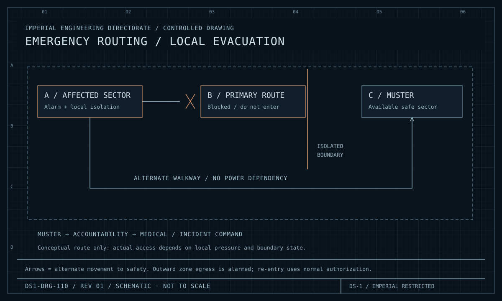
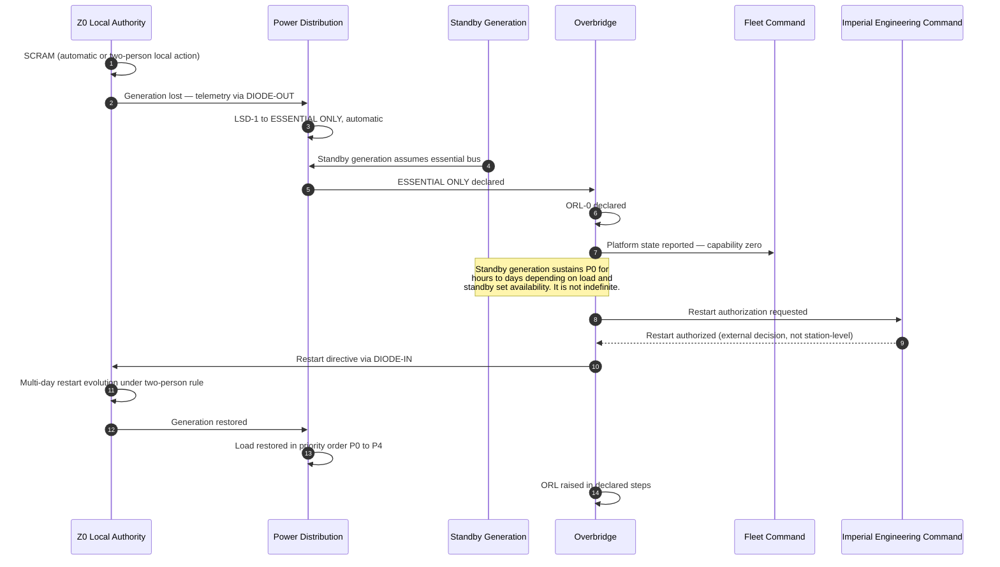

| Document ID | Classification | System | Document Owner | Status |
|---|---|---|---|---|
| `DS1-OPS-050` | IMPERIAL RESTRICTED | DS-1 Orbital Battle Station | Imperial Engineering Directorate — Operations Section | Operational / Controlled Document |

ACCESS: AUTHORIZED ENGINEERING PERSONNEL ONLY &middot; Unauthorized access will be logged and escalated to Sector Security Command.

# Disaster Recovery

## 1. Scope and Honesty Statement

This document states what the platform can recover from, how long it takes, and
**what it cannot recover from at all**.

The third category is not an omission. A recovery plan that claims coverage it
does not have is worse than no plan, because operational decisions are taken on
the strength of it. Section 5 exists for that reason and is not softened.

## 2. Recovery Objectives

| Loss | Recovery objective | Recovery point | Demonstrated |
|---|---|---|---|
| Sector Control Node | 0 (N+1 partner carries) | No loss | Yes, routinely |
| Sector Distribution Board | 0 (N+1 partner carries) | No loss | Yes, routinely |
| Quadrant Ring Bus | < 3 s transfer | No loss | Yes, quarterly exercise |
| Main Trunk Bus (one) | < 3 s transfer | No loss | Yes, exercised |
| Life support group, one side | 0 (2N partner carries) | No loss | Yes |
| Life support group, both sides | Hours (emergency transfer + evacuation) | No data loss; habitability loss | Partially — exercised at reduced scale |
| Quadrant Command Post | Sectors `DETACHED` immediately; post restored in hours | Reconciled on restoration | Yes |
| Overbridge | **15 min target / 26 min actual** | Command Log intact in 4 replicas | Yes — and the target is not met (`TD-05`) |
| Authorization Service, one instance | 0 (2N partner carries) | No loss | Yes |
| Authorization Service, both instances | Manual two-officer authority immediately | No loss | Yes, exercised |
| External interfaces, all | 0 — platform is autonomous | Queued and reconciled | Yes, 72 h exercise annually |
| Hyperdrive below 5 units | Mobility lost; platform otherwise nominal | N/A | Not exercised — see §5 |
| Reactor `SCRAM` | Essential bus on standby generation; restart is multi-day | No data loss | Twice, both during commissioning |
| **Reactor loss with containment failure** | **None** | **N/A** | **See §5** |

## 3. Recovery Sequences

<figure class="blueprint" markdown>

<figcaption>DS1-DRG-110 · Emergency routing / local evacuation · Rev 01 · Schematic, not to scale</figcaption>
</figure>

This local evacuation schematic illustrates route selection around an isolated compartment. It is not a station-wide escape plan and does not imply recovery from containment failure.

### Reactor `SCRAM`

**Restart is not a station-level decision.** It requires Imperial Engineering
Command authorization in each instance. Both `SCRAM` events since construction
occurred during commissioning; neither occurred in operational service.

### Overbridge Loss

| Step | Action | Time |
|---|---|---|
| 1 | Quadrant posts continue on last authorized directives; sectors remain `LINKED` | Immediate |
| 2 | Surviving senior officer determines the Overbridge is unable to exercise authority | Variable |
| 3 | Declared handover initiated — two-party, logged | — |
| 4 | Alternate Overbridge state synchronisation completed | **The 26-minute figure lives here** |
| 5 | Command authority assumed and announced to all quadrants | — |
| 6 | Command Log reconciled across all four replicas | Concurrent |

No automatic failover occurs at any point. See
[Building Block View §5.2](../architecture/building-block-view.md#52-level-2-command-and-control-ds1-eng-010)
for why.

### Loss of All External Interfaces

The platform is designed to be indifferent to this and treats it as a degraded
state, not a disaster.

| Interface lost | Consequence |
|---|---|
| `IF-01` | Strategic tasking queues; store-and-forward retains |
| `IF-02` | Navigation to `NO-BEACON`; transit permitted with extended margin |
| `IF-03` | Local sensor picture only |
| `IF-04` | Cached clearances to expiry, then local fallback authority ([ADR-007](../decisions/adr-007-identity-federation.md)) |
| `IF-05` | Consumption against held stock; forecast continues |
| `IF-06` | Bays closed; no unverified approach accepted |

Verified annually by a 72-hour isolation exercise. The design target is 30 days
of full controllability, modelled but not exercised at full duration.

## 4. What Is Preserved

| Asset | Preservation | Survives |
|---|---|---|
| Command Log | Append-only, 4-way replicated, one per quadrant | Loss of any three quadrants |
| Security audit store | Separate from the Command Log, 4-way replicated | Loss of any three quadrants |
| Astrogation database | Signed, 4-way replicated | Loss of any three quadrants |
| Authorization policy | 2N, pole-split | Loss of either pole |
| This documentation library | Replicated per quadrant; also held off-platform by the Directorate | Loss of the platform |

## 5. What Cannot Be Recovered

Stated plainly.

### 5.1 Loss of the Reactor with Containment Failure

**There is no recovery.** The platform's dominant risk
([R-01](../risks/risk-register.md)) has no recovery path, only prevention and
mitigation, and the mitigations do not sum to a recovery.

| Measure | What it does | What it does not do |
|---|---|---|
| 2N containment field | Contains an excursion | Does not survive a sufficient external insult |
| `Z0` physical isolation, two-person rule | Removes the insider actuation path | Does not remove the structural target |
| Diode-only connectivity | Removes the remote actuation path | Does not remove the physical one |
| Standby generation | Sustains life for hours to days after `SCRAM` | Does not sustain the platform, and does not apply to containment failure |

This is accepted at Imperial High Command level, not at Directorate level. It is
recorded in [ADR-001](../decisions/adr-001-single-core-reactor.md) as a consequence
of constraint `C-T-01`, not as a design choice the Directorate made freely.

### 5.2 Loss of Mobility

Hyperdrive availability below 5 of 7 removes transit capability with no automatic
mitigation. The platform remains fully functional and cannot leave. Recovery
requires either repair — which for the hyperdrive cluster requires a down-state —
or external assistance, which is itself an external dependency the architecture
otherwise refuses.

This scenario is **not exercised**, because exercising it would require
deliberately disabling three hyperdrive units.

### 5.3 Simultaneous Loss of Both Poles

The Overbridge, the Alternate Overbridge and both Authorization Service instances
are pole-split for maximum separation. An event affecting both poles removes
command authority and authorization simultaneously. Sectors would hold in
`DETACHED` on their last authorized configuration and progressively enter `SAFE`.

There is no designed recovery. Maximum physical separation within a single hull
is a bounded quantity, and this is that bound.

### 5.4 Documentation Divergence Beyond Reconstruction

If the as-built platform diverges far enough from this library, the library
ceases to be a control and becomes a hazard — work packets would be correct
against a platform that no longer exists.

`TD-32` records that documentation conformance sampling runs at roughly 6 per
cent against a 20 per cent target. This is the slowest-moving item in this
section and the one most likely to be underestimated.

## 6. Exercise Programme

| Scenario | Cadence | Last result |
|---|---|---|
| Ring bus transfer | Quarterly, rotating quadrant | 1.8 s — within target |
| Sector breach and isolation | Semi-annual, rotating sector | 5.4 s seal; muster 3 min 40 s except `Q-III` |
| External isolation, 72 h | Annual | Clean; no unauthorized authorizations granted |
| Command handover | Annual | 26 min against 15 min target — **not met** |
| Audit reconstruction | Quarterly, and after every Class-1 | Within 48 h |
| Standby generation under load | Monthly | All eight sets available |
| Life support group both-side loss | Annual, reduced scale | Partial — full-scale exercise not authorized |
| Reactor `SCRAM` recovery | **Not exercised** | Cannot be exercised on a live platform |
