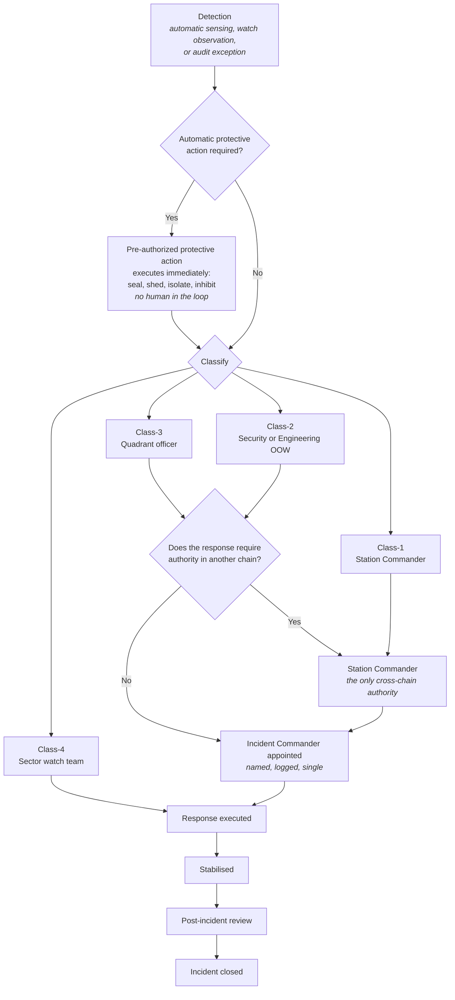

| Document ID | Classification | System | Document Owner | Status |
|---|---|---|---|---|
| `DS1-OPS-020` | IMPERIAL RESTRICTED | DS-1 Orbital Battle Station | Imperial Engineering Directorate — Operations Section | Operational / Controlled Document |

ACCESS: AUTHORIZED ENGINEERING PERSONNEL ONLY &middot; Unauthorized access will be logged and escalated to Sector Security Command.

# Incident Response

## 1. Incident Classification

An incident is any event requiring a response beyond the routine authority of the
watch. Classification determines who commands it and what it interrupts.

| Class | Definition | Commanded by | Interrupts |
|---|---|---|---|
| `Class-1` | Life safety, containment, or loss of a critical system | Station Commander or a named deputy | Everything. All windows abort. |
| `Class-2` | Security event, or loss of a redundant critical element | Security or Engineering Officer of the Watch, per domain | Routine activity in the affected zone |
| `Class-3` | Degradation, procedural failure, or budget breach | Quadrant officer of the relevant chain | Nothing; handled within the watch |
| `Class-4` | Defect or observation | Sector watch team | Nothing; raised into the maintenance backlog |

**Classification is not negotiable downward during an incident.** An incident may
be escalated at any time by anyone; it may only be de-escalated by the authority
commanding it, and only with the reason recorded.

## 2. Escalation Path

The three watch chains (`C-O-02`) meet only at the Station Commander. Escalation
across chains is therefore an explicit designed path.

Two properties of this diagram matter more than the rest:

1. **Automatic protective action happens before classification.** Sealing a
   bulkhead, shedding load and inhibiting the armament are pre-authorized and do
   not wait for anyone to decide what kind of incident this is.
2. **An incident has exactly one commander at a time**, named and logged. Split
   command during an incident has been the proximate cause of two of the four
   Class-1 incidents recorded since commissioning.

## 3. Incident Command

| Responsibility | Held by the Incident Commander |
|---|---|
| Declaring and changing incident class | Yes |
| Directing the response | Yes |
| Authorizing boundary openings for response entry | Via the Quadrant Command Post, logged per entry |
| Requesting cross-chain authority | Via the Station Commander only |
| Declaring stabilisation | Yes |
| **Closing the incident** | **No** — closure follows the review |

The Incident Commander cannot close their own incident. Closure is a governance
act by the Directorate, not an operational one.

## 4. Response Locality

Response is answered from within the zone, never across a boundary. This is why
damage control parties and medical teams are stationed inside the zones they
serve rather than centrally — see
[Internal Transit §4](../systems/internal-transit.md#4-mitigations-for-the-transit-cost).

| Zone | Response stationed in | Rationale |
|---|---|---|
| `Z0` | `Z0`, two-person constituted | A `Z0` response cannot wait for a two-person boundary transit |
| `Z1` | `Z1`, per life support group | Plant incidents are time-critical |
| `Z2` | `Z2`, per quadrant | — |
| `Z3` | `Z3`, per sector | Largest population; highest incident rate |
| `Z4` | `Z4`, per hangar belt sector | Hull and containment events |

## 5. Class-1 Response Timeline

Timings are requirements, verified at exercise.

| Elapsed | Required |
|---|---|
| 0 s | Detection |
| < 8 s | Automatic protective action complete (seal, shed, isolate) |
| < 30 s | Class-1 declared, Incident Commander appointed |
| < 90 s | Response party moving |
| < 4 min | Muster complete in adjacent sectors, reported per sector |
| < 15 min | Platform state impact assessed and reported to Fleet Command |
| Variable | Stabilisation |
| < 48 h | Reconstruction of the decision chain available ([QS-08](../architecture/quality-requirements.md#qs-08-post-incident-audit-reconstruction)) |
| < 14 days | Post-incident review complete; incident closed |

## 6. Post-Incident Review

Mandatory for every `Class-1` and every `Class-2`. It is not optional, not
deferrable and not delegable to the responding chain.

| Element | Requirement |
|---|---|
| Reconstruction | Full causal chain from the Command Log, ordered by logical sequence, not timestamp |
| Attribution | What each actor did and under what authority |
| Refusals | Every authorization refused during the incident, and whether the refusal was correct |
| Automatic actions | Every pre-authorized action taken, and whether it was appropriate |
| Documentation conformance | Did this library describe the platform accurately? Discrepancies are raised against the library |
| Outcome | Findings against systems, against procedures, or against this library — never against individuals in the first instance |

!!! note "Findings are raised against systems, not people"

    A review that concludes "the operator should have noticed" has not finished.
    The question is why the platform required them to notice. This is
    [CC-7](../architecture/crosscutting-concepts.md#cc-7-human-factors-and-command-ergonomics)
    applied after the fact, and it is the reason the alert budget and the
    refusal-reason requirements exist at all — both originated as post-incident
    findings.

## 7. Security Incidents

Security events follow the same classification but a different chain and a
different store.

| Property | Difference from an engineering incident |
|---|---|
| Chain | Security Officer of the Watch → Sector Security Command |
| Store | Security audit store, separate from the Command Log |
| Disclosure | Findings are not published to the general engineering population |
| Cross-chain | Engineering support is requested through the Station Commander |
| Escalation | A Class-2 security event escalates to Sector Security Command automatically, without Station Commander involvement |

The automatic escalation is deliberate: a security event that a station authority
would prefer not to escalate is exactly the event that must be escalated.

## 8. Incident Record

Since commissioning:

| Class | Count | Notable pattern |
|---|---|---|
| `Class-1` | 4 | Two involved split incident command; both produced the single-commander rule now in §3 |
| `Class-2` | 61 | 38 were boundary security events, of which 31 involved contractor personnel |
| `Class-3` | 940+ | Dominated by alert budget breaches from three legacy sector nodes (`TD-31`) |
| `Class-4` | Not individually tracked | Aggregated into the maintenance backlog |

The 31 contractor-related boundary events across 61 Class-2 incidents is the
empirical basis for [R-04](../risks/risk-register.md). None resulted in a
successful unauthorized transit; all were refused at the boundary and detected.
The concern is the rate, not the outcome to date.
