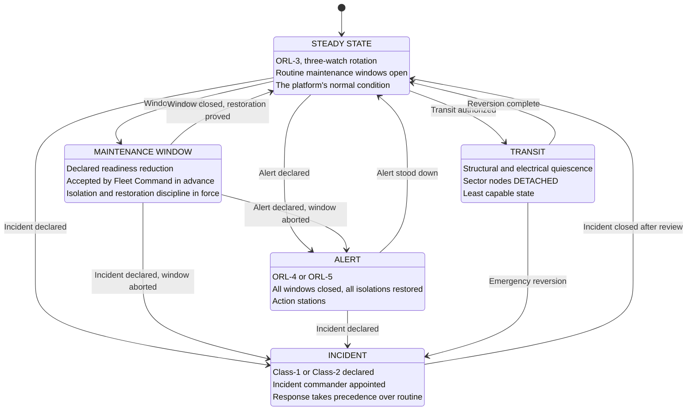

| Document ID | Classification | System | Document Owner | Status |
|---|---|---|---|---|
| `DS1-OPS-001` | IMPERIAL RESTRICTED | DS-1 Orbital Battle Station | Imperial Engineering Directorate — Operations Section | Operational / Controlled Document |

ACCESS: AUTHORIZED ENGINEERING PERSONNEL ONLY &middot; Unauthorized access will be logged and escalated to Sector Security Command.

# Operations Volume

How the platform is run. The architecture in the preceding volumes describes what
the platform *is*; this volume describes what is done with it, by whom, under
what authority, and what happens when it goes wrong.

| Document | ID | Covers |
|---|---|---|
| [Operating Model](operating-model.md) | `DS1-OPS-002` | Readiness levels, watch organisation, authority delegation |
| [Observability and Monitoring](observability.md) | `DS1-OPS-010` | Signal architecture, alerting, the alert budget |
| [Incident Response](incident-response.md) | `DS1-OPS-020` | Incident classes, escalation, command of an incident |
| [Maintenance and Windows](maintenance.md) | `DS1-OPS-030` | Window model, isolation discipline, restoration proving |
| [Supply and Replenishment](supply-and-replenishment.md) | `DS1-OPS-040` | Consumption model, forecast, replenishment cycle |
| [Disaster Recovery](disaster-recovery.md) | `DS1-OPS-050` | Loss scenarios, recovery objectives, what is not recoverable |
| [Deployment and Commissioning](deployment-and-commissioning.md) | `DS1-OPS-060` | Construction phases, commissioning gates, the live-commissioning legacy |

## The Operational Cycle

Everything in this volume happens inside one of five states. The platform is
always in exactly one.

Two transitions are worth stating explicitly because they are the ones most often
got wrong:

- **A maintenance window aborts on an alert or an incident.** It does not pause.
  Aborting means restoring every isolation, which takes time, which is why window
  scope is bounded by how fast it can be abandoned.
- **An incident does not close at stabilisation.** It closes after the
  post-incident review defined in [Incident Response](incident-response.md).
  Stabilisation is a state change; closure is a governance act.
