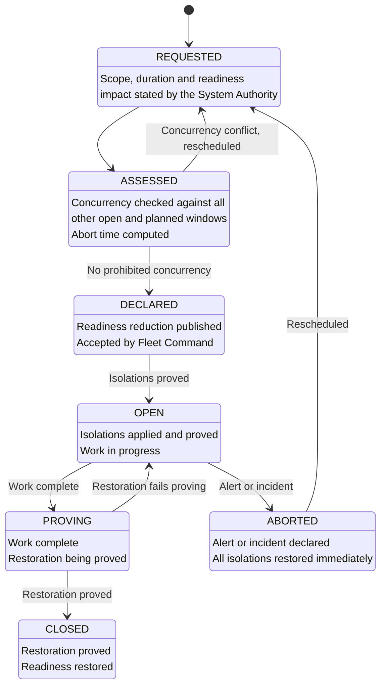
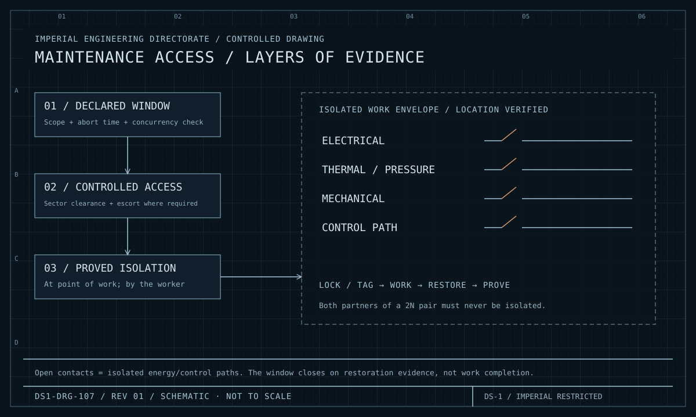

| Document ID | Classification | System | Document Owner | Status |
|---|---|---|---|---|
| `DS1-OPS-030` | IMPERIAL RESTRICTED | DS-1 Orbital Battle Station | Imperial Engineering Directorate — Operations Section | Operational / Controlled Document |

ACCESS: AUTHORIZED ENGINEERING PERSONNEL ONLY &middot; Unauthorized access will be logged and escalated to Sector Security Command.

# Maintenance and Windows

## 1. The Governing Constraint

`C-T-07`: the platform cannot be taken out of service. Every maintenance action
is performed on a live, occupied, operational station. There is no quiescent
state in which work is safe by default.

The entire discipline below exists because of that one sentence.

## 2. The Window Model

Work is performed inside a **declared maintenance window**: a bounded period with
a published readiness reduction, accepted in advance by Fleet Command.

| Window class | Duration | Readiness impact | Authorised by |
|---|---|---|---|
| `W-ROUTINE` | ≤ 8 h, within one watch | None declared; redundancy carries the load | Engineering Officer of the Watch |
| `W-EXTENDED` | ≤ 72 h | Declared reduction in one capability | Station Commander |
| `W-MAJOR` | > 72 h | Declared reduction in one or more capabilities; may require `ORL-2` | Imperial Engineering Command |
| `W-STRUCTURAL` | Variable | Hull work; sector isolation; may require partial evacuation | Imperial Engineering Command |
| `W-EMERGENCY` | Unbounded | Declared during an incident | Incident Commander |

### Window Lifecycle

**A window that cannot be aborted within its declared abort time is not
approved.** Window scope is therefore bounded by restoration speed, not by work
content — which is why the `ORL-3` → `ORL-4` transition time (`TD-29`) constrains
what maintenance the platform can undertake at all.

## 3. Isolation Discipline

<figure class="blueprint" markdown>

<figcaption>DS1-DRG-107 · Maintenance access / layers of evidence · Rev 01 · Schematic, not to scale</figcaption>
</figure>

Read the access layers before the isolation sequence. A clearance permits arrival at the work area; it does not prove the equipment safe to work on.

The five-step sequence. Every step is recorded, and no step may be assumed.

| Step | Action | Recorded |
|---|---|---|
| 1. **Identify** | Item identified by full location designation `Z / SECTOR / ITEM` | Work packet |
| 2. **Isolate** | Every energy source isolated: electrical, thermal, pressure, mechanical, and the item's control path | Isolation register |
| 3. **Prove** | Isolation proved dead at the point of work, by the person who will do the work | Isolation register, signed |
| 4. **Secure** | Isolation locked and tagged against restoration by anyone else | Isolation register |
| 5. **Restore and prove** | Isolation removed, item proved functional, redundancy proved restored | Window closure record |

!!! danger "Proving is done by the person doing the work"

    Not by the person who applied the isolation, and not by anyone else. This
    rule exists because of an early incident in which an isolation was applied to
    the correct item in the wrong sector, proved by the applier, and worked on by
    someone who trusted the record. The rule is not procedural formality; it is
    the entire control.

## 4. Concurrency Rules

Prohibited concurrency is enforced at window assessment, automatically, against
the declared scope. These are the rules a window request is tested against:

| Prohibited combination | Reason |
|---|---|
| Both sides of any 2N pair | Removes the redundancy entirely |
| Two adjacent life support groups | Removes emergency atmosphere transfer between them |
| Two of four trunk network rings | `TD-18` makes this worse than it appears |
| Two hyperdrive units | Would take availability below the 5-of-7 requirement |
| Armament work and transit preparation | Contradictory interlock inputs; occurred once during commissioning |
| Both Authorization Service instances | Would take the platform to `NO-AUTH` |
| Any critical-system window during `ORL-4` or above | All windows close at `ORL-4` |
| More than two hangar bays per quadrant | Sortie rate floor |
| Reference-node hold-out during a declared alert state | `TD-04` |

## 5. Maintenance Categories

| Category | Trigger | Typical window |
|---|---|---|
| Scheduled preventive | Calendar or running hours | `W-ROUTINE` |
| Condition-based | Telemetry trend crossing a threshold | `W-ROUTINE` or `W-EXTENDED` |
| Corrective | Defect raised | Per severity |
| Exercise | Calendar; see [Operating Model §4](operating-model.md#4-operating-rhythm) | `W-ROUTINE` |
| Modification | Approved change package | `W-EXTENDED` or `W-MAJOR` |
| Structural | Hull, conduit routing, compartment changes | `W-STRUCTURAL` |

Condition-based maintenance is the platform's principal preventive mechanism. It
depends entirely on the measurement retention described in
[Observability §6](observability.md#6-retention) — a trend cannot be seen without
history.

## 6. Contractor Work

Contractors perform most `W-MAJOR` and all `W-STRUCTURAL` work, under `C-M-04`:
the architecture must remain safe with untrusted personnel physically present.

| Control | Rule |
|---|---|
| Clearance | Time-boxed and sector-scoped. Never platform-wide, never open-ended. |
| Escort | Continuous within `Z3` and inward. Unescorted contractor presence inward of `Z4` is a Class-2 security event. |
| Work packets | Bounded to the declared scope. A packet that requires access outside its scope is returned, not extended. |
| Materiel | Tracked in and out; manifest reconciliation per movement. |
| Egress | Ordered at `ORL-4`. Contractor egress time is part of the `ORL-4` transition figure. |
| Expiry | Checked at boundary transit; **not yet continuously** — see `TD-25`. |

## 7. Restoration Proving

A window does not close when the work finishes. It closes when restoration is
proved, which is a separate activity with its own record.

| Proof required | Evidence |
|---|---|
| Item functional | Operated through its full range under load |
| Redundancy restored | The redundant partner is proved available, not assumed |
| Telemetry restored | Every signal the item emits is confirmed present at its destination |
| Isolation register clear | Every isolation applied for this window is removed and signed off |
| Configuration matches the library | As-built state checked against this documentation ([CC-8](../architecture/crosscutting-concepts.md#cc-8-documentation-as-a-control)) |

The last row is the documentation conformance sampling described in CC-8. A
discrepancy is recorded against whichever is wrong — the platform or the library.

## 8. Known Deficiencies

| Ref | Deficiency | Impact | Status |
|---|---|---|---|
| `TD-04` | `PREPROD` uses a real operational sector node held out of service, leaving that sector on `N+1` with no further margin, and blocking other work while held. | Window overrun rate 18 per cent; [QS-06](../architecture/quality-requirements.md#qs-06-scheduled-maintenance-without-readiness-loss) partially met. | Dedicated reference hardware requested; refused twice on cost |
| `TD-29` | Isolation restoration during `ORL-3` → `ORL-4` is tracked manually. | Transition takes 4 h 20 min against a 4 h target; constrains window scope. | Automation approved |
| `TD-32` | Documentation conformance sampling covers roughly 6 per cent of closed windows against a 20 per cent target. | Divergence between this library and the as-built platform accumulates undetected. | Sampling rate increase approved; resource-constrained |
