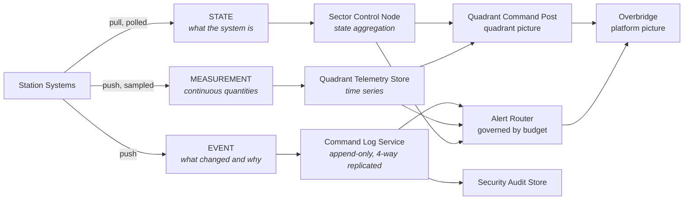

| Document ID | Classification | System | Document Owner | Status |
|---|---|---|---|---|
| `DS1-OPS-010` | IMPERIAL RESTRICTED | DS-1 Orbital Battle Station | Imperial Engineering Directorate — Operations Section | Operational / Controlled Document |

ACCESS: AUTHORIZED ENGINEERING PERSONNEL ONLY &middot; Unauthorized access will be logged and escalated to Sector Security Command.

# Observability and Monitoring

## 1. Purpose

To ensure that the platform's actual state is knowable, that changes are
attributable, and that operators are told what they need to act on and nothing
else.

The last clause is the hard one. A platform of this scale can generate more
signal than any watch can absorb, and an operator who cannot absorb the signal is
in a worse position than one receiving none, because they believe they are
informed.

## 2. Signal Architecture

Three classes, established in [CC-4](../architecture/crosscutting-concepts.md#cc-4-observability).
They are not interchangeable, and a system that conflates them is non-conformant.

### Why State Is Pulled and Events Are Pushed

A system that pushes state emits most when it is least healthy — the moment when
the network is already degraded and the watch is already loaded. Polling state at
a fixed rate makes the observability load independent of platform condition.
Events are rare by construction and are pushed because their value decays.

This was learned during commissioning, when a single sector's state-push
implementation saturated a trunk ring during a power transient and removed
visibility of the transient it was reporting.

## 3. Mandatory Event Content

Every event carries, without exception:

| Field | Purpose |
|---|---|
| Identity | The actor — person, droid or service. Never absent, never shared. |
| Location designation | `Z / SECTOR / ITEM`, per `C-C-01` |
| Platform time | Imperial Time, advisory for ordering |
| Logical sequence | Emitter-local, authoritative for causality (CC-6) |
| Causing directive reference | The directive this event resulted from |
| Outcome | What happened, including refusals |

**An event with no causing directive reference is itself significant** and is
flagged. It means something happened that no directive asked for — which is
either an automatic protective action (expected, and it carries its own rule
reference) or something nobody asked for at all (not expected, and it is
investigated).

## 4. The Alert Budget

Alert fatigue is treated as a failure mode with a body count, not as an
inconvenience.

| Rule | Value |
|---|---|
| Alert budget per sector per watch | 12 |
| Alert budget per quadrant per watch | 40 |
| Platform alert budget per watch | 120 |
| Budget exceeded | The excess is suppressed to the telemetry store, and **the suppression itself alarms** as a Class-3 event against the emitting system |
| Authorization prompts per operator per watch | 20 maximum; exceeding it is a design defect raised against the requesting system |

A system that exceeds its budget is not producing more information. It is
producing noise, and the budget makes that visible as a defect against its System
Authority rather than as a burden on the watch.

### Alert Classification

| Class | Meaning | Routing | Response time |
|---|---|---|---|
| `A1` | Life safety or containment | Overbridge + quadrant + sector, simultaneously | Immediate, automatic action already taken |
| `A2` | Loss of a redundant element | Quadrant + sector | Within the watch |
| `A3` | Degradation within tolerance | Sector | Next window |
| `A4` | Informational, trend-relevant | Telemetry store only, no operator notification | None |

`A4` exists so that systems have somewhere to put signal that matters for
trending but not for action. Misclassifying `A4` as `A3` is the most common cause
of budget exhaustion.

## 5. What Is Watched Permanently

The Overbridge picture is deliberately small. These signals are displayed at all
times and nothing else is:

| Signal | Source | Why it is on the permanent picture |
|---|---|---|
| Reactor thermal margin | Power Generation | The platform's leading indicator; every `THROTTLED` event was visible here first |
| Thermal rejection margin | Life Support | Second-order constraint; gates propulsion and armament |
| Supply margin and `LSD-1` stage | Power Distribution | Determines what the platform can still do |
| Sector node modes, 72 | Command and Control | `DETACHED` and `SAFE` counts; the single most-watched figure |
| Hyperdrive unit availability | Propulsion | Mobility is a strategic property, not an engineering one |
| Sensor coverage gap map | Sensors | Gaps stated explicitly, never interpolated |
| Shield envelope integrity map | Defensive Systems | Same rule |
| Engagement posture | Defensive Systems | Must never be ambiguous |
| Armament state | Primary Armament | Must never be ambiguous |
| Open incidents and their commanders | Incident Response | — |
| Contractor population by sector | Crew and Garrison | The platform's largest security variable |

## 6. Retention

| Class | Retention | Store |
|---|---|---|
| State | Current + 90 days of history | Quadrant telemetry store |
| Event | **Life of the programme** | Command Log Service, append-only, 4-way replicated |
| Measurement | 2 years full resolution, then aggregated indefinitely | Quadrant telemetry store |
| Security events | Life of the programme | Security audit store, separate from the Command Log |

Event retention for the life of the programme is what makes
[QS-08](../architecture/quality-requirements.md#qs-08-post-incident-audit-reconstruction)
achievable. It is expensive and it is not negotiable.

## 7. Absence of Signal

Every emitter has a declared heartbeat interval. Silence beyond it is an event in
its own right, raised against the silent emitter.

This closes the most dangerous observability gap: a system that fails in a way
that also prevents it reporting the failure. Without heartbeat monitoring, such a
system looks identical to one that is nominal and quiet.

## 8. Known Deficiencies

| Ref | Deficiency | Impact | Status |
|---|---|---|---|
| `TD-30` | Alert budget is enforced per watch but not trended across watches. | A slowly rising alert rate is invisible until it breaches the budget. | Trending approved |
| `TD-31` | Three legacy sector nodes emit state by push rather than pull, contrary to CC-4. | Those sectors contribute disproportionate load during transients — exactly when they should not. | Rework scheduled; blocked on `PREPROD` availability (`TD-04`) |
