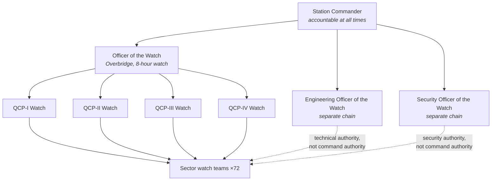

| Document ID | Classification | System | Document Owner | Status |
|---|---|---|---|---|
| `DS1-OPS-002` | IMPERIAL RESTRICTED | DS-1 Orbital Battle Station | Imperial Engineering Directorate — Operations Section | Operational / Controlled Document |

ACCESS: AUTHORIZED ENGINEERING PERSONNEL ONLY &middot; Unauthorized access will be logged and escalated to Sector Security Command.

# Operating Model

## 1. Operational Readiness Levels

The platform's readiness is expressed on a six-point scale. The level is a
declared state, not an assessment: it is set by an authority, published, and
binding on every system.

| Level | Designation | Meaning | Set by |
|---|---|---|---|
| `ORL-0` | Down | Reactor `SCRAM`; essential bus on standby generation | Automatic, or Imperial Engineering Command |
| `ORL-1` | Dormant | Powered, uncrewed at watch stations, no operational capability | Station Commander |
| `ORL-2` | Reduced | Partially crewed; major systems in extended maintenance | Station Commander |
| `ORL-3` | **Operational, restricted** | **Normal condition.** Fully crewed, three watches, routine windows open | Station Commander |
| `ORL-4` | Action | All windows closed, isolations restored, action stations, armament gates satisfiable | Station Commander, on Fleet Command direction |
| `ORL-5` | Engaged | Active engagement; all discretionary activity suspended | Station Commander |

The platform has spent 96 per cent of its operational life at `ORL-3`.

### What Each Level Binds

| Level | Maintenance windows | Contractors aboard | Transit permitted | Armament gate |
|---|---|---|---|---|
| `ORL-0` | Emergency only | No | No | Inhibited |
| `ORL-1` | Extended windows | Yes, escorted | No | Inhibited |
| `ORL-2` | Extended windows | Yes, escorted | Yes | Inhibited |
| `ORL-3` | Routine windows | Yes, escorted, bounded | Yes | Inhibited |
| `ORL-4` | **None** | **Egress ordered** | Yes, with authorization | Satisfiable |
| `ORL-5` | None | None | Emergency only | Satisfiable |

The `ORL-3` → `ORL-4` transition is the most operationally significant on the
platform: it closes every window, restores every isolation and orders every
contractor off. **The time it takes is a measured, published figure**, currently
4 hours 20 minutes against a 4-hour target, and it is the reason window scope is
bounded.

## 2. Watch Organisation

**Three separate chains that meet only at the Station Commander** (`C-O-02`).
This is deliberate: an engineering officer cannot order an operational action, a
security officer cannot order an engineering action, and neither can be
overruled by the other. Cross-chain escalation is a designed path, described in
[Incident Response](incident-response.md), not an informal one.

### Watch Handover

Handover is a logged event with a fixed structure, not a conversation.

| Element | Required content |
|---|---|
| Platform state | Current ORL, open windows, active isolations |
| Open incidents | Every incident not yet closed, with its commander and state |
| Degradations | Every system not at `NOMINAL`, with cause and expected restoration |
| Standing authorizations | Those in force, and those due to expire in the watch |
| Outstanding refusals | Any authorization refusal not yet resolved |
| Contractor population | Count, sectors, clearance expiries within the watch |

An incomplete handover is a Class-3 event. Handover overlap is 30 minutes and is
not compressible.

## 3. Authority Delegation

| Authority | Held by | Delegable to | Never delegable |
|---|---|---|---|
| Command authority | Station Commander | Officer of the Watch, within a declared envelope | Armament release; ORL-4/5 declaration |
| Engineering authority | Engineering Officer of the Watch | Quadrant engineering officers | Reactor `SCRAM` recovery; both-side essential bus work |
| Security authority | Security Officer of the Watch | Quadrant security officers | Clearance grant; lockdown release |
| Incident command | Appointed per incident | Not delegable during an incident | — |

**A delegated authority is always narrower than the authority that delegated it,
always time-boxed, and always logged.** This is the same rule as sector
autonomy: delegation never widens.

## 4. Operating Rhythm

| Cadence | Activity |
|---|---|
| Per watch (8 h) | Handover; alert budget review; degradation review |
| Daily | Platform state report to Fleet Command; window schedule review |
| Weekly | Maintenance window planning; contractor population review |
| Monthly | Emergency comms voice check, every compartment; standby generation exercise; blast door exercise; red-team boundary exercise |
| Quarterly | Bus transfer exercise, one quadrant; authorization audit; risk register review; audit reconstruction drill |
| Semi-annual | Breach exercise, one sector; operations documentation review |
| Annual | Isolation exercise (72 h minimum); command handover exercise; sustainment audit; architecture review |

Exercises are not optional and are not deferred for operational convenience.
Deferral requires Station Commander approval and is recorded; a twice-deferred
exercise escalates to Imperial Engineering Command.

## 5. Known Deficiencies

| Ref | Deficiency | Impact | Status |
|---|---|---|---|
| `TD-29` | The `ORL-3` → `ORL-4` transition takes 4 h 20 min against a 4 h target, dominated by isolation restoration. | Alert response is slower than specification; window scope must be bounded more tightly than intended. | Isolation tracking automation approved |
| `TD-30` | Alert budget review is performed per watch but not trended across watches, so a slowly rising alert rate is not visible. | [CC-7](../architecture/crosscutting-concepts.md#cc-7-human-factors-and-command-ergonomics) conformance is nominal rather than effective. | Trending added to the observability backlog |
