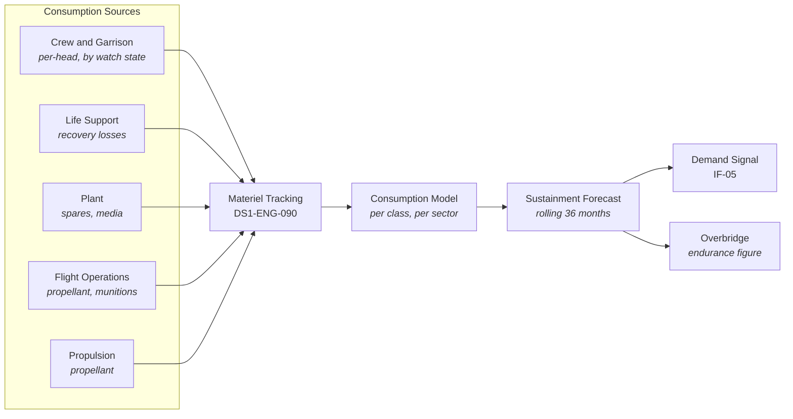

| Document ID | Classification | System | Document Owner | Status |
|---|---|---|---|---|
| `DS1-OPS-040` | IMPERIAL RESTRICTED | DS-1 Orbital Battle Station | Imperial Engineering Directorate — Operations Section | Operational / Controlled Document |

ACCESS: AUTHORIZED ENGINEERING PERSONNEL ONLY &middot; Unauthorized access will be logged and escalated to Sector Security Command.

# Supply and Replenishment

## 1. Purpose

To sustain 1.7 million people and every consuming system for **3 standard years
without external replenishment** ([QS-04](../architecture/quality-requirements.md#qs-04-sustained-operation-without-resupply)),
and to manage replenishment when it is available without creating a dependency on
it.

Autonomy is a top-level property (`FR-01`). Every proposal that would trade
autonomy for efficiency requires an ADR.

## 2. Consumable Classes

| Class | Examples | Recovery | Reserve at ORL-3 |
|---|---|---|---|
| `S-A` Atmosphere | Oxygen, buffer gases, scrubber media | High recovery; consumable is the scrubber media | 3 years |
| `S-B` Water | Potable, process, coolant | Very high recovery; loss is leakage and venting | 3 years |
| `S-C` Nutrition | Rations, cultivated and stored | Partial recovery via cultivation | 3 years |
| `S-D` Propellant | Attitude, station-keeping, embarked craft | None | 18 months at nominal manoeuvring |
| `S-E` Spares | Plant, electronics, structure | Partial via fabrication | Varies by item; see §5 |
| `S-F` Medical | Pharmaceutical, consumable | Limited fabrication | 2 years |
| `S-G` Ordnance | Battery and embarked craft munitions | None | Operationally determined |

**`S-D` propellant is the binding constraint at 18 months**, not the headline
3-year figure. The 3-year figure describes survival; propellant describes
mobility. A platform that can breathe but cannot manoeuvre is not operational.
This distinction is frequently lost in summary reporting and is stated here
plainly.

## 3. The Consumption Model

The forecast is a **rolling 36-month projection per consumable class**, updated
each watch. Its output is a single endurance figure per class, and the minimum
across all classes is the platform's stated endurance.

### Forecast Accuracy

| Horizon | Target accuracy | Actual |
|---|---|---|
| 1 month | ±2% | ±2% |
| 6 months | ±3% | ±6% |
| 12 months | ±5% | **±11%** |
| 36 months | ±10% | Not measurable — the platform has not run 36 months without replenishment |

The 12-month figure is the reason [QS-04](../architecture/quality-requirements.md#qs-04-sustained-operation-without-resupply)
is at risk. Root causes are `TD-06` (cultivation
yield variance not modelled) and `TD-12` (coarse `P4` consumption telemetry).

!!! warning "The 3-year figure is modelled, not demonstrated"

    The platform has never operated for 3 years without replenishment. The figure
    derives from a consumption model whose 12-month accuracy is ±11 per cent.
    Extrapolating that model to 36 months carries an error band the Directorate
    does not consider well characterised.

    This is stated in every sustainment audit and is not softened in operational
    reporting.

## 4. Replenishment Cycle

| Phase | Activity | Duration |
|---|---|---|
| Demand | Forecast generates the demand signal over `IF-05` | Continuous |
| Scheduling | Supply Command schedules a replenishment group | External |
| Approach | Group arrives; craft identity verified per [RV-4](../architecture/runtime-view.md#rv-4-craft-recovery-cycle) | Hours |
| Discharge | Cargo into hangar bays, freight lift, freight ring, sector stores | 2–5 days |
| Reconciliation | Manifest reconciled against physical receipt | Per movement (target); per watch (actual, `TD-21`) |
| Stow | Materiel to its zone store | Concurrent |

### Replenishment as a Security Event

A replenishment is a large, scheduled, authorized influx of external materiel and
external personnel. It is treated as a security exposure with a logistics
purpose, not the reverse.

| Control | Rule |
|---|---|
| Manifest signing | Every manifest signed at origin; signature verified at receipt |
| Physical reconciliation | Every item reconciled against the manifest; discrepancies are **security** events |
| Personnel | Replenishment crews are contractors; time-boxed, sector-scoped, escorted, `Z4` only |
| Materiel destination | Items destined inward of `Z4` are transferred at `BCP-4/3` by station personnel, never carried in by the delivering crew |
| Bay posture | Bays in `RECOVERY-ONLY` during discharge |

## 5. Store Distribution

Spares are held in the zone where they are used, not in a central store
([Internal Transit §4](../systems/internal-transit.md#4-mitigations-for-the-transit-cost)).

| Zone | Store content | Duplication accepted |
|---|---|---|
| `Z0` | Containment and fuel handling spares | Yes — `Z0` spares cannot be fetched during an event |
| `Z1` | Plant, power, life support spares | Yes — per life support group |
| `Z2` | Control and network spares | Yes — per quadrant |
| `Z3` | General, habitation, medical | Per sector |
| `Z4` | Hull, hangar, containment field spares | Per hangar belt sector |

Store duplication multiplies holdings roughly 2.4× against a central-store
arrangement. This is the accepted cost of not moving parts across zone boundaries
during an incident.

## 6. Fabrication

On-platform fabrication converts `S-E` spares from a supply problem into a raw
material problem for a subset of items.

| Category | Fabricable | Note |
|---|---|---|
| Structural fittings, fasteners, plating patches | Yes | Full capability |
| Mechanical plant components | Mostly | Long lead items excepted |
| Electronics, control assemblies | Partially | Substrate stock is itself an `S-E` consumable |
| Sensor and communications heads | No | Precision beyond platform capability |
| Reactor, armament, hyperdrive components | No | Compartmented; not fabricable aboard |

Fabrication runs on the `P4` non-essential bus and is the first load shed under
`LSD-1`. This is correct — fabrication is never time-critical — but it means
sustained `LSD-1` operation suspends spares production exactly when consumption
of spares is likely rising.

## 7. Known Deficiencies

| Ref | Deficiency | Impact | Status |
|---|---|---|---|
| `TD-06` | Cultivation yield variance is not represented in the consumption model. | Principal contributor to the ±11 per cent 12-month forecast error; [QS-04](../architecture/quality-requirements.md#qs-04-sustained-operation-without-resupply) at risk. | Model revision in progress |
| `TD-12` | `P4` consumption telemetry sampled at 60 s. | Secondary contributor to forecast error. | Instrumentation upgrade approved |
| `TD-21` | Manifest reconciliation is per watch, not per handover. | A discrepancy may go unnoticed for up to 8 hours; relevant to [R-04](../risks/risk-register.md). | Real-time reconciliation approved; highest logistics priority |
| `TD-33` | Propellant endurance is reported inside the aggregate endurance figure rather than separately. | The 18-month mobility limit is obscured by the 3-year survival figure in summary reporting. | Separate reporting approved |
