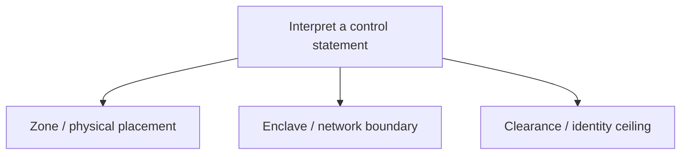

| Document ID | Classification | System | Document Owner | Status |
|---|---|---|---|---|
| `DS1-REF-010` | IMPERIAL RESTRICTED | DS-1 Orbital Battle Station | Imperial Engineering Directorate — Documentation Systems Section | Operational / Controlled Document |

ACCESS: AUTHORIZED ENGINEERING PERSONNEL ONLY &middot; Unauthorized access will be logged and escalated to Sector Security Command.

# Glossary

**Three different coordinates**

Location, network trust and identity clearance are distinct concepts; none automatically grants the others.

Terms used across this library. Each entry names the document that **defines**
it, not merely one that mentions it.

Terms are Imperial engineering usage. Where common usage differs, the definition
here governs within this library.

---

**Ablative plating** — Sacrificial outer hull layer in Zone `Z4`, designed to be
consumed rather than to resist. Replacement is routine hull work.
→ [Defensive Systems](../systems/defensive-systems.md)

**Alternate Overbridge** — Southern-polar command facility in warm standby.
Assumes command authority on **declared handover only**; never automatically.
→ [Command and Control](../systems/command-and-control.md)

**Aperture budget** — The fixed allocation of 24 hull penetrations for sensing.
Governed; an increase requires Imperial Engineering Command approval.
→ [Sensors](../systems/sensors.md#2-the-aperture-budget)

**arc42** — The architecture documentation template this library's core follows.
Deviations are recorded rather than silently taken.
→ [arc42 Conformance Matrix](arc42-conformance.md)

**Boundary Control Point (BCP)** — A policy *enforcement* point at a zone
boundary. Holds no policy, cannot be locally reconfigured, and fails closed. A
compromised BCP can refuse legitimate transits; it cannot grant access.
→ [Security Zones](../security/security-zones.md#2-what-a-boundary-control-point-is-and-is-not)

**Bus tie** — The normally-open connection between `MTB-A` and `MTB-B`. Closing
it merges two failure domains into one; closure outside a declared maintenance
window is a non-conformance and is alarmed.
→ [Power Distribution](../systems/power-distribution.md#why-the-bus-tie-is-normally-open)

**Clearance level (`IMP-1` … `IMP-5`)** — The zone depth an identity may reach.
Granted externally, revocable locally and immediately. Restriction is fast;
elevation is slow.
→ [Access Control Model](../security/access-control-model.md#2-clearance-levels)

**Command Log Service** — Append-only, four-way replicated record of every
directive, authorization decision and refusal. Retained for the life of the
programme; survives the loss of any three quadrants.
→ [Command and Control](../systems/command-and-control.md)

**Data diode** — A physically unidirectional connection. Two exist, both to
`ENC-CORE`: `DIODE-IN` carries setpoints inward, `DIODE-OUT` carries telemetry
outward. **Neither is redundant, deliberately.**
→ [Network Segmentation](../security/network-segmentation.md#3-the-diodes)

**`DETACHED`** — Sector node mode entered on loss of the quadrant link. The node
holds its last authorized configuration and may act only within a pre-authorized
envelope. **Strictly less capable than `LINKED`** — degradation never increases
authority.
→ [Runtime View RV-5](../architecture/runtime-view.md#rv-5-sector-link-loss-and-autonomous-degradation)

**Enclave (`ENC-CORE`, `ENC-CTRL`, `ENC-OPS`, `ENC-LOG`)** — A network trust
domain aligned exactly to the zone model, so that one boundary line severs
pressure, power and network together.
→ [Network Segmentation](../security/network-segmentation.md#1-enclave-model)

**Essential bus (`EB-A` / `EB-B`)** — The 2N supply to `P0` loads, backed by
standby generation with no shared dependency on the reactor. Never shed.
→ [Power Distribution](../systems/power-distribution.md)

**Friendly corridor** — The volume containing embarked craft on approach and
departure. An **absolute** engagement exclusion in every posture, including
`WEAPONS-FREE`.
→ [Defensive Systems](../systems/defensive-systems.md#4-engagement-authorization)

**Hypermatter reactor assembly** — The platform's single, non-redundant primary
energy source in Zone `Z0`. Described in this library only at the architectural
level.
→ [Power Generation](../systems/power-generation.md)

**Life support group** — One of 12 independent atmosphere, thermal and pressure
control domains, each serving six sectors. Cross-group support is emergency
transfer only.
→ [Life Support](../systems/life-support.md#life-support-groups)

**Load Shed Directive (`LSD-1`)** — The staged, automatic load-shedding
procedure. Stages 1–3 are automatic and reversible; stage 4 requires an
Overbridge directive.
→ [Power Distribution](../systems/power-distribution.md#load-shed-directive-lsd-1)

**Location designation** — `Z / SECTOR / ITEM`. The **only** permitted way to
state a location. Free-text location is rejected by work-order intake.
→ [Zone and Sector Architecture](../architecture/zone-and-sector-architecture.md#full-location-designation)

**`NO-AUTH`** — The state in which both Authorization Service instances are lost.
All discretionary action is refused; automatic protective actions are unaffected.
There is no fail-open path.
→ [Authentication and Authorization](../security/authentication-and-authorization.md#6-the-no-auth-state)

**Operational Readiness Level (`ORL-0` … `ORL-5`)** — The platform's declared
readiness state. `ORL-3` is normal. `ORL-4` closes every maintenance window,
restores every isolation and orders contractors off.
→ [Operating Model](../operations/operating-model.md#1-operational-readiness-levels)

**Overbridge** — The northern-polar facility holding command authority. Issues
authorized directives; has no direct actuation path to any plant.
→ [Command and Control](../systems/command-and-control.md)

**Priority class (`P0` … `P4`)** — Load classification determining shed order.
`P0` is never shed.
→ [Power Distribution](../systems/power-distribution.md#load-priority-classes)

**Quadrant (`Q-I` … `Q-IV`)** — One of four meridian ranges, each served by a
Quadrant Command Post.
→ [Zone and Sector Architecture](../architecture/zone-and-sector-architecture.md#sector-properties)

**Quadrant Ring Bus (`QRB-I` … `QRB-IV`)** — Closed, directionally protected
distribution ring serving one quadrant.
→ [Power Distribution](../systems/power-distribution.md)

**`SAFE`** — The most degraded sector node mode: load shed to `P0`/`P1`, sector
boundary sealed, life support preserved. **Not self-exiting** — recovery is an
authorized human action.
→ [Runtime View RV-5](../architecture/runtime-view.md#rv-5-sector-link-loss-and-autonomous-degradation)

**`SCRAM`** — Termination of the reaction. Automatic, or by local `Z0` authority
under the two-person rule. **Not commandable from the Overbridge** — a remotely
commandable scram is a remotely commandable platform kill. Restart requires
Imperial Engineering Command authorization.
→ [Power Generation](../systems/power-generation.md#4-operating-states-and-degradation)

**Sector** — One of 72 addressable surface divisions, designated
`<BAND>-<MERIDIAN>`. Maps one-to-one onto a Sector Control Node.
→ [Zone and Sector Architecture](../architecture/zone-and-sector-architecture.md#2-the-sector-model)

**Sector Control Node** — The execution element of the command architecture; one
per sector, 72 total. Runs `LINKED`, `DETACHED` or `SAFE`. **Cannot address its
peers**, in policy and in network topology.
→ [Command and Control](../systems/command-and-control.md)

**Standing authorization** — A pre-computed transit permission for a watch
keeper's assigned route. The decision is pre-computed, not skipped. **Revoked
wholesale and immediately on any lockdown.**
→ [Access Control Model](../security/access-control-model.md#5-standing-authorizations)

**Sustainment forecast** — The rolling 36-month projection of consumable
endurance per class. The platform's stated endurance is the minimum across all
classes.
→ [Supply and Replenishment](../operations/supply-and-replenishment.md#3-the-consumption-model)

**Thermal margin** — Available heat rejection capacity. The platform's leading
indicator: every `THROTTLED` transition in the past two years was preceded by an
hour or more of visible margin reduction.
→ [Power Generation](../systems/power-generation.md#6-observability)

**Two-person rule** — Two independently authorized identities, both present,
neither able to authorize the other. Required for `Z0` entry, armament charge
hold, command handover and both-side essential bus work. **A droid may never be
the second party** — the rule requires two independent *judgements*, and the
second party's value is that it may refuse.
→ [ADR-005](../decisions/adr-005-droid-automation-boundary.md#why-a-droid-cannot-be-the-second-party)

**Vent channel** — The thermal rejection path from the `Z0` region to the hull.
Few and large, per [ADR-004](../decisions/adr-004-exhaust-venting-topology.md),
ruled over recorded Directorate dissent. Compounds with
[ADR-001](../decisions/adr-001-single-core-reactor.md) into
[R-01](../risks/risk-register.md).
→ [ADR-004](../decisions/adr-004-exhaust-venting-topology.md)

**Window (maintenance)** — A bounded period with a published readiness reduction,
accepted in advance by Fleet Command. **Aborts, rather than pauses, on an alert
or an incident** — which is why window scope is bounded by abort time.
→ [Maintenance and Windows](../operations/maintenance.md#2-the-window-model)

**Zone (`Z0` … `Z4`)** — Concentric criticality band. Criticality rises inward;
exposure falls inward. Traversal is one boundary at a time, inward only.
→ [Zone and Sector Architecture](../architecture/zone-and-sector-architecture.md#1-the-zone-model)
