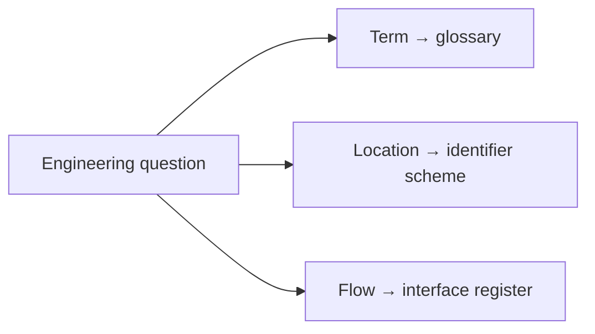

| Document ID | Classification | System | Document Owner | Status |
|---|---|---|---|---|
| `DS1-REF-000` | IMPERIAL RESTRICTED | DS-1 Orbital Battle Station | Imperial Engineering Directorate — Documentation Systems Section | Operational / Controlled Document |

ACCESS: AUTHORIZED ENGINEERING PERSONNEL ONLY &middot; Unauthorized access will be logged and escalated to Sector Security Command.

# Reference Volume

**Navigate by question**

Resolve terms, locate equipment or identify permitted connectivity before reading implementation detail.

| Document | ID | Content |
|---|---|---|
| [Glossary](glossary.md) | `DS1-REF-010` | Terms, with the document that defines each |
| [Identifier Scheme](identifier-scheme.md) | `DS1-REF-020` | Volume codes, allocation, addressing conventions |
| [Interface Register](interface-register.md) | `DS1-REF-030` | Every declared interface, external and internal |
| [arc42 Conformance Matrix](arc42-conformance.md) | `DS1-REF-040` | Where each arc42 chapter is held |

Reference material is normative. The [Interface Register](interface-register.md)
in particular is not a description of what exists — it is the **definition of
what is permitted**. A flow not in that register is blocked by default at every
gateway.
