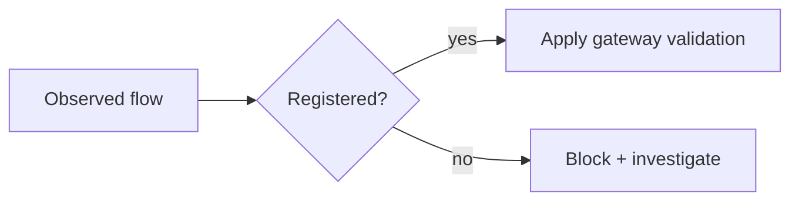

| Document ID | Classification | System | Document Owner | Status |
|---|---|---|---|---|
| `DS1-REF-030` | IMPERIAL RESTRICTED | DS-1 Orbital Battle Station | Imperial Engineering Directorate — Architecture Authority | Operational / Controlled Document |

ACCESS: AUTHORIZED ENGINEERING PERSONNEL ONLY &middot; Unauthorized access will be logged and escalated to Sector Security Command.

# Interface Register

!!! danger "This register is normative"

    It is not a description of interfaces that exist. It is the **definition of
    the interfaces that are permitted**. A flow not enumerated here is blocked by
    default at every gateway, and an observed flow not enumerated here is an
    anomaly — blocked automatically, then investigated. There is no
    "probably benign" category.

    Adding an interface requires an entry here, which requires Architecture
    Review Board approval.

## 1. External Interfaces

| ID | Peer | Direction | Enclave | Protection | On loss |
|---|---|---|---|---|---|
| `IF-01` | Imperial HoloNet relay network | Bidirectional | `ENC-LOG` → `ENC-CTRL` | Encrypted, signed, store-and-forward | Platform autonomous; strategic tasking queues |
| `IF-02` | Hyperspace beacon network | **Inbound only** | `ENC-LOG` → `ENC-CTRL` | Signed; cross-checked against 3 independent sources; **signature alone is not trust** | Navigation to `NO-BEACON`; transit with extended margin |
| `IF-03` | Fleet tactical data network | Bidirectional | `ENC-LOG` → `ENC-CTRL` | Authenticated, rate-limited, schema-validated; **carries no control authority** | Local sensor picture only |
| `IF-04` | Imperial Identity Authority | **Inbound only** | `ENC-LOG` → `ENC-CTRL` | Signed assertions, cached with expiry | Cached to expiry, then local fallback authority |
| `IF-05` | Supply Command logistics | Bidirectional | `ENC-LOG` | Authenticated, manifest-signed | Consumption against held stock |
| `IF-06` | Visiting and embarked craft | Bidirectional | `ENC-LOG` | Transponder challenge; visual confirmation | Bay closure; no unverified approach accepted |

**No external interface is required for the platform to remain safe.** All six may
be lost, individually or together, without loss of life-safety or of control
authority aboard. Verified annually by a 72-hour isolation exercise.

## 2. Internal Interfaces

| ID | From | To | Direction | Content | Notes |
|---|---|---|---|---|---|
| `IX-CMD` | Command and Control | All acting systems | Outbound | Authorized directives with scoped tokens | Tokens validated against local state, not signature alone |
| `IX-TLM` | All systems | Command and Control | Inbound | State and telemetry | Read-only to C2 |
| `IX-PWR` | Power Distribution | All systems | Bidirectional | Supply out; consumption and supply-state telemetry in | — |
| `IX-GEN` | Power Generation | Power Distribution | Outbound | Converted output at the conversion halls | — |
| `IX-CORE` | Command and Control | Power Generation | **Outbound only** | Setpoint requests via `DIODE-IN` | **No return path. No acknowledgement. No session.** |
| `IX-CORE-T` | Power Generation | Command and Control | **Outbound only** | Containment, thermal and output state via `DIODE-OUT` | Physically separate path from `IX-CORE` |
| `IX-PIC` | Sensors | Command and Control, Defensive Systems | Outbound | Tracks, classifications, coverage gaps | Gaps stated explicitly, never interpolated |
| `IX-NAV` | Navigation | Propulsion, Sensors | Outbound | Solution, fix, attitude, reference frame | — |
| `IX-ENV` | Life Support | All crewed volumes | Bidirectional | Atmosphere, thermal, gravity, pressure; local sensing in | — |
| `IX-THM` | Power Generation | Life Support | Outbound | Core heat load presented to the vent network | — |
| `IX-LOG` | Hangar and Docking | Internal Transit | Bidirectional | Cargo handover; manifest reconciliation | Personnel handled separately at `BCP-4/3` |
| `IX-ACC` | Access Control | Internal Transit, Crew and Garrison | Bidirectional | Identity, clearance, standing authorizations | Decision always at the Authorization Service |
| `IX-SUP` | Internal Transit, Crew and Garrison | Supply | Outbound | Consumption and movement data | Feeds the sustainment forecast |
| `IX-STR` | Structures | Propulsion | Outbound | Structural loading limits and current state | — |
| `IX-HAN` | Hangar and Docking | Defensive Systems | Outbound | Friendly corridor state | Absolute engagement exclusion |
| `IX-NET` | Communications | All systems | Bidirectional | Transport | Enclave-gated per `DS1-SEC-020` |

## 3. Enclave Gateways

| Gateway | From | To | Validation | Authorization | Rate limit |
|---|---|---|---|---|---|
| `GW-LO` | `ENC-LOG` | `ENC-OPS` | Schema (91 per cent coverage — `TD-36`) | Per message class | Yes |
| `GW-OL` | `ENC-OPS` | `ENC-LOG` | Schema | Per message class | Yes |
| `GW-OC` | `ENC-OPS` | `ENC-CTRL` | Schema + semantic | **Per message, against the Authorization Service** | Yes |
| `GW-CO` | `ENC-CTRL` | `ENC-OPS` | Schema | Broadcast, read-only | Yes |
| `DIODE-IN` | `ENC-CTRL` | `ENC-CORE` | Schema; setpoints only | Per message | Yes |
| `DIODE-OUT` | `ENC-CORE` | `ENC-CTRL` | Schema; telemetry only | N/A | Yes |

## 4. Prohibited Connections

**Default-deny flow governance**

The register defines permitted connectivity; observation alone does not authorize a flow.

Enumerated explicitly, because a prohibition that is only implied is a
prohibition that will be proposed.

| Prohibited | Reason | Enforced by |
|---|---|---|
| Any path from `ENC-CORE` carrying anything but telemetry | [ADR-003](../decisions/adr-003-network-segmentation.md); refused three times | Diode, physically |
| Sector node to sector node, directly | [ADR-002](../decisions/adr-002-sector-autonomy.md) invariant 2 | Enclave segmentation |
| `DEV` or `INT` to any real actuator | Deployment View §7.2 | Segment isolation |
| `PREPROD` to any node other than its own | Deployment View §7.2 | Segment isolation |
| `IF-03` to any control path | Tactical data is a picture, not a command | Gateway policy |
| Any external interface directly into `ENC-CTRL` | All external traffic terminates at `ENC-LOG` | Gateway policy |
| Emergency communications onto the trunk network | Its value is that it shares nothing; refused three times | Physical separation |

## 5. Change Control

| Change | Approval |
|---|---|
| New internal interface | Architecture Review Board |
| New external interface | Architecture Review Board + Imperial Engineering Command |
| Change to an interface's direction | Architecture Review Board; treated as a new interface |
| Change to `ENC-CORE` connectivity | **Invalidates [ADR-001](../decisions/adr-001-single-core-reactor.md)'s mitigation set; requires Imperial High Command** |
| Removal of an interface | Architecture Review Board; the entry is retained with status `Withdrawn` |
