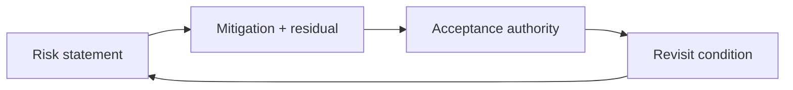

| Document ID | Classification | System | Document Owner | Status |
|---|---|---|---|---|
| `DS1-RSK-000` | IMPERIAL RESTRICTED | DS-1 Orbital Battle Station | Imperial Engineering Directorate — Architecture Authority | Operational / Controlled Document |

ACCESS: AUTHORIZED ENGINEERING PERSONNEL ONLY &middot; Unauthorized access will be logged and escalated to Sector Security Command.

# Risks Volume

arc42 chapter 11, held as two registers.

| Register | ID | Content |
|---|---|---|
| [Risk Register](risk-register.md) | `DS1-RSK-001` | Risks to the platform: things that may happen |
| [Technical Debt Register](technical-debt.md) | `DS1-RSK-010` | Deficiencies that exist now: things that are already true |

The distinction is enforced. A risk is a possibility with a likelihood; technical
debt is a present condition with an impact. Recording debt as risk understates
it, because it makes something that has already happened sound conditional.

## Severity Scale

The five-point Directorate scale (`C-C-05`). Local scales are not permitted.

| Severity | Definition |
|---|---|
| Critical | Loss of the platform, or mass casualty |
| High | Loss of a top-level capability, or a stated quality scenario not met |
| Medium | Loss of a redundant element, or a quality scenario partially met |
| Low | Operational inefficiency without capability loss |
| Nominal | Observation; no current impact |

## Governance

**Risk treatment remains traceable**

An accepted risk still needs an owner and a condition that would change the decision.

| Activity | Cadence | Authority |
|---|---|---|
| Register review | Quarterly | Architecture Review Board |
| Severity change | On evidence | Architecture Review Board |
| Risk acceptance, Critical | Annual reaffirmation | **Imperial High Command** — not the Directorate |
| Risk acceptance, High | Annual reaffirmation | Imperial Engineering Command |
| Debt item closure | On verified remediation | Architecture Review Board |
| New item | Any time, by anyone | Raised to the Architecture Authority |

!!! danger "The Directorate cannot accept a Critical risk"

    Acceptance of a Critical risk requires
    Imperial High Command. The Directorate's role is to characterise it
    accurately, state what is and is not mitigated, and refuse to describe it as
    smaller than it is.

    [R-01](risk-register.md) is the standing example.

## Current Position

| | Critical | High | Medium | Low |
|---|---|---|---|---|
| **Risks** | 1 | 3 | 4 | 2 |
| **Technical debt** | 0 | 9 | 18 | 9 |

Three of eight [quality scenarios](../architecture/quality-requirements.md) are
not fully met, and all three trace to technical debt rather than to risk — that
is, to conditions that already exist rather than to events that might occur.

Eleven debt items trace to a single decision,
[ADR-008](../decisions/adr-008-live-commissioning.md).
