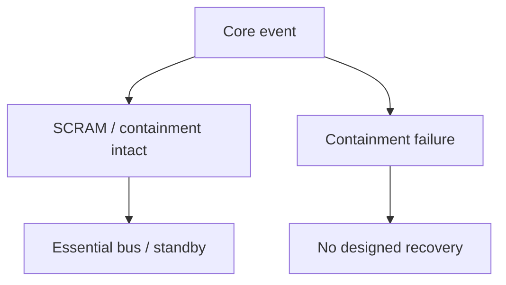

| Document ID | Classification | System | Document Owner | Status |
|---|---|---|---|---|
| `DS1-RSK-001` | IMPERIAL RESTRICTED | DS-1 Orbital Battle Station | Imperial Engineering Directorate — Architecture Authority | Operational / Controlled Document |

ACCESS: AUTHORIZED ENGINEERING PERSONNEL ONLY &middot; Unauthorized access will be logged and escalated to Sector Security Command.

# Risk Register

Reviewed quarterly. Severity changes require Architecture Review Board ruling on
evidence, not on judgement.

## Summary

| ID | Risk | Severity | Likelihood | Owner | Acceptance |
|---|---|---|---|---|---|
| [R-01](#r-01-concentrated-structural-vulnerability) | Concentrated structural vulnerability | Critical | Low | Imperial High Command | Annual, High Command |
| [R-02](#r-02-close-in-defensive-coverage) | Close-in defensive coverage against small fast targets | High | Medium | Ordnance Systems Authority | Annual, IEC |
| [R-03](#r-03-authorization-service-as-a-chokepoint) | Authorization Service as a denial-of-service chokepoint | High | Low | Control Systems Authority | Annual, IEC |
| [R-04](#r-04-insider-and-contractor-access) | Insider and contractor access | High | **High** | Sector Security Command | Annual, IEC |
| [R-05](#r-05-divergent-sector-configuration) | Divergent sector configuration | Medium | High | Control Systems Authority | ARB |
| [R-06](#r-06-readiness-erosion-through-deferred-work) | Readiness erosion through deferred work | Medium | High | Operations Section | ARB |
| [R-07](#r-07-navigation-source-falsification) | Navigation source falsification | Medium | Low | Propulsion Systems Authority | ARB |
| [R-08](#r-08-sustainment-forecast-error) | Sustainment forecast error | Medium | Medium | Operations Section | ARB |
| [R-09](#r-09-documentation-divergence) | Documentation divergence from as-built | Low | High | Documentation Systems Section | ARB |
| [R-10](#r-10-mobility-loss) | Mobility loss below the hyperdrive threshold | Low | Low | Propulsion Systems Authority | ARB |

---

## R-01 — Concentrated Structural Vulnerability

**Two failure paths, different outcomes**

Standby generation helps after a scram with containment intact. It is not a recovery path for containment failure.

| Field | Value |
|---|---|
| **Severity** | Critical |
| **Likelihood** | Low |
| **Owner** | Imperial High Command (the Directorate cannot accept a Critical risk) |
| **Origin** | [ADR-001](../decisions/adr-001-single-core-reactor.md) and [ADR-004](../decisions/adr-004-exhaust-venting-topology.md), compounding |

### Statement

The platform's entire generation capability resides in a single non-redundant
assembly in `Z0` (`ADR-001`, forced by `C-T-01`). Thermal rejection from that
assembly is via a small number of large continuous channels between the hull and
the `Z0` region (`ADR-004`, ruled over recorded Directorate dissent).

**The two decisions share a single failure consequence.** A sufficient insult
delivered through the venting topology to the reactor assembly results in loss of
the platform, with no recovery path.

### Mitigations in Place

| Mitigation | Effect | Limitation |
|---|---|---|
| 2N containment field, independently powered | Contains an internally initiated excursion | Does not survive a sufficient external insult |
| `Z0` two-person boundary | Removes the insider actuation path | Does not remove the structural target |
| Diode-only connectivity | Removes the remote actuation path | Does not remove the physical one |
| Vent baffling, sensing, mechanical closure | Detection and delay | **Detective, not preventive** — the Directorate's dissent |
| Standby generation on the essential bus | Sustains life after `SCRAM` | Does not apply to containment failure |
| Thermal margin as leading indicator | Prevents the most probable internal path | Does not address deliberate attack |

### Explicitly Not Mitigated

A sufficient external kinetic insult delivered via the venting topology. **No
available measure addresses this**, and the Directorate does not claim otherwise.

### Directorate Position

Carried forward from the [ADR-004 dissent](../decisions/adr-004-exhaust-venting-topology.md#5-recorded-dissent-imperial-engineering-directorate),
at the Directorate's request and with Imperial Engineering Command's agreement:

> The residual risk arising from the venting topology is not, in the Directorate's
> assessment, adequately characterised, and it compounds directly with the
> residual risk of the single-core generation decision.

Reviewed 11 times. Not closed. Not downgraded.

### Would Change If

Option C of `ADR-004` (intermediate thermal store) becomes feasible within the
mass and volume budget, removing the large continuous channels. Nothing else
materially changes this risk.

---

## R-02 — Close-In Defensive Coverage

| Field | Value |
|---|---|
| **Severity** | High &nbsp; **Likelihood** Medium |
| **Owner** | Ordnance Systems Authority |

Close-in batteries are dimensioned against capital-scale engagement and are
tracking-rate limited against small, fast, close targets. The design mitigation
is the embarked fighter wing.

**The mitigation is conditional.** It depends on hangar availability, sortie rate
and warning time — all of which are themselves degraded during transit, during
alert transitions and while bays are in `RECOVERY-ONLY` (11 bays permanently, per
`TD-20`).

The platform is best defended against the threat it was designed to fight and
least defended against the smallest one.

**Mitigations:** embarked fighter wings; picket by attached units; sensor coverage
overlap; alert posture management.
**Not mitigated:** the tracking rate itself, which is a property of the installed
batteries.
**Would change if:** battery tracking performance is uplifted, or bay availability
constraints (`TD-20`) are closed, strengthening the conditional mitigation.

---

## R-03 — Authorization Service as a Chokepoint

| Field | Value |
|---|---|
| **Severity** | High &nbsp; **Likelihood** Low |
| **Owner** | Control Systems Authority |

There is exactly one logical Authorization Service and no fail-open path. Loss of
both instances puts the platform in `NO-AUTH`, in which all discretionary action
is refused.

This is the deliberate cost of `CC-1`. **The platform can be halted by an attack
on the Authorization Service; it cannot be caused to act by one.** Automatic
protective actions are pre-authorized and unaffected.

**Mitigations:** 2N pole-split instances, co-located with neither bridge;
two-officer manual authority procedure; restoration is the highest-priority
engineering action.
**Residual:** the manual procedure is slow and its logging is on paper (`TD-35`),
so a `NO-AUTH` period is imperfectly reconstructable.
**Would change if:** `TD-35` closes, or a third instance is funded.

---

## R-04 — Insider and Contractor Access

| Field | Value |
|---|---|
| **Severity** | High &nbsp; **Likelihood** **High** |
| **Owner** | Sector Security Command |

The contractor population varies between roughly 20,000 and 90,000. `C-M-04`
requires the architecture to remain safe with untrusted personnel physically
present, and this is the vector threat actor `T-1` is most likely to use.

**Empirical basis.** Since commissioning: 61 Class-2 incidents, 38 boundary
security events, **31 involving contractor personnel**. None succeeded; all were
refused at the boundary and recorded.

The likelihood rating is High because the control is being tested regularly, not
because it has failed. The severity is High because a success would place a
hostile actor inward of `Z4`.

**Mitigations:** attribute-based access; `IMP-2` contractor ceiling; sector
scoping; time boxing; continuous escort inward of `Z4`; count reconciliation;
craft and crew identity decided separately; manifest reconciliation; egress
ordered at `ORL-4`.
**Residual:** clearance expiry checked at transit only (`TD-25`); manifest
reconciliation per watch rather than per handover (`TD-21`); entitlement review
samples ~3 per cent (`TD-34`).
**Would change if:** `TD-21`, `TD-25` and `TD-34` close. All three are approved;
`TD-34` is unfunded.

---

## R-05 — Divergent Sector Configuration

| Field | Value |
|---|---|
| **Severity** | Medium &nbsp; **Likelihood** High |
| **Owner** | Control Systems Authority |

[ADR-002](../decisions/adr-002-sector-autonomy.md) requires a pre-authorized
envelope per sector node. Envelopes are maintained manually across 72 nodes and
have drifted (`TD-08`): a `Q-III` node may refuse an action a `Q-I` node permits.

Autonomous behaviour is therefore not uniform across the platform, which
undermines the operator's ability to predict what a detached sector will do.

**Mitigations:** quarterly envelope review; drift tolerance defined and monitored.
**Residual:** drift is approaching, though has not crossed, the tolerance that
would trigger revisiting `ADR-002`.
**Would change if:** envelope consolidation completes.

---

## R-06 — Readiness Erosion Through Deferred Work

| Field | Value |
|---|---|
| **Severity** | Medium &nbsp; **Likelihood** High |
| **Owner** | Operations Section |

`C-T-07` means all maintenance is live, window availability is scarce, and window
scope is bounded by abort time. Work that cannot fit is deferred; deferred work
accumulates; accumulated work erodes readiness invisibly, because each individual
deferral is defensible.

Four debt items are currently blocked on window availability, and four more on
reference-node availability (`TD-04`), which is itself a window contention
problem.

**Mitigations:** window planning cadence; twice-deferred exercises escalate to
Imperial Engineering Command; window overrun rate trended (currently 18 per cent).
**Residual:** the mechanism is structural, not procedural.
**Would change if:** `TD-04` closes, freeing reference-node contention and
unblocking four other items.

---

## R-07 — Navigation Source Falsification

| Field | Value |
|---|---|
| **Severity** | Medium &nbsp; **Likelihood** Low |
| **Owner** | Propulsion Systems Authority |

`IF-02` is the only navigation source under external control and is the obvious
attack surface. A falsified ephemeris surviving into a transit solution is a
platform-loss event.

**Mitigations:** four independent position sources; integrity monitor rejects any
beacon fix disagreeing with the inertial solution beyond tolerance **regardless of
signature validity**; a signed but inconsistent fix escalates as a security event,
not a navigation one; transit inhibited in `INTEGRITY-ALARM`.
**Residual:** `TD-15` — two stellar heads obscured, so ~15 per cent of attitudes
have one fewer cross-check source.
**Would change if:** `TD-15` closes.

---

## R-08 — Sustainment Forecast Error

| Field | Value |
|---|---|
| **Severity** | Medium &nbsp; **Likelihood** Medium |
| **Owner** | Operations Section |

The 3-year endurance figure ([QS-04](../architecture/quality-requirements.md#qs-04-sustained-operation-without-resupply))
is modelled from a consumption model whose 12-month accuracy is ±11 per cent
against a ±5 per cent target. The platform has never run 36 months without
replenishment; extrapolating that model to 36 months carries an error band the
Directorate does not consider well characterised.

Separately, the binding constraint is propellant at 18 months, not the headline
3-year survival figure, and this is obscured in summary reporting (`TD-33`).

**Mitigations:** rolling 36-month forecast per class; annual sustainment audit;
model revision in progress.
**Would change if:** `TD-06`, `TD-12` and `TD-33` close.

---

## R-09 — Documentation Divergence

| Field | Value |
|---|---|
| **Severity** | Low &nbsp; **Likelihood** High |
| **Owner** | Documentation Systems Section |

`C-O-04`: institutional knowledge does not persist in people. This library is a
load-bearing control ([CC-8](../architecture/crosscutting-concepts.md#cc-8-documentation-as-a-control)).
If the as-built platform diverges far enough, work packets become correct against
a platform that no longer exists.

Documentation conformance sampling runs at ~6 per cent of closed windows against
a 20 per cent target (`TD-32`).

Rated Low on severity because divergence is currently small and detected. Rated
High on likelihood because the sampling rate means divergence accumulates faster
than it is found. **This is the slowest-moving item in the register and the one
most likely to be underestimated.**

**Would change if:** `TD-32` closes.

---

## R-10 — Mobility Loss

| Field | Value |
|---|---|
| **Severity** | Low &nbsp; **Likelihood** Low |
| **Owner** | Propulsion Systems Authority |

Hyperdrive availability below 5 of 7 removes transit with no automatic
mitigation. The platform remains fully operational and cannot reposition.
Recovery requires a down-state or external assistance — the latter being an
external dependency the architecture otherwise refuses.

Severity is Low because life safety and platform function are unaffected. It is
carried because the recovery path is genuinely absent, not because the
consequence is severe.

**Residual:** `TD-14` — unit 4 on a temporary mounting, first to de-rate, making
the arrangement effectively better than 5-of-6 but worse than 5-of-7.
**Not exercised:** exercising would require deliberately disabling three units.
**Would change if:** `TD-14` closes, restoring the margin `ADR-006` intended.
