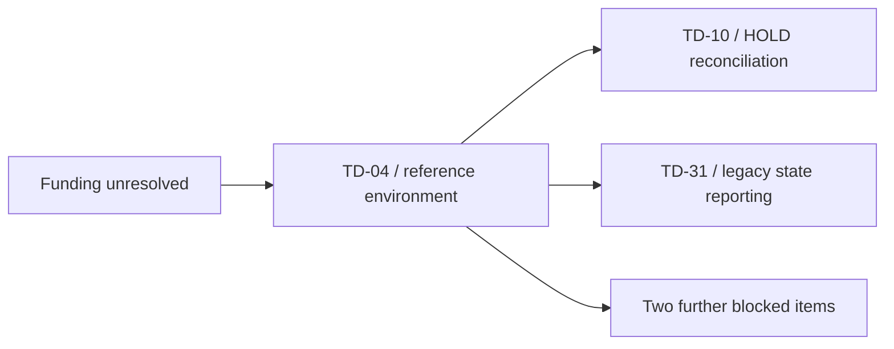

| Document ID | Classification | System | Document Owner | Status |
|---|---|---|---|---|
| `DS1-RSK-010` | IMPERIAL RESTRICTED | DS-1 Orbital Battle Station | Imperial Engineering Directorate — Architecture Authority | Operational / Controlled Document |

ACCESS: AUTHORIZED ENGINEERING PERSONNEL ONLY &middot; Unauthorized access will be logged and escalated to Sector Security Command.

# Technical Debt Register

Deficiencies that **exist now**. Unlike the [Risk Register](risk-register.md),
nothing here is conditional. Each entry is a present divergence between the
platform as designed and the platform as built or operated.

## Register

| ID | Deficiency | Severity | System | Origin | Blocked on |
|---|---|---|---|---|---|
| `TD-01` | Trunk network diversity below specification | High | Communications | ADR-008 | Structural window |
| `TD-02` | 16 `Z1` plant rooms retain pre-scheme location references | Medium | Zone architecture | ADR-008 | Resource |
| `TD-03` | Reconciliation after long `DETACHED` is slow and occasionally rejected | Medium | Command and Control | ADR-002 | Investigation |
| `TD-04` | `PREPROD` uses a live operational sector node | High | Deployment | ADR-008 | **Funding — refused twice** |
| `TD-05` | Command handover 26 min against a 15 min requirement | High | Command and Control | Commissioning gate | Design |
| `TD-06` | Cultivation yield variance absent from the consumption model | High | Supply | ADR-008 | Model revision |
| `TD-07` | `Q-III` has 4 of 6 required `Z3`→`Z2` boundary control points | Medium | Security zones | Construction | Structural window |
| `TD-08` | Pre-authorized envelopes drifted between quadrants | Medium | Command and Control | ADR-002 | Consolidation work |
| `TD-09` | Core thermal instrumentation at reduced resolution in 2 of 8 sectors | Low | Power Generation | Construction | Major window |
| `TD-10` | `HOLD` reconciliation on `DIODE-IN` restoration is manual, ~40 min | Low | Power Generation | ADR-003 | `TD-04` |
| `TD-11` | 6 `Q-II` sector distribution boards commissioned without `N+1` partners | Medium | Power Distribution | ADR-008 | Window availability |
| `TD-12` | `P4` consumption telemetry sampled at 60 s | Medium | Power Distribution | Construction | Instrumentation |
| `TD-13` | Transit abort rate 22 per cent, dominated by quiescence timeouts | Medium | Propulsion | `TD-03` | `TD-03` |
| `TD-14` | Hyperdrive unit 4 on a temporary mounting | Medium | Propulsion | ADR-008 | Full down-state |
| `TD-15` | 2 stellar reference heads obscured by later structure | Medium | Navigation | ADR-008 | Hull work |
| `TD-16` | `Q-IV` detection-to-track latency roughly double platform figure | Low | Sensors | Construction | Window availability |
| `TD-17` | 2 long-range sensor heads share a distribution board | Medium | Sensors | ADR-008 | Major window |
| `TD-18` | Trunk rings 2 and 3 share a 4 km conduit run | High | Communications | ADR-008 | Structural window |
| `TD-19` | `EMCON` conformance monitoring does not cover `IF-06` | Low | Communications | Scope gap | Design |
| `TD-20` | 11 hangar bays have single-side containment plant | High | Hangar and Docking | ADR-008 | Installation programme |
| `TD-21` | Manifest reconciliation per watch, not per handover | High | Hangar / Logistics | Construction | Implementation |
| `TD-22` | Life support groups 7 and 8 share a 2 km thermal transport route | Medium | Life Support | Construction | Structural window |
| `TD-23` | `Q-III` gravity plating control two revisions behind standard | Low | Life Support | Construction | Uplift programme |
| `TD-24` | Materiel tracking carries no logical sequence (CC-6) | Medium | Internal Transit | Scope gap | Implementation |
| `TD-25` | Contractor clearance expiry checked at transit, not continuously | High | Access Control | Scope gap | Implementation |
| `TD-26` | `Q-III` medical capacity 18 per cent below platform standard | Medium | Crew and Garrison | ADR-008 | Structural window |
| `TD-27` | Armament thermal inhibit sampled at 1 s, source measured at 100 ms | Low | Primary Armament | Scope gap | Ordnance Systems Authority |
| `TD-28` | Friendly corridor state at 100 ms only during declared launch/recovery | Low | Defensive Systems | Scope gap | Implementation |
| `TD-29` | `ORL-3` → `ORL-4` transition 4 h 20 min against a 4 h target | Medium | Operating model | Manual process | Automation |
| `TD-30` | Alert budget enforced per watch but not trended across watches | Low | Observability | Scope gap | Implementation |
| `TD-31` | 3 legacy sector nodes emit state by push, contrary to CC-4 | Medium | Observability | Construction | `TD-04` |
| `TD-32` | Documentation conformance sampling at ~6 per cent against 20 per cent | High | Documentation | Resource | Resource |
| `TD-33` | Propellant endurance reported inside the aggregate endurance figure | Low | Supply | Reporting | Implementation |
| `TD-34` | Entitlement review manual, samples ~3 per cent of holders | Medium | Access Control | Resource | **Unfunded** |
| `TD-35` | Two-officer manual authority procedure logged on paper | Medium | Authorization | Scope gap | Implementation |
| `TD-36` | `GW-LO` schema validation covers 91 per cent of message classes | Medium | Network segmentation | Scope gap | Schema work |

**Totals:** 9 High, 18 Medium, 9 Low. None Critical — a Critical technical debt
item would mean the platform is currently unsafe, which would be an incident
rather than a register entry.

## Origin Analysis

```mermaid
flowchart LR
    A8["ADR-008<br/>Live commissioning"]
    A2["ADR-002<br/>Sector autonomy"]
    A3["ADR-003<br/>Diodes to Z0"]
    CON["Construction-phase<br/>economies"]
    SCOPE["Scope gaps<br/>identified in service"]
    RES["Resource<br/>constraints"]

    D11["11 items"]
    D2["2 items"]
    D1["1 item"]
    D9["9 items"]
    D8["8 items"]
    D5["5 items"]

    A8 --> D11
    A2 --> D2
    A3 --> D1
    CON --> D9
    SCOPE --> D8
    RES --> D5

    style A8 fill:#1a1010,stroke:#a83c33
    style D11 fill:#1a1010,stroke:#a83c33
```

**Eleven of thirty-six items trace to a single decision**,
[ADR-008](../decisions/adr-008-live-commissioning.md), and every one of the
eleven is a redundancy or diversity compromise. Under schedule pressure, the
second path is what gets cut, because a single path passes its commissioning
test. The Directorate's protest at the time requested a remediation budget; it
was not established.

## Blocking Analysis

**The reference-environment dependency**

TD-04 blocks several remediations, so its indirect programme impact exceeds the local severity score.

The register's real structure is not severity. It is what each item is waiting
for.

| Blocked on | Items | Note |
|---|---|---|
| **Structural window** | `TD-01` `TD-07` `TD-18` `TD-22` `TD-26` | The scarcest resource on the platform |
| **Major or full down-state** | `TD-09` `TD-14` `TD-17` | Requires conditions the platform cannot enter while deployed |
| **`TD-04` (reference environment)** | `TD-10` `TD-31` + 2 others | Four items blocked by one item |
| **Window availability** | `TD-11` `TD-16` | Contention, not scarcity |
| **Implementation** | `TD-19` `TD-21` `TD-24` `TD-25` `TD-28` `TD-30` `TD-33` `TD-35` `TD-36` | Approved, queued |
| **Funding** | `TD-04` `TD-34` | `TD-04` refused twice; `TD-34` never funded |

!!! danger "The `TD-04` cascade"

    `TD-04` is the absence of a dedicated reference environment. It is itself a
    consequence of `ADR-008`, it has been refused funding twice on cost, and it
    now blocks four other remediations — three of which were also caused by
    `ADR-008`.

    The Directorate's assessment is that `TD-04` is the highest-leverage item in
    this register and that its severity rating of High
    understates its programme effect, because the rating measures its direct
    impact and not the four items it holds.

## Impact on Quality Scenarios

| Scenario | Status | Blocking debt |
|---|---|---|
| [QS-03](../architecture/quality-requirements.md#qs-03-unauthorized-access-attempt-on-a-zone-boundary) | Partial | `TD-07` |
| [QS-04](../architecture/quality-requirements.md#qs-04-sustained-operation-without-resupply) | At risk | `TD-06`, `TD-12` |
| [QS-06](../architecture/quality-requirements.md#qs-06-scheduled-maintenance-without-readiness-loss) | Partial | `TD-04` |
| [QS-07](../architecture/quality-requirements.md#qs-07-loss-of-the-overbridge) | Not met | `TD-05` |

Five of the eight quality scenarios are fully met. The three that are not are
blocked by four debt items, all of which have named owners and approved
remediation.

## Register Discipline

| Rule | Reason |
|---|---|
| An item is closed only on **verified** remediation, never on completed work | Verification is the control |
| An item may not be reclassified as a risk | Debt is a present condition; reclassifying it makes it sound conditional |
| An item that has been open for more than two review cycles without progress is escalated to Imperial Engineering Command | Prevents indefinite carriage |
| Severity is set by consequence, not by remediation cost | Cheap items are not downgraded to make the register look better |
| Every item names what it is blocked on | An item with no blocker is either being worked or is unowned |

Fourteen items in this register have been open for more than two review cycles
and are escalated at each annual report to Imperial Engineering Command.
