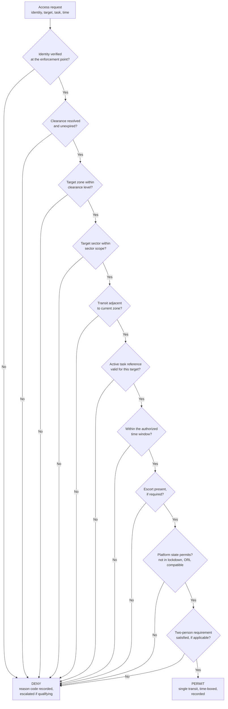

| Document ID | Classification | System | Document Owner | Status |
|---|---|---|---|---|
| `DS1-SEC-010` | IMPERIAL RESTRICTED | DS-1 Orbital Battle Station | Sector Security Command | Operational / Controlled Document |

ACCESS: AUTHORIZED ENGINEERING PERSONNEL ONLY &middot; Unauthorized access will be logged and escalated to Sector Security Command.

# Access Control Model

## 1. Model

Access is **attribute-based**. A role alone never grants access; it contributes
one attribute among several.

This is forced by `C-O-03`: contractor personnel hold time-boxed, sector-scoped
clearances, and no role-based scheme expresses "this person, in this sector, for
this task, until this hour" without degenerating into one role per person.

### Decision Inputs

Every access decision evaluates all of the following. A missing input is
evaluated as failing.

| Attribute | Source | Example |
|---|---|---|
| Identity | Credential + biometric at the enforcement point | Single, never shared |
| Clearance level | Imperial Identity Authority via `IF-04`, cached | IMP-1 … IMP-5 |
| Clearance expiry | Same | Absolute time |
| Sector scope | Local policy | `N1-060`, `N1-090` |
| Zone scope | Derived from clearance and sector scope | `Z4`, `Z3` |
| Active task reference | Work packet or watch assignment | `WP-4471` |
| Escort requirement | Personnel class | Contractors: always inward of `Z4` |
| Time window | Work packet or watch | Absolute start and end |
| Platform state | Command and Control | ORL; lockdown state; incident state |
| Two-person requirement | Target zone | `Z0` only |

### Decision Rule

Conjunctive, fail-closed, with no override path. A condition that cannot be
evaluated fails.

## 2. Clearance Levels

| Level | Zones | Typical holders | Grant authority |
|---|---|---|---|
| `IMP-1` | Z4 | Hangar, cargo, hull maintenance, contractors | Sector Security Officer |
| `IMP-2` | Z4, Z3 | Garrison, general crew, support, senior contractors | Security Officer of the Watch |
| `IMP-3` | Z4 … Z2 | Watch-keeping, sector control, sensor and comms operators | Sector Security Command |
| `IMP-4` | Z4 … Z1 | Plant engineers, power, life support, propulsion | Sector Security Command |
| `IMP-5` | Z4 … Z0 | Reactor Systems Authority personnel only | Imperial Security, per individual |

Clearance is **granted externally and revoked locally**. Sector Security Command
can suspend a clearance aboard immediately; it cannot grant one above `IMP-3`.
Asymmetric by design: restriction is fast, elevation is slow.

## 3. Contractor Access

The largest security variable on the platform. The contractor population varies
between roughly 20,000 and 90,000 depending on the refit cycle, and the model is
designed against the upper bound.

| Control | Rule | Enforcement |
|---|---|---|
| Clearance ceiling | `IMP-2`. Higher clearance for a contractor requires Imperial Security per individual and is rare. | Authorization Service |
| Sector scope | Named sectors only. Never platform-wide. | Authorization Service |
| Time box | Bounded by the work packet, never open-ended. | Authorization Service |
| Escort | Continuous inward of `Z4`. Unescorted contractor presence inward of `Z4` is a Class-2 event. | Boundary control + garrison patrol |
| Materiel | Tracked in and out; reconciled per movement. | Materiel tracking |
| Egress | Ordered at `ORL-4`; egress time is part of the transition figure. | Operating model |
| Expiry | Checked at transit. **Not continuously** — `TD-25`. | Authorization Service |

### Empirical Basis

Since commissioning: 61 Class-2 incidents, of which 38 were boundary security
events, of which **31 involved contractor personnel**. None resulted in a
successful unauthorized transit; every one was refused at the boundary and
recorded.

The Directorate's position: the control is working, and the rate tells us the
control is being tested regularly. It is the basis for
[R-04](../risks/risk-register.md), which is rated on likelihood of attempt, not
on the outcome record.

## 4. Droid and Service Identity

Droids and automated services hold identities to the same standard as personnel.

| Rule | Rationale |
|---|---|
| One identity per unit; no shared service credentials | Attribution is meaningless without it |
| Clearance and sector scope, exactly as for personnel | A droid in the wrong zone is the same problem as a person in the wrong zone |
| No droid holds above `IMP-3` | [ADR-005](../decisions/adr-005-droid-automation-boundary.md) |
| No droid may satisfy a two-person requirement | The two-person rule exists to require two *judgements* |
| Every droid action carries its causing directive reference | [CC-4](../architecture/crosscutting-concepts.md#cc-4-observability) |
| Droid identities are revocable individually and in bulk | A compromised droid class must be removable in one action |

The two-person rule constraint is the important one: a droid cannot be the second
party. Two independent judgements is the control, and a droid performing a
scripted concurrence is not a second judgement.

## 5. Standing Authorizations

Watch-keeping personnel hold pre-computed transit permissions for their assigned
route, revalidated each watch.

| Property | Rule |
|---|---|
| Scope | The specific route for the specific watch. Nothing else. |
| Validity | The watch. Expires at handover; does not roll over. |
| Decision | Still made per transit — the decision is pre-computed, not skipped |
| Recording | Every transit recorded exactly as a per-transit decision |
| Revocation | **Immediate and wholesale on any lockdown** |

Standing authorizations are the concession to the transit cost imposed by `S-1`.
They are acceptable only because the revocation is instantaneous and total.

## 6. Audit

| Recorded | Retention | Store |
|---|---|---|
| Every access decision, permit and deny | Life of the programme | Security audit store |
| Every refusal reason code | Life of the programme | Security audit store |
| Every count reconciliation exception | Life of the programme | Security audit store |
| Every clearance grant, change and revocation | Life of the programme | Security audit store |
| Every standing authorization issued and revoked | Life of the programme | Security audit store |

The security audit store is **separate from the Command Log** and is replicated
independently. An event present in one and absent from the other is itself an
incident — the two stores cross-check each other.

### Quarterly Authorization Audit

| Check | Failure means |
|---|---|
| Sample of decisions replayed against current policy | Policy has drifted from what was applied |
| Enforcement-point logs reconciled against decision-point logs | A decision was enforced that was never made, or vice versa |
| Clearances held against clearances required by assignment | Scope creep — the `T-4` insider vector |
| Standing authorizations against watch assignments | Authorizations outliving their purpose |
| Contractor clearances against active work packets | Contractors aboard without a reason to be |

## 7. Known Deficiencies

| Ref | Deficiency | Impact | Status |
|---|---|---|---|
| `TD-25` | Contractor clearance expiry checked at transit, not continuously. | Expired clearance undetected until next transit. | Continuous sweep approved |
| `TD-34` | Scope-creep detection in the quarterly audit is manual and samples roughly 3 per cent of holders. | The `T-4` insider vector is the least well monitored of the six modelled threats. | Automated entitlement review requested; not yet funded |
