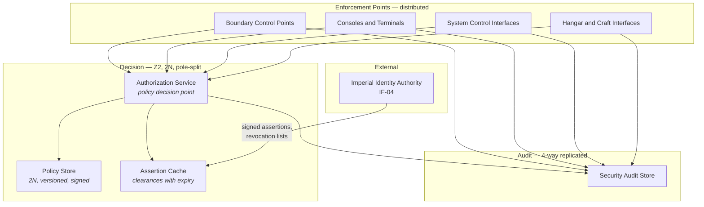
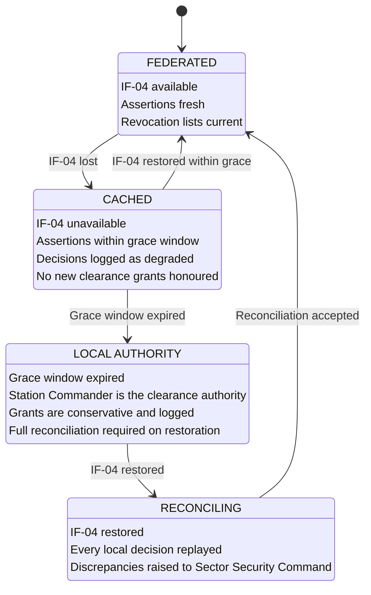

| Document ID | Classification | System | Document Owner | Status |
|---|---|---|---|---|
| `DS1-SEC-030` | IMPERIAL RESTRICTED | DS-1 Orbital Battle Station | Sector Security Command | Operational / Controlled Document |

ACCESS: AUTHORIZED ENGINEERING PERSONNEL ONLY &middot; Unauthorized access will be logged and escalated to Sector Security Command.

# Authentication and Authorization

## 1. Separation of Concerns

Three distinct questions, three distinct components, deliberately never merged.

| Question | Component | Location |
|---|---|---|
| **Who is this?** | Authentication at the enforcement point | Local — boundary control point, terminal, console |
| **What may they do?** | Authorization Service (policy decision point) | Central — `Z2`, 2N, pole-split |
| **Did it happen?** | Security audit store | Central — 4-way replicated, separate from the Command Log |

Merging authentication and authorization would put policy at the enforcement
point, and an enforcement point is by definition in a place that can be reached.
Keeping them apart is what makes a compromised enforcement point a
denial-of-service problem rather than a breach.

## 2. Architecture

**Enforcement points log independently of the decision point.** The two logs are
reconciled at the quarterly audit. A decision present in one and absent from the
other means either a decision was enforced that was never made, or a decision was
made and never enforced — both are incidents.

## 3. Authentication

| Factor | Applies to | Note |
|---|---|---|
| Credential | All | Individually issued; never shared; revocable individually |
| Biometric | All personnel | Verified locally at the enforcement point |
| Cryptographic attestation | Droids and services | Per-unit key; no class keys |
| Physical presence of a second party | `Z0` entry, armament hold, command handover, both-side essential bus work | Two independent judgements, not two credentials |

Credential verification is **local**. An enforcement point that cannot reach the
Authorization Service can still determine *who* someone is; it simply cannot
determine what they may do, and therefore refuses.

## 4. Authorization

The decision rule and its inputs are in
[Access Control Model §1](access-control-model.md#1-model). Properties of the
decision itself:

| Property | Rule |
|---|---|
| Single decision point | Logically one service. Systems do not decide for themselves. |
| Conjunctive | Every condition must pass. |
| Fail-closed | A condition that cannot be evaluated fails. |
| Scoped | Zone, sector, task, time — always all four. |
| Single-use | One decision authorizes one action. |
| Reasoned refusal | Every denial carries a reason code, returned to the requester ([CC-7](../architecture/crosscutting-concepts.md#cc-7-human-factors-and-command-ergonomics)). |
| Recorded | Permits and denials both, for the life of the programme. |

### Authorization Tokens

For system-to-system actions, a permit is issued as a scoped, time-boxed token.

| Field | Purpose |
|---|---|
| Subject | The identity the token was issued to |
| Scope | Zone, sector, target system, permitted operation |
| Validity | Absolute start and end |
| Causing directive | The directive that prompted the request |
| Signature | Authorization Service, verifiable at the enforcement point |

Tokens are **validated at the enforcement point against local state as well as
against the signature**. A structurally valid token that contradicts local
conditions is refused locally. A valid token is a necessary condition, never a
sufficient one — this is what prevented a replayed token from completing an
isolation during a commissioning exercise.

## 5. Federation and Degradation

`IF-04` supplies clearance assertions from the Imperial Identity Authority. It is
an inbound-only, one-way interface. The decision is always made aboard.

**At no point does the posture become more permissive.** `CACHED` honours what
was already asserted and grants nothing new. `LOCAL` grants conservatively under
a named authority and logs every decision for reconciliation. See
[ADR-007](../decisions/adr-007-identity-federation.md) and
[QS-02](../architecture/quality-requirements.md#qs-02-command-authorization-under-degraded-comms).

### Revocation Under Degradation

Revocation is the hard case. A revocation issued at Coruscant cannot reach the
platform when `IF-04` is down.

| Mechanism | Coverage |
|---|---|
| Cached revocation list | Revocations known before the interface was lost |
| Local suspension | Sector Security Command may suspend any clearance aboard, immediately, at any time |
| Expiry | All cached assertions expire; they do not become permanent |

The gap — a revocation issued externally during an outage — is real and is
unclosable without a channel that does not exist. It is bounded by the assertion
expiry period and is accepted.

## 6. The `NO-AUTH` State

Loss of both Authorization Service instances.

| Consequence | Detail |
|---|---|
| Discretionary actions | **All refused.** No fail-open path exists. |
| Automatic protective actions | **Unaffected.** Bulkhead sealing, load shedding, containment and inhibits are pre-authorized. |
| Manual authority | Two-officer procedure available; deliberately slower; itself logged |
| Priority | Restoration of one instance is the highest-priority engineering action |

The platform can be halted by an attack on the Authorization Service. It cannot
be *caused to act* by one. That asymmetry is the design, and it was chosen
knowing the denial-of-service exposure it creates.

## 7. Known Deficiencies

| Ref | Deficiency | Impact | Status |
|---|---|---|---|
| `TD-34` | Entitlement review is manual and samples ~3 per cent of holders quarterly. | Scope creep (`T-4`) is the least well monitored modelled threat. | Automation requested; not funded |
| `TD-35` | The two-officer manual authority procedure is exercised annually but has never been used in anger, and its logging is on paper. | Reconstruction of a `NO-AUTH` period would be incomplete, weakening [QS-08](../architecture/quality-requirements.md#qs-08-post-incident-audit-reconstruction). | Electronic capture on an independent store approved |
