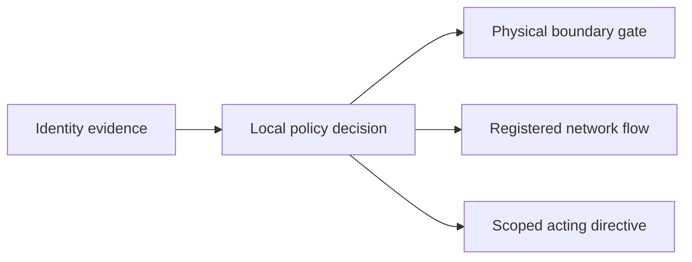

| Document ID | Classification | System | Document Owner | Status |
|---|---|---|---|---|
| `DS1-SEC-001` | IMPERIAL RESTRICTED | DS-1 Orbital Battle Station | Sector Security Command — in concurrence with the Imperial Engineering Directorate | Operational / Controlled Document |

ACCESS: AUTHORIZED ENGINEERING PERSONNEL ONLY &middot; Unauthorized access will be logged and escalated to Sector Security Command.

# Security Volume

| Document | ID | Covers |
|---|---|---|
| [Security Zones](security-zones.md) | `DS1-SEC-002` | Zone boundaries as security controls |
| [Access Control Model](access-control-model.md) | `DS1-SEC-010` | Attribute-based access; clearance; contractor handling |
| [Authentication and Authorization](authentication-and-authorization.md) | `DS1-SEC-030` | Identity, decision architecture, federation |
| [Network Segmentation](network-segmentation.md) | `DS1-SEC-020` | Enclaves, gateways, diodes, flow governance |
| [Publication and Access Control](publication-and-access-control.md) | `DS1-SEC-040` | How this library itself is protected |

## Threat Model

The architecture assumes the adversary has read this library. Controls that
depend on the adversary's ignorance are not counted as controls.

| # | Threat actor | Capability assumed | Primary vector | Principal control |
|---|---|---|---|---|
| `T-1` | Rebel Alliance intelligence, external | Full knowledge of this documentation; access to Imperial supply chains; capable technical resources | Contracted industry; supply chain | [Access Control Model](access-control-model.md); manifest reconciliation |
| `T-2` | Infiltrator with valid `Z4` credentials | Legitimate contractor or crew identity; physical presence; time | Zone boundary traversal; tailgating; credential misuse | Boundary control points; per-transit decisions; count reconciliation |
| `T-3` | Compromised external interface | Ability to present well-formed, correctly signed but false input | `IF-02` beacon falsification; `IF-03` picture injection | Cross-source integrity monitoring; `IF-03` carries no control authority |
| `T-4` | Insider with legitimate elevated clearance | Full authorized access within their scope | Abuse of scope; scope creep over time | Scope bounding; two-person rules; complete audit; refusal trending |
| `T-5` | Physical attack on the hull | Knowledge of structural and system layout | Direct kinetic attack on `Z0` or the poles | Zone depth; containment; [R-01](../risks/risk-register.md) — **not fully mitigated** |
| `T-6` | Interdiction of embarked or attached forces | Ability to compromise a craft before it returns | `IF-06` approach; craft-borne insertion | Craft identity and crew identity decided separately ([RV-4](../architecture/runtime-view.md#rv-4-craft-recovery-cycle)) |

### What the Threat Model Does Not Claim

- It does not claim `T-5` is mitigated. It is not. See
  [R-01](../risks/risk-register.md) and
  [Disaster Recovery §5.1](../operations/disaster-recovery.md#51-loss-of-the-reactor-with-containment-failure).
- It does not claim `T-1` is prevented, only that its most likely path — the
  contractor population — is controlled and monitored. 31 of 61 Class-2 incidents
  since commissioning involved contractor personnel at a zone boundary. None
  succeeded. The rate, not the outcome, is the concern.
- It does not treat operational secrecy as a control. Secrecy raises the cost of
  an attack; it does not prevent one, and an architecture that relies on it fails
  the moment it is breached.

## Security Design Principles

**Independent control layers**

A single identity assertion does not create a route, grant physical access or authorize actuation.

| Principle | Applied as |
|---|---|
| **Default deny** | Absence of a decision is a denial. No fail-open path exists anywhere on the platform. |
| **Decide centrally, enforce locally** | One Authorization Service; enforcement points hold no policy and cannot be locally reconfigured. |
| **Scope everything** | Every permission is bounded by zone, sector, task and time. Unbounded permissions do not exist. |
| **Separate identity decisions** | Craft identity is not crew identity. Cargo authorization is not personnel authorization. |
| **Degrade closed** | Loss of a security control reduces what is permitted, never increases it. |
| **Assume disclosure** | The adversary has this documentation. Design accordingly. |
| **Audit completely** | Every decision, including every refusal, is recorded for the life of the programme. |
| **Two parties for the irreversible** | `Z0` entry, armament charge hold, command handover, both-side essential bus work. |

## Escalation

Security events follow the security chain, not the engineering chain, and use a
separate store. A `Class-2` security event escalates to Sector Security Command
**automatically**, without Station Commander involvement — because an event a
station authority would prefer not to escalate is precisely the event that must
be. See [Incident Response §7](../operations/incident-response.md#7-security-incidents).
