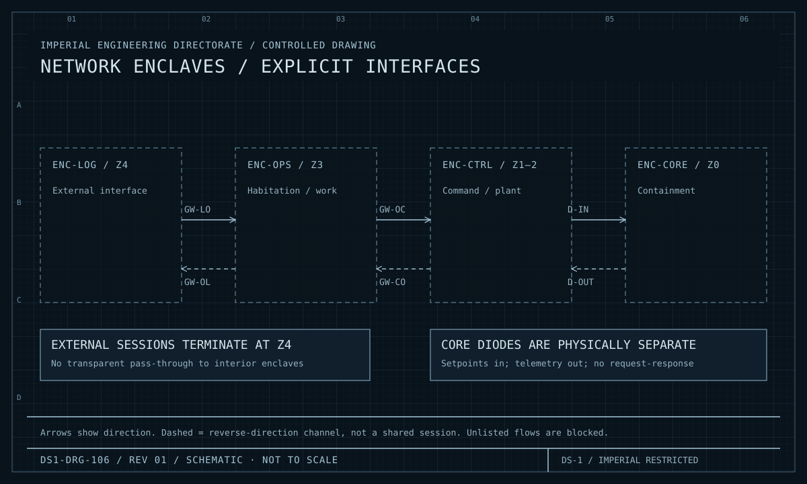

| Document ID | Classification | System | Document Owner | Status |
|---|---|---|---|---|
| `DS1-SEC-020` | IMPERIAL RESTRICTED | DS-1 Orbital Battle Station | Sector Security Command — in concurrence with the Control Systems Authority | Operational / Controlled Document |

ACCESS: AUTHORIZED ENGINEERING PERSONNEL ONLY &middot; Unauthorized access will be logged and escalated to Sector Security Command.

# Network Segmentation

## 1. Enclave Model

Four network enclaves aligned exactly to the zone model. Alignment is
deliberate: a single boundary that severs pressure, power and network at the same
line is comprehensible, testable and hard to get wrong.

| Enclave | Zones | Contains | Trust posture |
|---|---|---|---|
| `ENC-CORE` | Z0 | Reactor containment control | Trusts nothing; reachable only through diodes |
| `ENC-CTRL` | Z1, Z2 | Command, sector control, plant control | Trusts `ENC-CORE` telemetry; treats `ENC-OPS` as untrusted input |
| `ENC-OPS` | Z3 | Habitation, maintenance, medical, personnel, engineering environments | Treats `ENC-LOG` as untrusted input |
| `ENC-LOG` | Z4 | Hangar, cargo, external interface layer | Treats everything external as hostile |

## 2. Flow Architecture

<figure class="blueprint" markdown>

<figcaption>DS1-DRG-106 · Network enclaves / explicit interfaces · Rev 01 · Schematic, not to scale</figcaption>
</figure>

The paired arrows represent distinct channels. At the core boundary they are physically separate one-way diodes, never a shared session.

```mermaid
flowchart TB
    EXT["External<br/>IF-01 … IF-06"]

    LOG["ENC-LOG — Z4"]
    OPS["ENC-OPS — Z3"]
    CTRL["ENC-CTRL — Z1 / Z2"]
    CORE["ENC-CORE — Z0"]

    EXT -->|"terminated at the<br/>external interface layer;<br/>nothing passes through"| LOG

    LOG -->|"GW-LO<br/>schema-validated<br/>rate-limited<br/>manifests and traffic control only"| OPS
    OPS -->|"GW-OL<br/>tasking and manifests<br/>read-mostly"| LOG

    OPS -->|"GW-OC<br/>schema-validated<br/>authorized per message<br/>fully audited"| CTRL
    CTRL -->|"GW-CO<br/>state broadcast<br/>READ-ONLY"| OPS

    CTRL -->|"DIODE-IN<br/>setpoints only<br/>NO RETURN PATH"| CORE
    CORE -->|"DIODE-OUT<br/>telemetry only<br/>SEPARATE PHYSICAL PATH"| CTRL

    style CORE fill:#1a1010,stroke:#a83c33,stroke-width:2px
```

### Gateway Properties

| Gateway | Direction | Validation | Authorization | Rate limit |
|---|---|---|---|---|
| `GW-LO` | `ENC-LOG` → `ENC-OPS` | Schema | Per message class | Yes |
| `GW-OL` | `ENC-OPS` → `ENC-LOG` | Schema | Per message class | Yes |
| `GW-OC` | `ENC-OPS` → `ENC-CTRL` | Schema + semantic | **Per message, against the Authorization Service** | Yes |
| `GW-CO` | `ENC-CTRL` → `ENC-OPS` | Schema | Broadcast, read-only | Yes |
| `DIODE-IN` | `ENC-CTRL` → `ENC-CORE` | Schema, setpoints only | Per message | Yes |
| `DIODE-OUT` | `ENC-CORE` → `ENC-CTRL` | Schema, telemetry only | N/A — outbound telemetry | Yes |

`GW-OC` is the most heavily controlled path on the platform: it is the route from
the population-carrying enclave into the control enclave. Every message is
authorized individually.

## 3. The Diodes

`ENC-CORE` connectivity is unidirectional, on two physically distinct paths.

| Property | Detail |
|---|---|
| Physical | Two separate devices, two separate cable routes, two separate compartments |
| `DIODE-IN` | Carries setpoint requests only. **No acknowledgement, no response, no session, no return path of any kind.** |
| `DIODE-OUT` | Carries telemetry only. Cannot be commanded, cannot be configured from `ENC-CTRL`. |
| Redundancy | **None, deliberately.** A redundant diode is a second path into `Z0`. |
| Loss of `DIODE-IN` | Reactor to `HOLD`; local `Z0` authority under the two-person rule |
| Loss of `DIODE-OUT` | Reactor telemetry lost; the platform is operating a reactor it cannot see; treated as a Class-1 condition |

Consumers of `IX-CORE` are written to a fire-and-observe contract: a setpoint is
sent, and its acceptance is inferred from a changed telemetry value on the other
path. There is no request-response.

## 4. Within-Enclave Segmentation

Enclaves are segmented internally by sector.

| Enclave | Internal segmentation | Cross-segment |
|---|---|---|
| `ENC-CTRL` | Per sector, 72 segments | Only via the Quadrant Command Post; **peer-to-peer between sector nodes is not permitted** |
| `ENC-OPS` | Per sector, plus isolated `DEV`/`INT` segments | Via sector aggregation |
| `ENC-LOG` | Per hangar belt sector | Via the freight and traffic control aggregation |
| `ENC-CORE` | Single segment | N/A |

**Sector control nodes cannot address each other.** This is the network
enforcement of the rule in
[RV-5](../architecture/runtime-view.md#rv-5-sector-link-loss-and-autonomous-degradation):
a node in `DETACHED` cannot be commanded by a peer. The policy and the topology
say the same thing, which is the intent.

## 5. Flow Governance

Every permitted flow is enumerated in the
[Interface Register](../reference/interface-register.md). Enumeration is not
documentation of what exists; it is the definition of what is allowed.

| Rule | Enforcement |
|---|---|
| A flow not in the register does not exist | Blocked by default at every gateway |
| An observed flow not in the register is an anomaly | **Blocked automatically, then investigated** — there is no "probably benign" category |
| Adding a flow requires an entry, which requires Architecture Review Board approval | Change control |
| Every gateway logs permitted and blocked flows | Security audit store |

Blocking first and investigating second is the deliberate order. An undeclared
flow that is allowed to continue while it is analysed is an undeclared flow that
is working.

## 6. Engineering Environment Isolation

`DEV` and `INT` are isolated segments of `ENC-OPS`
([Deployment View §7.2](../architecture/deployment-view.md#72-engineering-environments-on-a-live-platform)).

| From | To | Permitted |
|---|---|---|
| `DEV`/`INT` | Simulation and rig hardware within the segment | Yes |
| `DEV`/`INT` | `ENC-CTRL`, `ENC-CORE` | **Never** |
| `DEV`/`INT` | Any real actuator | **Never** |
| `PROD` | `DEV`/`INT` | Telemetry export only, one-way, sanitised |
| `PREPROD` | Its own node's hardware | Yes |
| `PREPROD` | Any other node | **Never** |

The `PROD` → `DEV` telemetry export is one-way and sanitised. It is the only path
between the environments and it carries data, never control.

## 7. Known Deficiencies

| Ref | Deficiency | Impact | Status |
|---|---|---|---|
| `TD-01` | Trunk network diversity is below specification; commissioning-phase routing compromises around occupied compartments. | Physical diversity does not fully match logical segmentation. | Re-route requires structural windows |
| `TD-18` | Trunk rings 2 and 3 share a 4 km conduit run. | Two of four rings lost to a single structural event, contrary to CC-5. | Re-route designed; major structural window required |
| `TD-36` | `GW-LO` schema validation covers 91 per cent of message classes; the remainder are passed with syntactic checks only. | A narrow undeclared-content path from the least trusted enclave. | Schema completion in progress |
