<div class="doc-control" markdown>

| Document ID | Classification | System | Document Owner | Status |
|---|---|---|---|---|
| `DS1-SEC-040` | IMPERIAL RESTRICTED | DS-1 Orbital Battle Station | Imperial Engineering Directorate — Documentation Systems Section | Operational / Controlled Document |

ACCESS: AUTHORIZED ENGINEERING PERSONNEL ONLY &middot; Unauthorized access will be logged and escalated to Sector Security Command.
</div>

# Publication and Access Control

How this library is published, and how its `IMPERIAL RESTRICTED` marking is
enforced technically rather than merely asserted.

A classification marking that is not enforced is a label. This document is the
enforcement.

## 1. The Single Boundary Principle

**Every page and every asset of this library resolves under one path prefix:
`/death-star/`.** That prefix is the sole access-control boundary. There is no
second boundary, no exception list and no per-page rule.

The reasoning is the same as the zone model's: a boundary that can be reasoned
about in one sentence is a boundary that can be verified. A rule set with
exceptions is a rule set whose exceptions are the attack surface.

```mermaid
flowchart TB
    subgraph PUB["Unrestricted — no authentication"]
        ROOT["/<br/><i>Engineering Practices</i><br/>public documentation only"]
        ASSETS["/assets/<br/><i>theme runtime</i>"]
    end

    subgraph RESTRICTED["/death-star/* — authenticated"]
        IDX["/death-star/"]
        ARCH["/death-star/architecture/*"]
        SYS["/death-star/systems/*"]
        OPS["/death-star/operations/*"]
        SEC["/death-star/security/*"]
        DEC["/death-star/decisions/*"]
        RSK["/death-star/risks/*"]
        REF["/death-star/reference/*"]
        ES["/death-star/es/*"]
        BLU["/death-star/assets/blueprints/*<br/><i>controlled drawings</i>"]
        CSS["/death-star/assets/stylesheets/*<br/><i>private visual language</i>"]
        SEARCH["/death-star/search.json<br/><i>private search index</i>"]
    end

    IDX --> ARCH & SYS & OPS & SEC & DEC & RSK & REF & ES
    IDX --> CSS & SEARCH
    ARCH -.->|"relative reference"| BLU
    SYS -.->|"relative reference"| BLU

    style RESTRICTED fill:#1a1010,stroke:#a83c33,stroke-width:2px
```



## 2. Route Rule

The whole library is protected by a single Azure Static Web Apps route rule:

```json
{
  "routes": [
    {
      "route": "/death-star/*",
      "allowedRoles": ["authenticated"]
    }
  ],
  "responseOverrides": {
    "401": { "statusCode": 302, "redirect": "/.auth/login/aad" }
  }
}
```

One rule. One prefix. Nothing to keep in sync.

!!! danger "Do not add exceptions to this rule"

    Every proposal to exempt a page from `/death-star/*` — a public overview, a
    shareable diagram, a contractor-facing summary — has been refused, and the
    refusals are recorded. An exception list requires that every future author
    understand it, and authors rotate on an 18-month cycle (`C-O-04`).

    A contractor-facing summary is a **separate document**, written for that
    purpose, classified for that purpose, published elsewhere. It is not this
    library with a hole in it.

## 3. Content Placement Rules

Binding on every author.

| Rule | Reason |
|---|---|
| Every DS-1 page lives under `docs/death-star/`. | Single boundary. |
| Every DS-1 asset — drawings, diagrams, data — lives under `docs/death-star/assets/`. | An asset outside the prefix is served without authentication. |
| Internal links are **relative**, never absolute or site-root. | A root-absolute link breaks under a different base path or a preview deployment; a relative link does not. |
| No DS-1 content in the root `docs/index.md` or in any file outside the prefix. | Single boundary. |
| No DS-1 content in the site title, description, or navigation labels above the DS-1 entry. | These render on unauthenticated pages. |
| Site-wide presentation assets contain no DS-1 subject matter. | See §4. |

### Verification

These rules are mechanically checkable and are checked at each publication:

```bash
# 1. No DS-1 pages outside the protected prefix.
find docs -name '*.md' -not -path 'docs/death-star/*' -not -name 'index.md'

# 2. No DS-1 assets outside the protected prefix.
find docs -name '*.svg' -not -path 'docs/death-star/*'

# 3. No root-absolute internal links (they bypass relative resolution).
grep -rnE '\]\(/(death-star|architecture|systems|operations|security)' docs/

# 4. The unrestricted root page discloses nothing beyond the library's existence.
cat docs/index.md
```

## 4. Visual Assets and Search Stay Inside the Boundary

All DS-1 source assets live under `docs/death-star/assets/`: blueprint SVGs in
`blueprints/` and the private presentation layer in `stylesheets/`. Markdown
pages reference these assets relatively. The deployment output places them
under `/death-star/assets/`.

The public and private documentation are built separately. This keeps DS-1
navigation labels, page text, search entries and sitemap entries out of the
public build. The private search index is `/death-star/search.json`; private
theme resources also remain under `/death-star/`.

The public Engineering Practices pages use their own stylesheet and never
request the private presentation layer. There is no stylesheet exception.

Before publication, `scripts/verify_assets.py` resolves local image, stylesheet,
script and SVG-link references from the generated private HTML. Missing files
or URLs outside `/death-star/` fail the build, including those in the private
404 page. This verifies publication paths; Azure enforces authentication.

## 5. Authenticated Access

| Property | Value |
|---|---|
| Identity provider | Imperial Identity Authority via the platform's configured provider |
| Role required | `authenticated` |
| Unauthenticated `/death-star/*` | 302 to the login endpoint; no content, no directory listing, no page title |
| Session | Per the identity provider's policy |
| Logging | Every access recorded against the requesting identity |

## 6. What This Boundary Does and Does Not Do

| Protects against | Does not protect against |
|---|---|
| Anonymous retrieval of any DS-1 page or drawing | An authorized reader disclosing content onward |
| Search-engine indexing of controlled content | An authorized reader's session being taken over |
| A misconfigured page leaking through a per-page rule (there are none) | Content quoted into an uncontrolled document |
| Assets served without authentication (there are none inside the boundary) | Screen capture, transcription, recall |

The right-hand column is handled by classification handling obligations
([Document Control §1](../document-control.md#1-classification-scheme)) and by
access logging, not by routing. **The boundary is a technical control against
anonymous retrieval. It is not, and does not claim to be, a control against an
authorized reader.**

## 7. Portability

This library is a self-contained content package. It carries no dependency on the
host site's configuration beyond the route rule and the Markdown extensions it
uses.

| Property | Consequence |
|---|---|
| All content under one directory | The package moves as a unit |
| All links relative | The package works under any base path |
| All assets inside the boundary | Moving the package moves its assets |
| No absolute site URLs | No rewriting on integration |
| Navigation contributed as one nav subtree | One block to paste into a host configuration |

Integration instructions for a host site are held in `INTEGRATION.md` at the
repository root, outside this library and outside the boundary — deliberately, so
that a site operator can read them without holding a Directorate clearance.
