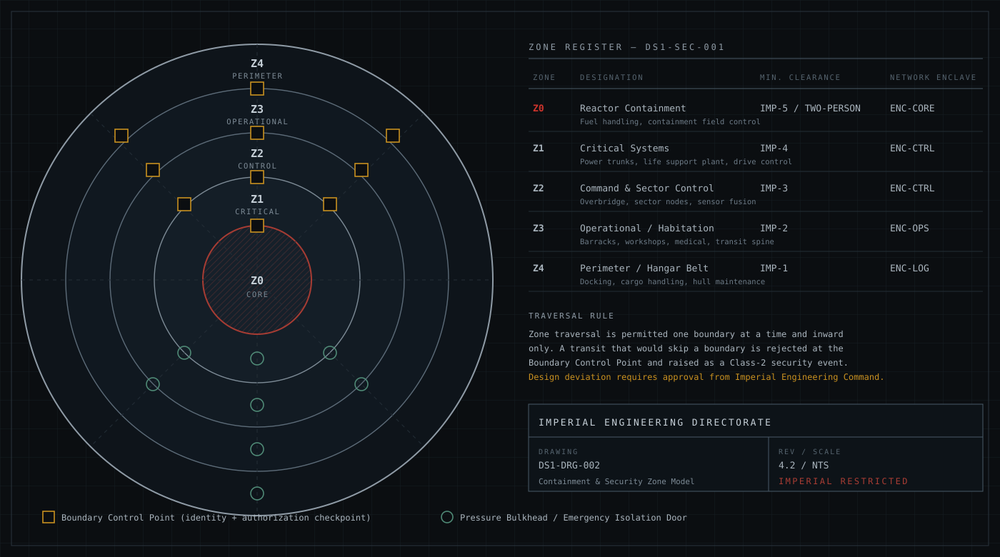
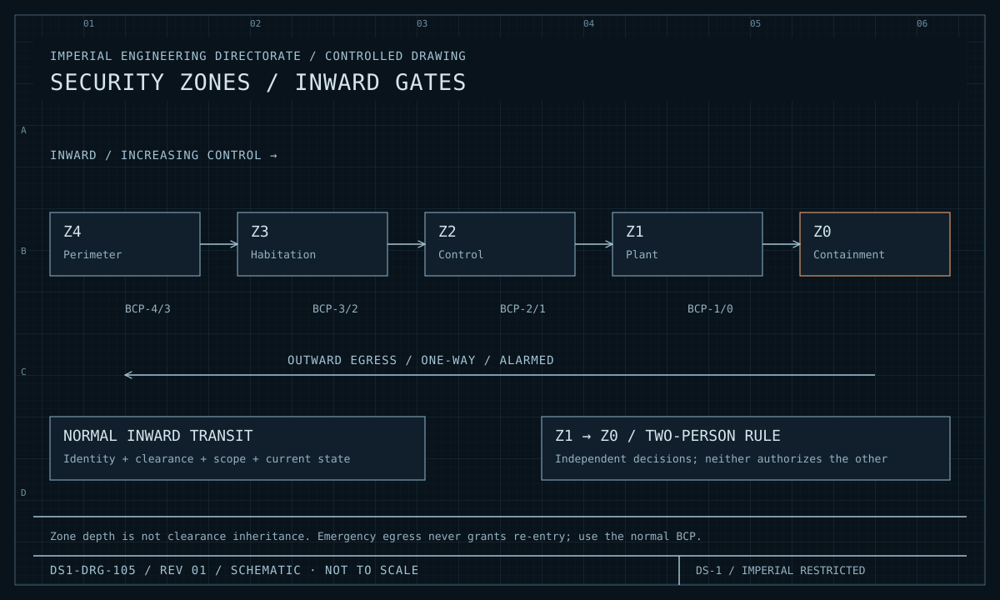
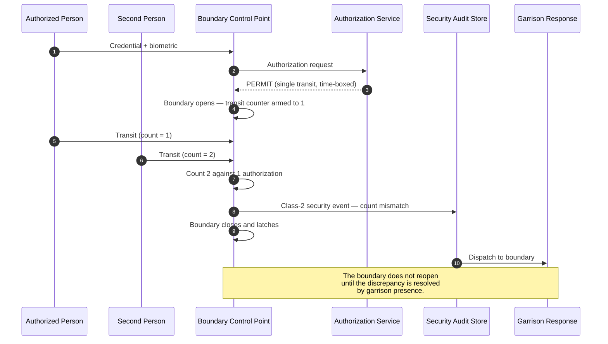

| Document ID | Classification | System | Document Owner | Status |
|---|---|---|---|---|
| `DS1-SEC-002` | IMPERIAL RESTRICTED | DS-1 Orbital Battle Station | Sector Security Command | Operational / Controlled Document |

ACCESS: AUTHORIZED ENGINEERING PERSONNEL ONLY &middot; Unauthorized access will be logged and escalated to Sector Security Command.

# Security Zones

The zone model is described spatially in
[Zone and Sector Architecture](../architecture/zone-and-sector-architecture.md).
This document describes it as a **security control**: what each boundary enforces,
how it fails, and what it does not protect against.

<figure class="blueprint" markdown>

<figcaption>DS1-DRG-002 &middot; Containment and Security Zone Model &middot; Rev 4.2</figcaption>
</figure>

## 1. Boundary Controls by Zone

<figure class="blueprint" markdown>

<figcaption>DS1-DRG-105 · Security zones / inward gates · Rev 01 · Schematic, not to scale</figcaption>
</figure>

Each inward crossing requires its own boundary decision. Outward emergency egress does not create a return path.

| Boundary | Minimum clearance | Additional requirement | Failure mode |
|---|---|---|---|
| Exterior → `Z4` | IMP-1 | Craft identity verified separately from crew identity | Bay closed |
| `Z4` → `Z3` | IMP-2 | Active task reference; escort for contractors | Boundary closed |
| `Z3` → `Z2` | IMP-3 | Active task reference; watch assignment or authorized visit | Boundary closed |
| `Z2` → `Z1` | IMP-4 | Active work packet with isolation reference | Boundary closed |
| `Z1` → `Z0` | IMP-5 | **Two-person rule**: two independently authorized identities, both present, neither able to authorize the other | Boundary closed |

Every boundary fails closed. There is no boundary anywhere on the platform that
opens on the loss of its control.

## 2. What a Boundary Control Point Is and Is Not

| It is | It is not |
|---|---|
| A policy **enforcement** point | A policy **decision** point |
| A recorder of every transit and every refusal | A store of clearance data |
| Physically able to hold a boundary closed | Able to hold one open |
| Reconfigurable only from the Authorization Service | Reconfigurable locally, by anyone, under any circumstance |

**A compromised BCP cannot grant access.** It holds no policy and no credentials.
The worst a compromised BCP can do is refuse legitimate transits — a denial of
service, not a breach. This asymmetry is the point of the design.

## 3. Transit Properties

| Property | Rule | Detects |
|---|---|---|
| **Adjacency** | One boundary per transit; `Z4` → `Z2` directly is not a route | Attempted non-adjacent transit — Class-2 event |
| **Single use** | Each authorization permits exactly one transit | Reuse — refused and recorded |
| **Time-boxed** | Each authorization expires | Delayed use — refused and recorded |
| **Count reconciliation** | Persons through the boundary are counted against authorizations issued | Tailgating — Class-2 event |
| **Direction** | Inward and outward are separately authorized | Unauthorized egress from a restricted zone |
| **Task binding** | Inward of `Z3`, an active task reference is required | Presence without purpose |

### Tailgating Detection

The boundary **latches closed** on a count mismatch. This produces genuine
operational disruption when it triggers on a legitimate error — which it does,
several times per month — and that disruption is accepted, because the
alternative is a control that can be defeated by walking closely behind someone.

## 4. Emergency Egress

Every zone has emergency egress: one-way, outward, alarmed.

| Property | Rule | Why |
|---|---|---|
| Direction | Outward only, mechanically | It cannot be used to move inward, so it is not an access bypass |
| Authorization | None required | Life safety overrides access control, outward |
| Alarm | Every use raises a Class-3 event, minimum | Use is always investigated, never routine |
| Re-entry | Not possible through the egress route | Return is through a normal BCP with a normal decision |

**Life safety overrides access control in the outward direction and only in the
outward direction.** This asymmetry is stated in every security briefing because
it is the point most often misunderstood.

## 5. Zone Lockdown

| Lockdown scope | Set by | Effect |
|---|---|---|
| Sector | Sector Security Officer | Transit into and out of the sector halted at the next station; standing authorizations revoked in that sector |
| Zone, one quadrant | Security Officer of the Watch | All boundaries in that zone and quadrant hold closed; per-transit authorization only |
| Platform | Station Commander | All standing authorizations revoked platform-wide; all transit per-authorization only |

Lockdown **revokes standing authorizations immediately**. Standing
authorizations are a normal-operations convenience
([Internal Transit §4](../systems/internal-transit.md#4-mitigations-for-the-transit-cost));
lockdown withdraws them the instant they become a liability. This withdrawal is
the mechanism that makes the convenience acceptable in the first place.

## 6. What the Zone Model Does Not Protect Against

| Not protected | Why | Reference |
|---|---|---|
| Physical attack from outside the hull | Zones control movement, not kinetic effect | [R-01](../risks/risk-register.md) |
| An insider acting entirely within their authorized scope | Every action is authorized and logged; nothing refuses it | `T-4`; controlled by scope bounding, two-person rules and audit review, not by zoning |
| A contractor whose clearance expires while inside a zone | Expiry is checked at transit, not continuously | `TD-25` |
| Information disclosure by an authorized reader | Zoning controls presence, not memory | [Publication and Access Control](publication-and-access-control.md) |

The second row is the one that matters most. Zoning is a control against
*movement*. Against a properly cleared insider operating within their scope, it
does nothing at all, and the controls that do apply are audit, scope bounding and
the two-person rule.

## 7. Known Deficiencies

| Ref | Deficiency | Impact | Status |
|---|---|---|---|
| `TD-07` | `Q-III` has four `Z3`→`Z2` boundary control points where the standard is six. | Muster times 40 per cent above standard; garrison dispatch time misses the [QS-03](../architecture/quality-requirements.md#qs-03-unauthorized-access-attempt-on-a-zone-boundary) target in that quadrant. | Two additional BCPs funded; structural work required |
| `TD-25` | Contractor clearance expiry is checked at transit, not continuously. | A contractor whose clearance expires inside `Z3` is detected only at their next transit. | Continuous expiry sweep approved |
