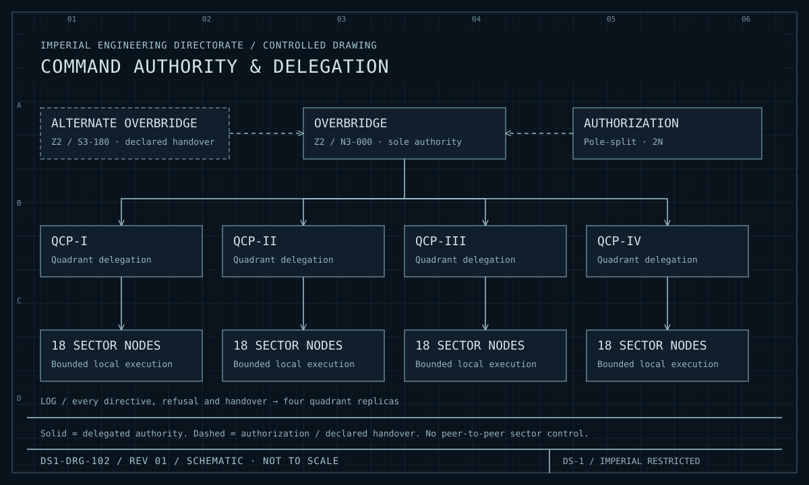
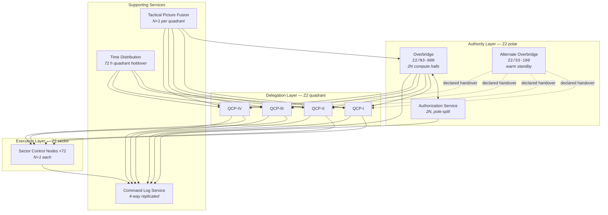

| Document ID | Classification | System | Document Owner | Status |
|---|---|---|---|---|
| `DS1-ENG-010` | IMPERIAL RESTRICTED | DS-1 Orbital Battle Station | Control Systems Authority | Operational / Controlled Document |

ACCESS: AUTHORIZED ENGINEERING PERSONNEL ONLY &middot; Unauthorized access will be logged and escalated to Sector Security Command.

# Command and Control

## 1. Purpose and Scope

Command and Control holds and exercises command authority over the platform. It
converts *intent* — from Imperial Command, from the Station Commander, or from an
automatic protective rule — into *authorized directives*, delivers them to the
system that will act, and records what was decided and why.

**In scope:** the Overbridge, the Alternate Overbridge, four Quadrant Command
Posts, 72 Sector Control Nodes, the Authorization Service, the Tactical Picture
Fusion service and the Command Log Service.

**Out of scope:** the actuation itself. C2 issues directives; it does not operate
plant. This separation is the reason a compromised C2 element cannot directly
cause a physical effect.

## 2. Decomposition

<figure class="blueprint" markdown>

<figcaption>DS1-DRG-102 · Command authority & delegation · Rev 01 · Schematic, not to scale</figcaption>
</figure>

Read authority from top to bottom. The alternate bridge assumes command only after a declared handover; authorization remains a separate service.

| Element | Count | Responsibility |
|---|---|---|
| Overbridge | 1 (2N internally) | Holds command authority. Single point of authority by design. |
| Alternate Overbridge | 1 | Assumes authority on declared handover only. Never automatically. |
| Authorization Service | 2 instances | The only policy decision point on the platform. |
| Quadrant Command Post | 4 | Delegates within a quadrant; aggregates quadrant state. |
| Sector Control Node | 72 | Executes within one sector; degrades autonomously and safely. |
| Tactical Picture Fusion | 4 clusters | Produces one agreed picture. Holds no control path. |
| Command Log Service | 4 replicas | Append-only record of every directive, decision and refusal. |
| Time Distribution | 1 per quadrant | Platform time plus logical sequence anchoring. |

## 3. Interfaces

| ID | Peer | Direction | Content | Protection |
|---|---|---|---|---|
| `IF-01` | Imperial Command | In/out | Strategic intent, readiness reporting | Encrypted, signed, store-and-forward |
| `IF-03` | Fleet tactical network | In/out | Tactical picture | Authenticated, schema-validated, **no control authority** |
| `IF-04` | Imperial Identity Authority | In | Clearance assertions | Signed, cached with expiry |
| `IX-CMD` | All acting systems | Out | Authorized directives with scoped tokens | Token-scoped, time-boxed |
| `IX-TLM` | All systems | In | State and telemetry | Read-only to C2 |
| `IX-CORE` | Power Generation | Out | Reactor setpoints via inbound diode | **Unidirectional, no return path** |
| `IX-PIC` | Sensors | In | Tracks and contacts | Read-only |

## 4. Operating Modes and Degradation

| Mode | Condition | Behaviour |
|---|---|---|
| `NOMINAL` | Overbridge, Authorization Service and all quadrants reachable | Full command function |
| `DEGRADED-AUTH` | One Authorization Service instance lost | Full function on the survivor; **no relaxation of policy**; second instance restoration is a priority action |
| `DEGRADED-QUAD` | One Quadrant Command Post lost | Its sectors go `DETACHED` and hold last authorized configuration; the Overbridge cannot reach them until the post is restored |
| `NO-AUTH` | Both Authorization Service instances lost | **All directives refused.** Two-officer manual authority procedure is available, is slower by design, and is itself logged |
| `NO-BRIDGE` | Overbridge unable to exercise authority | Quadrants continue on last authorized directives; declared handover to the Alternate Overbridge is initiated by the surviving senior officer |

!!! danger "There is no fail-open path"

    `NO-AUTH` refuses everything. This is a deliberate and expensive choice: it
    means a determined attack on the Authorization Service can halt discretionary
    platform activity. It cannot, however, *cause* anything — and automatic
    protective actions (bulkhead closure, load shed, containment) are
    pre-authorized and unaffected. Halting is recoverable; unauthorized actuation
    is not.

Sector node degradation is specified in
[RV-5](../architecture/runtime-view.md#rv-5-sector-link-loss-and-autonomous-degradation).

## 5. Redundancy and Failure Domains

| Element | Redundancy | Separation |
|---|---|---|
| Overbridge compute halls | 2N | Different `Z2` compartments, different ring buses |
| Overbridge / Alternate Overbridge | 1+1 | Opposite poles — maximum separation available |
| Authorization Service | 2N | Pole-split, deliberately **not** co-located with either bridge |
| Quadrant Command Posts | 2N internally | Own quadrant plus cross-feed from the adjacent quadrant |
| Sector Control Nodes | N+1 | Within-sector pair on separate distribution boards |
| Command Log | 4-way | One replica per quadrant; a quadrant loss loses no history |

The Authorization Service is deliberately not co-located with a bridge. An event
that removes the Overbridge must not simultaneously remove the platform's ability
to make authorization decisions, or the Alternate Overbridge would come up
unable to authorize anything.

## 6. Observability

| Signal | Class | Interval | Notes |
|---|---|---|---|
| Node mode (`LINKED`/`DETACHED`/`SAFE`) | State | 1 s poll | Per node; the single most-watched signal on the platform |
| Directive issued / decision / refusal | Event | Push | Full detail to the Command Log; retained for the life of the programme |
| Authorization decision latency | Measurement | Continuous | Trended; rising latency precedes `DEGRADED-AUTH` |
| Refusal rate by reason code | Measurement | Per watch | A rising rate at one gate is a defect indication, not operator error (CC-7) |
| Command Log replica divergence | State | 10 s | Any non-zero divergence beyond 30 s is an incident |
| Handover readiness of the Alternate Overbridge | State | 60 s | Drives `TD-05` remediation tracking |

## 7. Maintenance

- Sector node maintenance runs on the `N+1` partner; the sector is never without
  a node.
- Quadrant Command Post maintenance requires the quadrant to be declared at
  reduced readiness in advance and accepted by Fleet Command.
- Authorization Service maintenance is **single-instance only, never both**, and
  is prohibited during any declared alert state.
- Overbridge maintenance is performed hall-by-hall within the 2N pair.
- Change propagation follows the canary sequence in
  [Deployment View §7.3](../architecture/deployment-view.md#73-change-propagation-to-production).

## 8. Known Deficiencies

| Ref | Deficiency | Impact | Status |
|---|---|---|---|
| `TD-05` | Declared handover to the Alternate Overbridge takes 26 minutes against a 15-minute requirement. Cause: warm-standby state synchronisation is batch, not continuous. | [QS-07](../architecture/quality-requirements.md#qs-07-loss-of-the-overbridge) not met | Remediation approved; continuous synchronisation in design |
| `TD-03` | Reconciliation after long `DETACHED` periods is slow and occasionally rejected, forcing unnecessary `SAFE` transitions. | Availability loss after link events; operator confidence eroded | Under investigation by the Control Systems Authority |
| `TD-08` | The pre-authorized envelope for `DETACHED` operation is maintained manually per node and has drifted between sectors. | Inconsistent autonomous behaviour across the platform; a `Q-III` node may refuse what a `Q-I` node permits | Envelope consolidation scheduled |
