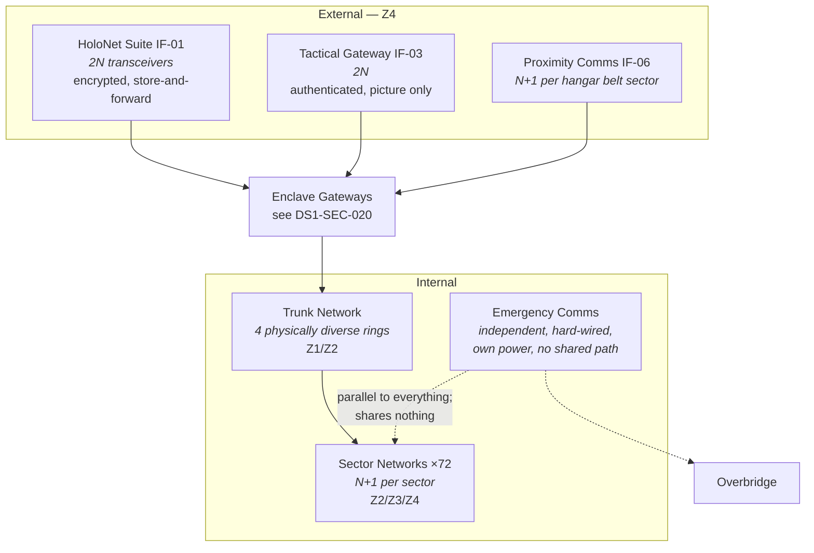

| Document ID | Classification | System | Document Owner | Status |
|---|---|---|---|---|
| `DS1-ENG-050` | IMPERIAL RESTRICTED | DS-1 Orbital Battle Station | Control Systems Authority | Operational / Controlled Document |

ACCESS: AUTHORIZED ENGINEERING PERSONNEL ONLY &middot; Unauthorized access will be logged and escalated to Sector Security Command.

# Communications

## 1. Purpose and Scope

Communications carries traffic between the platform and external parties, and
between locations aboard.

**In scope:** the long-range HoloNet suite (`IF-01`), the fleet tactical gateway
(`IF-03`), the internal trunk network, sector-local networks, and the emergency
communications provision.

**Out of scope:** the content of directives ([Command and Control](command-and-control.md));
enclave gateway policy ([Network Segmentation](../security/network-segmentation.md)).

## 2. Decomposition

### The Emergency Communications Provision

A hard-wired voice and alarm network reaching every crewed compartment. It shares
**no** component with the trunk network: not cabling, not power, not conduit
routing, not a common failure domain of any kind.

It carries no data, has no addressing beyond compartment, and cannot be
reconfigured. It exists for the case where everything else is gone, and its value
is exactly proportional to how little it shares with anything else. Proposals to
"modernise" it by carrying it over the trunk network have been refused three
times; the refusals are recorded.

## 3. Interfaces

| ID | Peer | Direction | Protection | On loss |
|---|---|---|---|---|
| `IF-01` | Imperial HoloNet | In/out | Encrypted, signed, store-and-forward | Platform autonomous; strategic tasking queues |
| `IF-03` | Fleet tactical network | In/out | Authenticated, rate-limited, schema-validated, **no control authority** | Local picture only |
| `IF-06` | Visiting and embarked craft | In/out | Transponder challenge | Bay closure; no unverified approach accepted |
| `IX-NET` | All internal systems | In/out | Enclave-gated per `DS1-SEC-020` | Sector networks continue locally; nodes go `DETACHED` |

## 4. Operating Modes and Degradation

| Mode | Condition | Behaviour |
|---|---|---|
| `NOMINAL` | All external and internal paths available | Full function |
| `EMCON` | Emission control directive, or transit | `IF-01` and `IF-03` suspended; internal unaffected |
| `DEGRADED-EXT` | One or more external interfaces lost | Store-and-forward queues; platform continues autonomously |
| `ISOLATED` | All external interfaces lost | Platform fully autonomous; see [QS-02](../architecture/quality-requirements.md#qs-02-command-authorization-under-degraded-comms) |
| `TRUNK-DEGRADED` | One or more trunk rings lost | Sector networks continue; affected sectors `DETACHED` |
| `EMERGENCY-ONLY` | Trunk network lost entirely | Emergency comms carries voice and alarm; all sectors `DETACHED` or `SAFE` |

## 5. Redundancy and Failure Domains

| Element | Redundancy | Separation |
|---|---|---|
| HoloNet transceivers | 2N | Opposite poles, separate apertures |
| Tactical gateways | 2N | Different quadrants |
| Trunk network | 4 physically diverse rings | Different structural routes; no two share a conduit run |
| Sector networks | N+1 | Separate distribution boards |
| Emergency comms | Independent | **Shares nothing** with any other system, by design |

## 6. Observability

| Signal | Class | Interval |
|---|---|---|
| External interface availability, per interface | State | 1 s |
| Store-and-forward queue depth | Measurement | 10 s; a growing queue is the leading indicator of `IF-01` degradation |
| Trunk ring integrity, per ring | State | 1 s |
| Sector network reachability, 72 sectors | State | 1 s |
| `EMCON` conformance | State | 1 s; an emission during `EMCON` is a Class-2 security event |
| Emergency comms continuity | State | 300 s; tested, not assumed |

## 7. Maintenance

- Trunk rings are maintained one ring at a time. Two rings out simultaneously is
  prohibited without Imperial Engineering Command approval.
- External transceiver work is single-side only and publishes a declared
  communications degradation to Fleet Command.
- **Emergency comms is tested monthly by end-to-end voice check from every
  crewed compartment.** A compartment that fails its check is treated as
  uninhabitable until restored. This is the most rigorously enforced maintenance
  rule on the platform.

## 8. Known Deficiencies

| Ref | Deficiency | Impact | Status |
|---|---|---|---|
| `TD-18` | Trunk rings 2 and 3 share a conduit run for 4 km in the southern hemisphere, a construction-phase economy contrary to CC-5. | A single structural event in that run takes two of four rings. | Re-route designed; requires a major structural window |
| `TD-19` | `EMCON` conformance monitoring does not cover `IF-06` proximity comms; conformance there is procedural only. | An emission during `EMCON` from a hangar belt sector may go undetected. | Monitoring extension in design |
