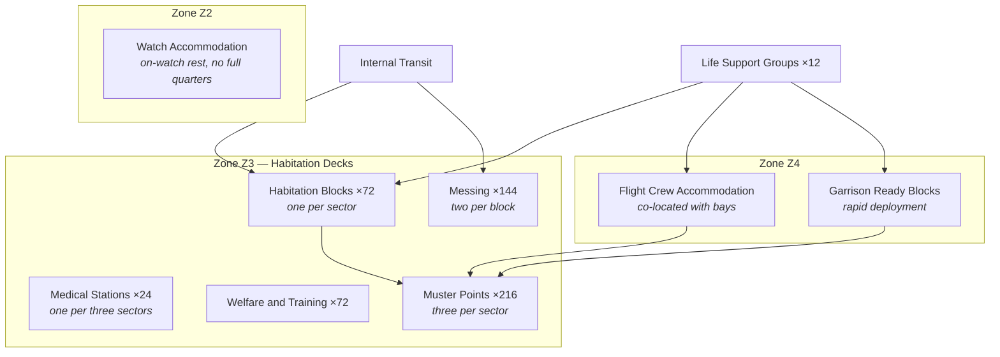

| Document ID | Classification | System | Document Owner | Status |
|---|---|---|---|---|
| `DS1-ENG-100` | IMPERIAL RESTRICTED | DS-1 Orbital Battle Station | Facilities and Habitation Authority | Operational / Controlled Document |

ACCESS: AUTHORIZED ENGINEERING PERSONNEL ONLY &middot; Unauthorized access will be logged and escalated to Sector Security Command.

# Crew and Garrison

## 1. Purpose and Scope

Crew and Garrison covers the accommodation, sustainment and organisation of the
platform's complement, and the architectural consequences of housing 1.7 million
people inside a military system.

**In scope:** accommodation, messing, medical, welfare, watch organisation,
muster arrangements, and the rotation cycle's effect on the architecture.

**Out of scope:** life support plant ([Life Support](life-support.md)); personnel
vetting (Sector Security Command); operational tasking of the garrison (Garrison
Command).

## 2. Complement

| Category | Approximate strength | Zone allocation | Clearance range |
|---|---|---|---|
| Station crew — operations and command | 265,000 | Z2, Z3 | IMP-2 to IMP-5 |
| Station crew — engineering and technical | 340,000 | Z1, Z2, Z3 | IMP-2 to IMP-5 |
| Garrison — ground forces | 610,000 | Z3, Z4 | IMP-1 to IMP-2 |
| Flight and hangar personnel | 195,000 | Z4 | IMP-1 to IMP-2 |
| Support, medical, facilities | 240,000 | Z3 | IMP-1 to IMP-2 |
| Contractors and specialists (varies) | 20,000–90,000 | Z3, Z4, escorted | Time-boxed, sector-scoped |
| **Total (nominal)** | **~1.7 M** | | |

The contractor figure varies by a factor of four between refit and operational
periods. **This variation is the platform's largest security variable**, and the
access control model is designed around its upper bound rather than its typical
value. See [R-04](../risks/risk-register.md).

## 3. Accommodation Architecture

### Allocation Principle

**Personnel are accommodated in the zone in which they work, not in a central
habitation district.** A `Z1` technician has quarters reachable from `Z1` without
crossing more than one boundary.

This is deliberate and expensive: it duplicates messing, medical and welfare
provision across zones rather than concentrating it. The alternative — a central
habitation district — would mean every watch change is a mass boundary crossing,
which is neither controllable nor survivable. The duplication is the cost of
`S-1`, and it is accepted.

## 4. Watch and Rotation

| Property | Value | Architectural consequence |
|---|---|---|
| Watch length | 8 hours | Sets the alert budget window (CC-7) |
| Watches per cycle | 3 | Three complete crews for every watch-keeping position |
| Rotation cycle | 18 standard months | `C-O-04`: institutional knowledge does not persist in people |
| Overlap at handover | 30 minutes | Handover is a logged event, not an informal conversation |

The 18-month rotation is why [CC-8 (Documentation as a Control)](../architecture/crosscutting-concepts.md#cc-8-documentation-as-a-control)
exists. Every operational procedure must be executable by someone who has been
aboard for six weeks, because within any two-year period, most of them have been.

## 5. Muster and Egress

| Rule | Rationale |
|---|---|
| Every compartment's muster point is in its own zone. | Muster never crosses a boundary and therefore never needs an authorization decision. |
| Muster routing is derived from the location designation, never from recall. | CC-7: recall fails under stress. |
| Emergency egress is one-way, outward, alarmed. | It cannot be used to move inward, so it is not an access control bypass. |
| Every crewed compartment is on the emergency comms network and is voice-checked monthly. | A compartment that fails its check is uninhabitable until restored. |
| Muster completion is reported per sector, not per person, within 4 minutes. | Per-person reporting does not complete in time to be useful. |

## 6. Interfaces

| ID | Peer | Direction | Content |
|---|---|---|---|
| `IX-ENV` | Life Support | In | Atmosphere, thermal, gravity, water |
| `IX-ACC` | Access Control | In/out | Identity, clearance, standing authorizations |
| `IX-CMD` | Command and Control | In | Muster activation, alert postures, lockdown |
| `IX-TLM` | Command and Control | Out | Complement disposition, muster state, medical capacity |
| `IX-SUP` | Supply and Replenishment | Out | Consumption data for the sustainment forecast |

## 7. Operating Modes

| Mode | Condition | Behaviour |
|---|---|---|
| `NOMINAL` | Routine | Three-watch rotation, full welfare provision |
| `ACTION` | Alert posture | All hands to action stations; welfare suspended; garrison ready blocks manned |
| `MUSTER` | Life-safety event | All personnel to their zone muster points; per-sector reporting |
| `LOCKDOWN` | Security event | Movement halted; standing authorizations revoked; per-transit authorization only |
| `EVACUATION` | Sector or group loss | Affected personnel moved outward one zone under escort; receiving zone capacity confirmed first |

## 8. Observability

| Signal | Class | Interval |
|---|---|---|
| Complement disposition by zone and sector | State | 300 s |
| Muster state during `MUSTER` | State | 10 s, per sector |
| Medical capacity and casualty load | State | 60 s |
| Contractor population and clearance expiry | State | 300 s; **expiry within 24 hours is flagged** |
| Emergency comms voice-check results | Event | Monthly, per compartment |
| Welfare and messing consumption | Measurement | Per watch; feeds the sustainment forecast |

## 9. Conformance Limitations

This system holds partial conformance against three cross-cutting concepts. The
limitations are recorded rather than resolved.

| Concept | Limitation | Rationale |
|---|---|---|
| CC-3 Degradation | Habitation services have no defined `DEGRADED` state; they are available or not. | Graceful degradation of messing and welfare has no meaningful intermediate state. Accepted. |
| CC-5 Redundancy | Habitation blocks are `N`, not `N+1`. | 72 blocks exist; loss of one is absorbed by adjacent blocks at reduced comfort. Duplicating them is not proportionate. |
| CC-6 Time and ordering | Welfare and messing systems carry timestamps only, no logical sequence. | These systems are not part of any causal chain requiring reconstruction. Accepted. |

## 10. Known Deficiencies

| Ref | Deficiency | Impact | Status |
|---|---|---|---|
| `TD-25` | Contractor clearance expiry is checked at boundary transit but not continuously. A contractor whose clearance expires while inside `Z3` is detected only on their next transit. | Directly relevant to [R-04](../risks/risk-register.md). | Continuous expiry sweep approved; implementation scheduled |
| `TD-26` | Medical capacity in quadrant `Q-III` is 18 per cent below the platform standard per head, a construction-phase economy. | Casualty reception in `Q-III` saturates faster; combines badly with the `TD-07` muster shortfall in the same quadrant. | Additional station funded; structural work required |
