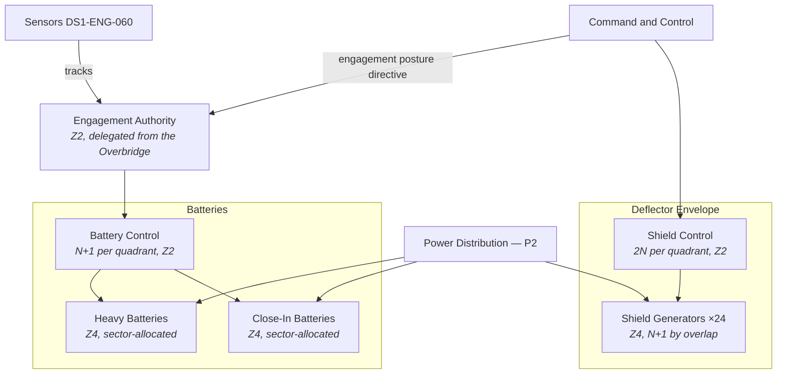

| Document ID | Classification | System | Document Owner | Status |
|---|---|---|---|---|
| `DS1-ENG-120` | IMPERIAL RESTRICTED | DS-1 Orbital Battle Station | Ordnance Systems Authority | Operational / Controlled Document |

ACCESS: AUTHORIZED ENGINEERING PERSONNEL ONLY &middot; Unauthorized access will be logged and escalated to Sector Security Command.

# Defensive Systems

!!! note "Scope limitation"

    Described at the architectural level: coverage architecture, control
    authority, engagement authorization and the couplings on other systems. No
    weapon design, effects, or engagement procedure detail is held here.

## 1. Purpose and Scope

Defensive Systems protect the hull against threats too small or too close for the
primary armament to address, and maintain the deflector envelope.

**In scope:** the deflector shield architecture, close-in defensive batteries,
the engagement authorization model, and the coverage governance.

**Out of scope:** the primary armament ([Primary Armament](primary-armament.md));
embarked fighter operations ([Hangar and Docking](hangar-and-docking.md)).

## 2. The Coverage Problem

Defensive coverage is organised by surface sector, and this creates the
platform's most-discussed architectural asymmetry.

| Threat class | Addressed by | Coverage |
|---|---|---|
| Capital-scale | Deflector envelope, primary armament, attached fleet | Full spherical |
| Cruiser and corvette | Deflector envelope, heavy batteries | Full spherical |
| Fighter and small craft | Close-in batteries, embarked fighters | **Tracking-rate limited** |

Close-in batteries are dimensioned against a threat model of capital-scale
engagement. Against small, fast, close targets they are tracking-rate limited,
and the design mitigation is the embarked fighter wing rather than more batteries.

!!! danger "This is a known and accepted asymmetry"

    The platform is best defended against the threat it was designed to fight and
    least defended against the smallest one. The mitigation — embarked fighters —
    depends on hangar availability, sortie rate and warning time, all of which are
    themselves degraded during transit and during alert transitions.

    This is recorded as [R-02](../risks/risk-register.md) and is not resolved. It
    is stated here plainly because a reader of this page is more likely to be
    designing something that depends on it than to be in a position to fix it.

## 3. Decomposition

## 4. Engagement Authorization

Unlike the primary armament, defensive engagement must sometimes occur faster
than a human decision. The model is therefore **pre-authorized within a declared
envelope**, which is the same pattern as sector autonomy.

| Posture | Set by | Engagement rule |
|---|---|---|
| `WEAPONS-TIGHT` | Overbridge directive | Engage only on a specific authorized directive |
| `WEAPONS-CONDITIONAL` | Overbridge directive | Engage automatically within a declared envelope: classification confirmed, inside range gate, outside the friendly corridor |
| `WEAPONS-FREE` | Station Commander, alert state only | Engage any track classified hostile within the sector envelope |
| `SAFE` | Any authority, immediate | No engagement; batteries mechanically inhibited |

**The envelope is declared, bounded and logged.** A battery cannot engage outside
its envelope regardless of posture, and cannot widen its own envelope. The
friendly corridor — the volume containing embarked craft on approach and
departure — is an absolute exclusion in every posture including `WEAPONS-FREE`.

Transitions toward `SAFE` are immediate and available to any authority.
Transitions toward `WEAPONS-FREE` require the Station Commander and an alert
state.

## 5. Interfaces

| ID | Peer | Direction | Content |
|---|---|---|---|
| `IX-PIC` | Sensors | In | Tracks and classifications |
| `IX-CMD` | Command and Control | In | Posture directives, envelope declarations, corridor definitions |
| `IX-PWR` | Power Distribution | In | `P2` priority; shed at `LSD-1` stage 3 |
| `IX-TLM` | Command and Control | Out | Posture, envelope state, generator and battery availability, coverage map |
| `IX-HAN` | Hangar and Docking | In | Friendly corridor state during launch and recovery |

## 6. Operating Modes and Degradation

| Mode | Condition | Behaviour |
|---|---|---|
| `NOMINAL` | All generators and batteries available | Full envelope, full coverage |
| `DEGRADED-SHIELD` | Generator losses have thinned the envelope | Thinned regions reported explicitly by bearing; **never silently interpolated** |
| `DEGRADED-BATTERY` | Battery losses in one or more sectors | Coverage gap reported; embarked fighters re-tasked to cover |
| `POWER-LIMITED` | `LSD-1` stage 3 | Batteries shed unless an interlocked hold is in force; shields held to `P2` |
| `SAFE` | Directive, or friendly corridor conflict | No engagement |

Coverage reporting follows the same rule as sensors: gaps are stated, never
inferred away.

## 7. Redundancy and Failure Domains

| Element | Redundancy | Separation |
|---|---|---|
| Shield generators | 24, N+1 by envelope overlap | Distributed across all four quadrants |
| Shield control | 2N per quadrant | Separate `Z2` compartments |
| Battery control | N+1 per quadrant | Separate `Z2` compartments |
| Batteries | Sector-allocated, no local redundancy | Redundancy is by adjacent-sector overlap |

## 8. Observability

| Signal | Class | Interval |
|---|---|---|
| Engagement posture | State | 1 s; displayed permanently at the Overbridge |
| Envelope declaration in force, per sector | State | 1 s |
| Friendly corridor state | State | 100 ms during launch and recovery |
| Shield envelope integrity map | State | 1 s, with thinned regions explicit |
| Battery availability and coverage map | State | 1 s, with gaps explicit |
| Engagements and engagement refusals | Event | Push; every automatic engagement is reviewed post hoc |

## 9. Maintenance

- Shield generators are maintained one per overlap group, with the resulting
  envelope thinning published in advance.
- Battery work requires the sector at `SAFE` and the adjacent-sector overlap
  proved.
- Battery control work runs on the `N+1` partner.
- No defensive maintenance during an alert state, and none concurrent with
  hangar surge operations.

## 10. Known Deficiencies

| Ref | Deficiency | Impact | Status |
|---|---|---|---|
| `R-02` (risk, not debt) | Close-in battery tracking rate is inadequate against small fast targets; mitigation depends on embarked fighter availability. | Accepted at Imperial High Command level. | See [Risk Register](../risks/risk-register.md) |
| `TD-28` | Friendly corridor state is published at 100 ms during launch and recovery but at 1 s otherwise, and the transition between rates is not instantaneous. | A brief window at the start of an unscheduled launch where corridor state is coarse. | Continuous 100 ms publication approved |
