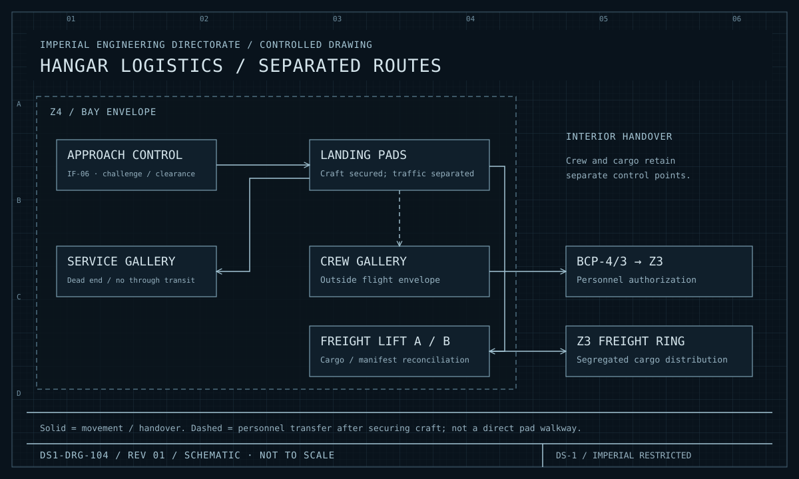

| Document ID | Classification | System | Document Owner | Status |
|---|---|---|---|---|
| `DS1-ENG-040` | IMPERIAL RESTRICTED | DS-1 Orbital Battle Station | Flight Operations Authority | Operational / Controlled Document |

ACCESS: AUTHORIZED ENGINEERING PERSONNEL ONLY &middot; Unauthorized access will be logged and escalated to Sector Security Command.

# Hangar and Docking

## 1. Purpose and Scope

Hangar and Docking receives, secures, services and launches craft, and forms the
platform's principal physical interface with the outside.

**In scope:** 72 hangar bays, bay traffic control, containment field plant, blast
door assemblies, landing pads, servicing galleries, freight lift banks and the
`Z4`→`Z3` boundary control points.

**Out of scope:** craft themselves; cargo movement beyond the freight lift
([Internal Transit and Logistics](internal-transit.md)).

## 2. Decomposition

<figure class="blueprint" markdown>

<figcaption>DS1-DRG-005 &middot; Typical Hangar Bay, General Plan and Traffic Flow &middot; Rev 4.2</figcaption>
</figure>

| Element | Per bay | Function |
|---|---|---|
| Bay Traffic Control `BTC-nn` | 1, N+1 internally | Approach sequencing, lane allocation, pad assignment |
| Containment Field Plant | 2N | Atmospheric retention at the bay mouth |
| Blast Door Assembly | 1 bi-parting | Physical closure; automatic on containment loss |
| Landing Pads | 12, with gravitic clamps | Craft securing and servicing |
| Servicing Gallery | 1 | Propellant and ordnance handling — **physically isolated, no through transit** |
| Crew Gallery | 1 | Personnel movement and muster |
| Freight Lift Bank | 1 (`A`/`B`) | Cargo into the internal logistics network |
| Boundary Control Point `BCP-4/3` | 1 | The **only** personnel route from `Z4` to `Z3` |

Bays are addressed by sector: `Z4/N1-060/BY-03`.

## 3. The Three Separations

<figure class="blueprint" markdown>

<figcaption>DS1-DRG-104 · Hangar logistics / separated routes · Rev 01 · Schematic, not to scale</figcaption>
</figure>

Follow crew, cargo and servicing separately. A confirmed craft does not authorize its occupants to cross into Z3.

The bay layout enforces three separations physically, not procedurally. Each is
the mitigation for a specific failure the platform has already experienced or
modelled.

| Separation | Mechanism | Prevents |
|---|---|---|
| **Flight from personnel** | Crew gallery is outside the pad envelope; pads have no direct gallery access | Personnel in the traffic envelope during movement |
| **Ordnance from transit** | Servicing gallery is a dead end with no through route | An ordnance event propagating along a transit path |
| **Bay from station interior** | `BCP-4/3` is the sole personnel route, and cargo goes by freight lift only | Unauthorized personnel reaching `Z3` behind a legitimate cargo movement |

The third is the primary control against the infiltration path modelled in
[R-04](../risks/risk-register.md). A confirmed craft carrying an unconfirmed
person results in a berthed craft and a person who does not leave `Z4`.

## 4. Interfaces

| ID | Peer | Direction | Content |
|---|---|---|---|
| `IF-06` | Visiting and embarked craft | In/out | Transponder challenge, approach clearance, lane assignment |
| `IX-LOG` | Internal Transit and Logistics | In/out | Cargo handover at the freight lift; manifest reconciliation |
| `IX-CMD` | Command and Control | In | Bay state directives, closure directives, alert postures |
| `IX-TLM` | Command and Control | Out | Bay state, containment integrity, door position, pad occupancy |
| `IX-ENV` | Life Support | In/out | Bay volume atmosphere; independently vented per bay |

## 5. Operating Modes and Degradation

| Mode | Condition | Behaviour |
|---|---|---|
| `OPEN` | Nominal | Full launch and recovery |
| `RECOVERY-ONLY` | Traffic saturation or reduced control | Inbound accepted, outbound suspended |
| `CLOSED` | Directive, alert posture, or transit preparation | Blast doors closed and locked; no movement |
| `SEALED` | Containment loss or hull damage | Doors closed automatically; bay volume vented; **not reopenable from within the bay** |
| `ISOLATED` | Sector isolation on a life-safety event | Bay sealed and its `BCP-4/3` held closed in both directions |

!!! danger "Blast door closure is not inhibitable from the bay"

    On containment field loss the blast doors close automatically, and no control
    within the bay can prevent or reverse it. A person in the bay when the field
    fails is in a bay that is sealing. This is a deliberate, contested design
    choice: the alternative is a local inhibit, and a local inhibit under
    pressure has a predictable outcome across a much larger population.

    Reopening a `SEALED` bay is an authorized action from the Quadrant Command
    Post, never from the bay.

## 6. Redundancy and Failure Domains

| Element | Redundancy |
|---|---|
| Bays | 72; the platform tolerates the loss of any number, with sortie rate degrading proportionally |
| Containment field plant | 2N per bay |
| Bay traffic control | N+1 internally; a bay whose `BTC` is fully lost goes `CLOSED`, not uncontrolled |
| Freight lifts | `A`/`B` pair per bay |
| `BCP-4/3` | Single per bay — but the bay itself is redundant, so the failure domain is one bay |

## 7. Observability

| Signal | Class | Interval |
|---|---|---|
| Bay mode, all 72 | State | 1 s |
| Containment field integrity, per bay | State | 100 ms |
| Blast door position | State | 200 ms |
| Pad occupancy and clamp state | State | 1 s |
| Approach refusals by cause | Event | Push; **trended and correlated against the tactical picture** |
| `BCP-4/3` transits and refusals | Event | Push to the security audit store |
| Manifest reconciliation exceptions | Event | Push; a cargo discrepancy is a security signal, not a logistics one |

## 8. Maintenance

- Containment plant is maintained one side at a time; a bay with a single
  containment side is restricted to `RECOVERY-ONLY`.
- Blast door assemblies are exercised monthly under load. An unexercised door is
  treated as failed and its bay is `CLOSED`.
- Servicing gallery work requires the bay `CLOSED` and the gallery purged.
- Bays are taken out of service in a rotation that never removes more than two
  per quadrant simultaneously.

## 9. Known Deficiencies

| Ref | Deficiency | Impact | Status |
|---|---|---|---|
| `TD-20` | Eleven bays retain single-side containment plant from the commissioning phase. | Those bays are permanently `RECOVERY-ONLY` and cannot support surge sortie rates. | Second-side installation scheduled by quadrant |
| `TD-21` | Manifest reconciliation is batch, once per watch, rather than at handover. | A cargo discrepancy may go unnoticed for up to eight hours — directly relevant to [R-04](../risks/risk-register.md). | Real-time reconciliation approved; highest-priority logistics change |
