| Document ID | Classification | System | Document Owner | Status |
|---|---|---|---|---|
| `DS1-ENG-001` | IMPERIAL RESTRICTED | DS-1 Orbital Battle Station | Imperial Engineering Directorate — Systems Engineering Section | Operational / Controlled Document |

ACCESS: AUTHORIZED ENGINEERING PERSONNEL ONLY &middot; Unauthorized access will be logged and escalated to Sector Security Command.

# Systems Volume

Per-system engineering descriptions. Each entry states the system's purpose,
decomposition, interfaces, degradation behaviour, redundancy allocation and known
deficiencies, in that order. Structure is fixed so that entries can be compared.

## System Register

| System | ID | Authority | Zone | Criticality | Conformance |
|---|---|---|---|---|---|
| [Command and Control](command-and-control.md) | `DS1-ENG-010` | Control Systems | Z2 | Critical | Full |
| [Power Generation](power-generation.md) | `DS1-ENG-020` | Reactor Systems | Z0 | Critical | Partial (CC-5) |
| [Power Distribution](power-distribution.md) | `DS1-ENG-021` | Power Systems | Z1 | Critical | Full |
| [Propulsion](propulsion.md) | `DS1-ENG-030` | Propulsion Systems | Z1 | High | Full |
| [Hangar and Docking](hangar-and-docking.md) | `DS1-ENG-040` | Flight Operations | Z4 | High | Full |
| [Communications](communications.md) | `DS1-ENG-050` | Control Systems | Z2 | High | Partial (CC-7) |
| [Sensors](sensors.md) | `DS1-ENG-060` | Control Systems | Z2 | High | Partial (CC-7) |
| [Navigation](navigation.md) | `DS1-ENG-070` | Propulsion Systems | Z2 | High | Full |
| [Life Support](life-support.md) | `DS1-ENG-080` | Facilities and Habitation | Z1 | Critical | Full |
| [Internal Transit and Logistics](internal-transit.md) | `DS1-ENG-090` | Facilities and Habitation | Z3 | Medium | Partial (CC-6) |
| [Crew and Garrison](crew-and-garrison.md) | `DS1-ENG-100` | Facilities and Habitation | Z3 | Medium | Partial (CC-3, CC-5, CC-6) |
| [Primary Armament](primary-armament.md) | `DS1-ENG-110` | Ordnance Systems | Z1 / Z4 | Critical | Full |
| [Defensive Systems](defensive-systems.md) | `DS1-ENG-120` | Ordnance Systems | Z4 | High | Full |

Conformance is against the [Cross-Cutting Concepts](../architecture/crosscutting-concepts.md)
matrix. "Partial" entries name the concept and record their scope limitation in
the system's own page.

## System Dependency Overview

Edges show *runtime dependency*: the tail cannot perform its function without the
head. Power and command dependencies dominate.

```mermaid
flowchart TB
    PG["Power Generation<br/>DS1-ENG-020"]
    PD["Power Distribution<br/>DS1-ENG-021"]
    CC["Command &amp; Control<br/>DS1-ENG-010"]
    LS["Life Support<br/>DS1-ENG-080"]
    SEN["Sensors<br/>DS1-ENG-060"]
    COM["Communications<br/>DS1-ENG-050"]
    NAV["Navigation<br/>DS1-ENG-070"]
    PRO["Propulsion<br/>DS1-ENG-030"]
    HAN["Hangar &amp; Docking<br/>DS1-ENG-040"]
    TRN["Internal Transit<br/>DS1-ENG-090"]
    CRW["Crew &amp; Garrison<br/>DS1-ENG-100"]
    ARM["Primary Armament<br/>DS1-ENG-110"]
    DEF["Defensive Systems<br/>DS1-ENG-120"]

    PG --> PD
    PD --> CC
    PD --> LS
    PD --> SEN
    PD --> COM
    PD --> PRO
    PD --> HAN
    PD --> TRN
    PD --> DEF
    PD --> ARM

    CC --> SEN
    CC --> COM
    CC --> PRO
    CC --> HAN
    CC --> DEF
    CC --> ARM
    SEN --> NAV
    NAV --> PRO
    LS --> CRW
    TRN --> CRW
    HAN --> TRN

    style PG fill:#1a1010,stroke:#a83c33
    style PD fill:#1a1010,stroke:#a83c33
```

Two observations the diagram makes plain, both discussed at length elsewhere:

1. **Every system depends on Power Distribution, and Power Distribution depends
   on Power Generation.** The essential bus and standby generation set exist to
   break that second dependency for the systems where its loss is fatal. See
   [Power Distribution](power-distribution.md) and
   [ADR-001](../decisions/adr-001-single-core-reactor.md).
2. **Command and Control is a dependency of every acting system but of no sensing
   system.** Sensing continues when command does not, which is what makes the
   degraded states in [RV-5](../architecture/runtime-view.md#rv-5-sector-link-loss-and-autonomous-degradation)
   recoverable.

## Entry Structure

Every system page uses the same eight sections:

1. Purpose and scope
2. Decomposition
3. Interfaces
4. Operating modes and degradation
5. Redundancy and failure domains
6. Observability
7. Maintenance
8. Known deficiencies

Where a section is genuinely not applicable, it states so and why. It is not
omitted.
