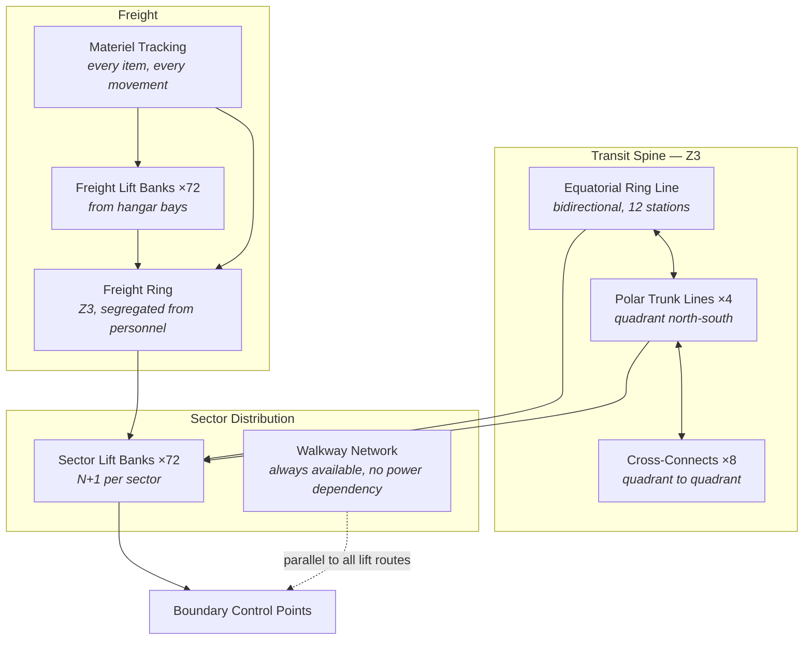

| Document ID | Classification | System | Document Owner | Status |
|---|---|---|---|---|
| `DS1-ENG-090` | IMPERIAL RESTRICTED | DS-1 Orbital Battle Station | Facilities and Habitation Authority | Operational / Controlled Document |

ACCESS: AUTHORIZED ENGINEERING PERSONNEL ONLY &middot; Unauthorized access will be logged and escalated to Sector Security Command.

# Internal Transit and Logistics

## 1. Purpose and Scope

Internal Transit moves personnel and materiel across a 160-kilometre hull through
a zone model that deliberately makes movement slow. This system exists to make
the platform workable despite that constraint, without weakening it.

**In scope:** the transit spine, sector lift banks, freight networks, the
materiel tracking system, and muster and egress routing.

**Out of scope:** boundary authorization decisions
([Access Control Model](../security/access-control-model.md)); external
replenishment ([Supply and Replenishment](../operations/supply-and-replenishment.md)).

## 2. The Transit Problem

<figure class="blueprint" markdown>

<figcaption>DS1-DRG-110 · Emergency routing / local evacuation · Rev 01 · Schematic, not to scale</figcaption>
</figure>

Walkways provide a path independent of powered transit. Actual route availability remains governed by local pressure and boundary state.

Strategy `S-1` requires that a transit crosses one zone boundary at a time. A
technician moving from a hangar bay in `Z4` to a plant room in `Z1` therefore
passes three boundary control points, each an authorization decision.

| Movement | Boundaries | Typical elapsed |
|---|---|---|
| Within a sector, same zone | 0 | 4–9 minutes |
| Adjacent sectors, same zone | 0 | 12–20 minutes |
| `Z4` → `Z3` | 1 | +6 minutes |
| `Z3` → `Z2` | 1 | +8 minutes |
| `Z2` → `Z1` | 1 | +11 minutes |
| `Z1` → `Z0` | 1 | +25 minutes (two-person rule) |
| Hangar bay to opposite-hemisphere `Z1` plant room | 3 | **90–130 minutes** |

The last row is the design reality this system must accommodate. It is not a
defect; it is the cost of `S-1`, and the mitigations below are how the platform
lives with it rather than attempts to remove it.

## 3. Decomposition

| Element | Count | Redundancy |
|---|---|---|
| Equatorial ring line | 1 bidirectional ring | Either direction serves any station |
| Polar trunk lines | 4 | One per quadrant; cross-connects allow rerouting |
| Cross-connects | 8 | Two per quadrant pair |
| Sector lift banks | 72 | N+1 per sector |
| Freight lift banks | 72 | `A`/`B` per hangar bay |
| Walkway network | Continuous | **No power dependency**; the fallback for everything above |

## 4. Mitigations for the Transit Cost

| Mitigation | Mechanism |
|---|---|
| **Pre-positioned response** | Damage control parties and medical teams are stationed *within* the zone they serve. A `Z1` incident is answered from `Z1`, never from `Z3`. |
| **Standing authorizations** | Watch-keeping personnel hold a pre-issued, time-boxed transit permission for their assigned route, revalidated each watch. The decision is still made per transit; it is simply already computed. |
| **Materiel pre-staging** | Spares for `Z1` and `Z2` plant are held in those zones, not in a central store. Store duplication is accepted as the cost of not moving parts across boundaries during an incident. |
| **Muster locality** | Every crewed compartment's muster point is in its own zone. Muster never crosses a boundary. |
| **Freight/personnel segregation** | Freight routes are physically separate from personnel routes, so a cargo surge cannot delay a response movement. |

## 5. Interfaces

| ID | Peer | Direction | Content |
|---|---|---|---|
| `IX-LOG` | Hangar and Docking | In/out | Cargo handover at the freight lift; manifest reconciliation |
| `IX-ACC` | Access Control | In | Boundary decisions; transit is *routed* here but *authorized* there |
| `IX-CMD` | Command and Control | In | Lockdown directives, priority movement, muster activation |
| `IX-TLM` | Command and Control | Out | Line availability, lift bank state, materiel position |
| `IX-SUP` | Supply and Replenishment | Out | Consumption and movement data feeding the sustainment forecast |

## 6. Operating Modes and Degradation

| Mode | Condition | Behaviour |
|---|---|---|
| `NOMINAL` | All lines available | Full service |
| `DEGRADED-LINE` | One trunk line or ring segment lost | Rerouted via cross-connects; journey times increase, no route is lost |
| `PRIORITY` | Class-1 incident declared | Response movements pre-empt all others; routine transit suspended |
| `LOCKDOWN` | Security event | Transit halted at the next station; standing authorizations revoked immediately; movement is per-transit authorized only |
| `WALKWAY-ONLY` | Power loss to the transit spine | Walkway network only; journey times increase by a factor of roughly eight |

`LOCKDOWN` revokes standing authorizations. This is the single most important
property of the standing-authorization mechanism: convenience is available in
normal operation and is withdrawn the instant it becomes a liability.

## 7. Observability

| Signal | Class | Interval |
|---|---|---|
| Line and segment availability | State | 1 s |
| Lift bank availability, 72 sectors | State | 1 s |
| Journey time by route | Measurement | Per journey; trended against the muster requirement |
| Materiel position and custody | Event | Per movement; every item, every handover |
| Manifest reconciliation exceptions | Event | Push to the security audit store |
| Standing authorizations in force | State | 60 s; and revoked wholesale on `LOCKDOWN` |

## 8. Maintenance

- Trunk line maintenance is one line at a time; cross-connect capacity is proved
  before isolation.
- Lift bank work runs on the `N+1` partner.
- The walkway network is inspected continuously and may not be obstructed. An
  obstructed walkway is a Class-2 safety event because it is the fallback for
  every other route.
- Freight ring work is scheduled outside replenishment windows.

## 9. Known Deficiencies

| Ref | Deficiency | Impact | Status |
|---|---|---|---|
| `TD-24` | Materiel tracking timestamps use platform time only and carry no logical sequence, contrary to CC-6. | Custody chains cannot be reliably ordered after a `DETACHED` period, weakening the reconciliation that manifest exceptions depend on. | Sequence field approved; implementation scheduled |
| `TD-07` | Quadrant `Q-III` has four `Z3`→`Z2` boundary control points where the standard is six. | Muster times in `Q-III` exceed the platform standard by roughly 40 per cent; contributes to [QS-03](../architecture/quality-requirements.md#qs-03-unauthorized-access-attempt-on-a-zone-boundary) and [QS-05](../architecture/quality-requirements.md#qs-05-hull-breach-in-an-occupied-sector) shortfalls. | Two additional BCPs funded; structural work required |
