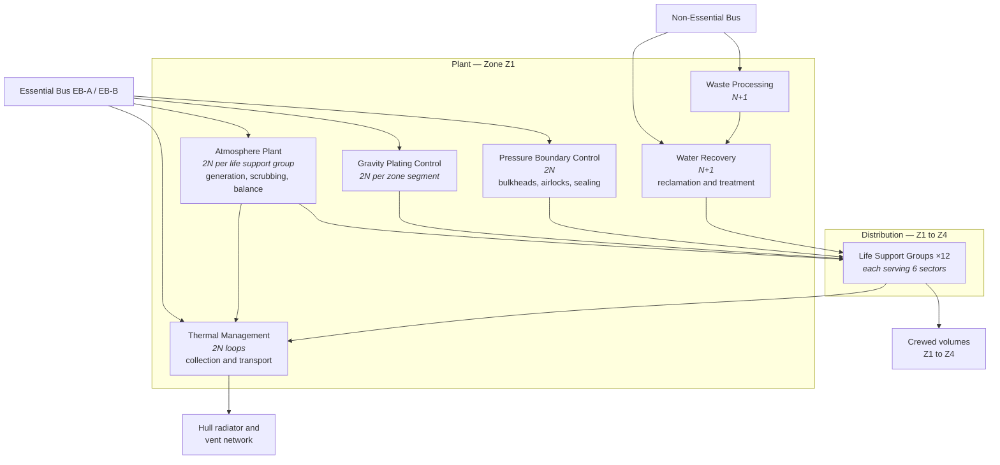
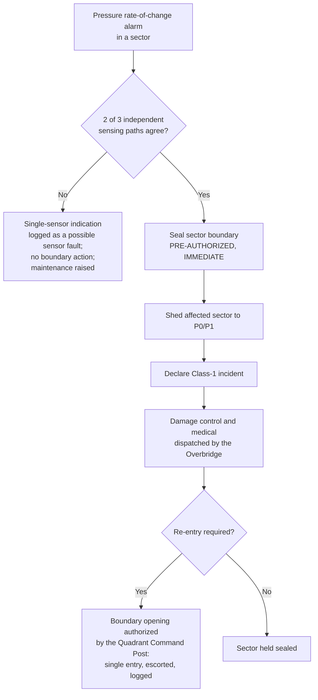

| Document ID | Classification | System | Document Owner | Status |
|---|---|---|---|---|
| `DS1-ENG-080` | IMPERIAL RESTRICTED | DS-1 Orbital Battle Station | Facilities and Habitation Authority | Operational / Controlled Document |

ACCESS: AUTHORIZED ENGINEERING PERSONNEL ONLY &middot; Unauthorized access will be logged and escalated to Sector Security Command.

# Life Support

## 1. Purpose and Scope

Life Support maintains survivable conditions in every crewed volume: atmosphere,
thermal, pressure, gravity and water.

**In scope:** atmosphere plant, thermal management and hull rejection, water
recovery, waste processing, gravity plating control, and pressure boundary
control.

**Out of scope:** habitability standards and accommodation
([Crew and Garrison](crew-and-garrison.md)); core thermal management inside `Z0`
([Power Generation](power-generation.md)).

!!! note "Gravity plating is classified as life support"

    Not as a facility service. A plating fault during a transit manoeuvre, or an
    uncommanded phase change in an occupied compartment, is a mass-casualty
    event. The classification follows the consequence, and brings plating under
    the same 2N standard, the same essential bus supply and the same maintenance
    discipline as atmosphere.

## 2. Decomposition

### Life Support Groups

The platform is divided into **12 life support groups**, each serving six
sectors. Groups are independent: atmosphere, thermal and pressure control in one
group has no dependency on any other.

| Property | Value |
|---|---|
| Groups | 12 |
| Sectors per group | 6 |
| Redundancy within a group | 2N atmosphere, 2N thermal, 2N pressure control |
| Cross-group support | Emergency atmosphere transfer only; no routine sharing |
| Failure containment | A group failure affects six sectors and no more |

Cross-group support is deliberately limited to emergency transfer. Routine
sharing would couple the groups into one failure domain, defeating the
arrangement.

## 3. Interfaces

| ID | Peer | Direction | Content |
|---|---|---|---|
| `IX-ENV` | All crewed volumes | Out + sensing in | Atmosphere, thermal, gravity, pressure |
| `IX-PWR` | Power Distribution | In | Essential bus for `P0` functions; non-essential for water and waste |
| `IX-CMD` | Command and Control | In | Isolation directives, group configuration |
| `IX-TLM` | Command and Control | Out | Group state, margins, boundary positions |
| `IX-THM` | Power Generation | In | Core heat load presented to the vent network |

## 4. Operating Modes and Degradation

| Mode | Condition | Behaviour |
|---|---|---|
| `NOMINAL` | All groups full function | Full habitability |
| `GROUP-DEGRADED` | One side of a 2N pair lost in one group | Full function on the survivor; **restoration is a priority action, not a scheduled one** |
| `GROUP-RESTRICTED` | Both sides lost in one group | Six sectors on stored atmosphere and emergency transfer; evacuation planning begins immediately |
| `SECTOR-ISOLATED` | Pressure event in one sector | Sector sealed automatically on 2-of-3 agreement; group otherwise unaffected |
| `THERMAL-LIMITED` | Rejection capacity constrained | Heat-generating loads restricted; `P3`/`P4` shed; propulsion and armament inhibited |

### Automatic Protective Action

**Sealing does not wait for a human. Opening always does.** This asymmetry is the
central design rule of the system and appears in
[RV-6](../architecture/runtime-view.md#rv-6-hull-breach-and-incident-escalation).

The 2-of-3 requirement exists because a single sensor fault that seals an
occupied compartment is itself a life-safety event. Sealing on one sensor was
tried during commissioning and produced four spurious isolations in six weeks.

## 5. Redundancy and Failure Domains

| Element | Redundancy | Separation |
|---|---|---|
| Atmosphere plant | 2N per group | Different `Z1` compartments, different essential bus sides |
| Thermal loops | 2N | Different structural routes to different radiator fields |
| Pressure boundary control | 2N | Independent actuation and independent sensing |
| Gravity plating control | 2N per zone segment | Different distribution boards |
| Water and waste | N+1 | Non-essential; loss is survivable for days, not minutes |

Water and waste are deliberately on the non-essential bus. Their loss is
survivable on stored reserves for a period long enough to restore them; putting
them on the essential bus would consume standby generation margin that
atmosphere needs.

## 6. Observability

| Signal | Class | Interval |
|---|---|---|
| Atmosphere composition and pressure, per compartment | Measurement | 1 s |
| Pressure rate of change, 3 independent paths per sector | Measurement | 100 ms |
| Thermal rejection margin | Measurement | 1 s; the platform's second-order constraint after reactor margin |
| Gravity plating phase and field integrity | State | 100 ms |
| Boundary positions, all bulkheads and airlocks | State | 200 ms |
| Group configuration and side availability | State | 1 s |
| Water and consumables reserve | Measurement | 300 s; feeds the sustainment forecast |

## 7. Maintenance

- Atmosphere plant is maintained **one side at a time, never both**, and never in
  two adjacent groups simultaneously.
- Thermal loop work is single-loop with the group in `THERMAL-LIMITED` and the
  restriction declared in advance.
- Gravity plating work requires the affected segment evacuated and the boundary
  sealed. Plating work with personnel present is prohibited without Imperial
  Engineering Command approval.
- Pressure boundary actuators are exercised monthly. An unexercised bulkhead is
  treated as failed and its compartment as uninhabitable.

## 8. Known Deficiencies

| Ref | Deficiency | Impact | Status |
|---|---|---|---|
| `TD-22` | Life support groups 7 and 8 share a thermal transport route for 2 km, contrary to CC-5. | A single structural event in that route puts twelve sectors into `THERMAL-LIMITED`. | Re-route designed; major structural window required |
| `TD-23` | Gravity plating in the `Q-III` habitation decks runs on a control generation two revisions behind the platform standard. | Phase-change response is slower than specification; plating work in `Q-III` requires a wider evacuation margin. | Uplift scheduled |
