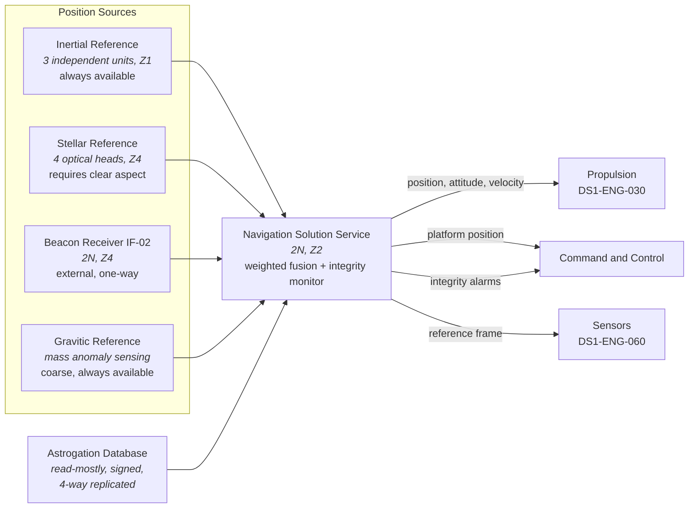

| Document ID | Classification | System | Document Owner | Status |
|---|---|---|---|---|
| `DS1-ENG-070` | IMPERIAL RESTRICTED | DS-1 Orbital Battle Station | Propulsion Systems Authority | Operational / Controlled Document |

ACCESS: AUTHORIZED ENGINEERING PERSONNEL ONLY &middot; Unauthorized access will be logged and escalated to Sector Security Command.

# Navigation

## 1. Purpose and Scope

Navigation establishes and maintains the platform's position, attitude and
velocity, and computes transit solutions for [Propulsion](propulsion.md).

**In scope:** the inertial reference, stellar reference, beacon receiver, the
navigation solution service and the astrogation database.

**Out of scope:** drive actuation; tactical positioning of attached units.

## 2. Decomposition

## 3. Source Independence

The four position sources are chosen to fail independently. This is the whole
design.

| Source | Fails when | Detectable by |
|---|---|---|
| Inertial | Never absent; drifts over time | Divergence from any other source |
| Stellar | Hull aspect obstructed, aperture damage, transit | Absence of fix, not wrong fix |
| Beacon (`IF-02`) | Network unavailable, **or deliberately falsified** | Cross-check against inertial and stellar |
| Gravitic | Coarse only; degraded near large masses | Consistency bounds |

!!! danger "Beacon data is treated as hostile input"

    `IF-02` is the only navigation source under external control, and it is the
    obvious attack surface: a falsified ephemeris that survives into a transit
    solution is a platform-loss event. The integrity monitor therefore refuses
    any beacon fix that disagrees with the inertial solution beyond a bounded
    tolerance, **regardless of how well it is signed**. A signed but inconsistent
    fix is a security event, not a navigation event, and escalates to Sector
    Security Command.

## 4. Interfaces

| ID | Peer | Direction | Content |
|---|---|---|---|
| `IF-02` | Hyperspace beacon network | **In only** | Ephemeris; signed, cross-checked, never trusted alone |
| `IX-NAV` | Propulsion | Out | Transit solution, continuous fix, attitude reference |
| `IX-PIC` | Sensors | Out | Reference frame for track correlation |
| `IX-TLM` | Command and Control | Out | Position, solution confidence, integrity alarms |

## 5. Operating Modes and Degradation

| Mode | Sources available | Solution confidence | Transit permitted |
|---|---|---|---|
| `FULL` | All four | Nominal | Yes |
| `NO-BEACON` | Inertial, stellar, gravitic | Reduced | Yes, with extended margin |
| `INERTIAL-STELLAR` | Inertial, stellar | Reduced | Yes, short transits only |
| `INERTIAL-ONLY` | Inertial, gravitic | Degrading with time | **No** |
| `INTEGRITY-ALARM` | Sources disagree beyond tolerance | Not established | **No** |

A transit is never computed from a single source. `INERTIAL-ONLY` and
`INTEGRITY-ALARM` both inhibit transit at the propulsion gate, not by convention
but by interlock.

## 6. Redundancy and Failure Domains

| Element | Redundancy | Separation |
|---|---|---|
| Inertial reference units | 3, voting | Three separate `Z1` compartments in different quadrants |
| Stellar optical heads | 4 | Distributed by aspect; any two give a fix |
| Beacon receivers | 2N | Different `Z4` sectors, different distribution boards |
| Navigation solution service | 2N | Pole-split, co-located with neither bridge |
| Astrogation database | 4-way replicated, signed | One replica per quadrant |

## 7. Observability

| Signal | Class | Interval | Notes |
|---|---|---|---|
| Solution confidence | Measurement | 1 s | Displayed permanently at the Overbridge |
| Per-source residual against the fused solution | Measurement | 1 s | The integrity monitor's working signal |
| Beacon fix rejections | Event | Push | **Every rejection is reviewed.** A rising rate is treated as a possible attack in progress, not as network noise |
| Inertial drift rate | Measurement | 60 s | Trended; drives calibration scheduling |
| Astrogation database replica divergence | State | 300 s | Any divergence is an incident; the database is read-mostly |

## 8. Maintenance

- Inertial units are calibrated one at a time against the other two. The voting
  arrangement is never reduced below two.
- Stellar head cleaning and alignment is a `Z4` hull activity and is scheduled
  into hull maintenance windows.
- Astrogation database updates arrive over `IF-01`, are signature-verified,
  applied to one replica, compared against the other three, and only then
  promoted. An update that fails comparison is rejected and escalated.

## 9. Known Deficiencies

| Ref | Deficiency | Impact | Status |
|---|---|---|---|
| `TD-15` | Two stellar heads are obscured by structure added during the commissioning phase under [ADR-008](../decisions/adr-008-live-commissioning.md). | Stellar fixes are unavailable across roughly 15 per cent of platform attitudes, forcing `NO-BEACON` operation into `INERTIAL-ONLY` in those aspects. | Relocation requires hull work; scheduled, not dated |
