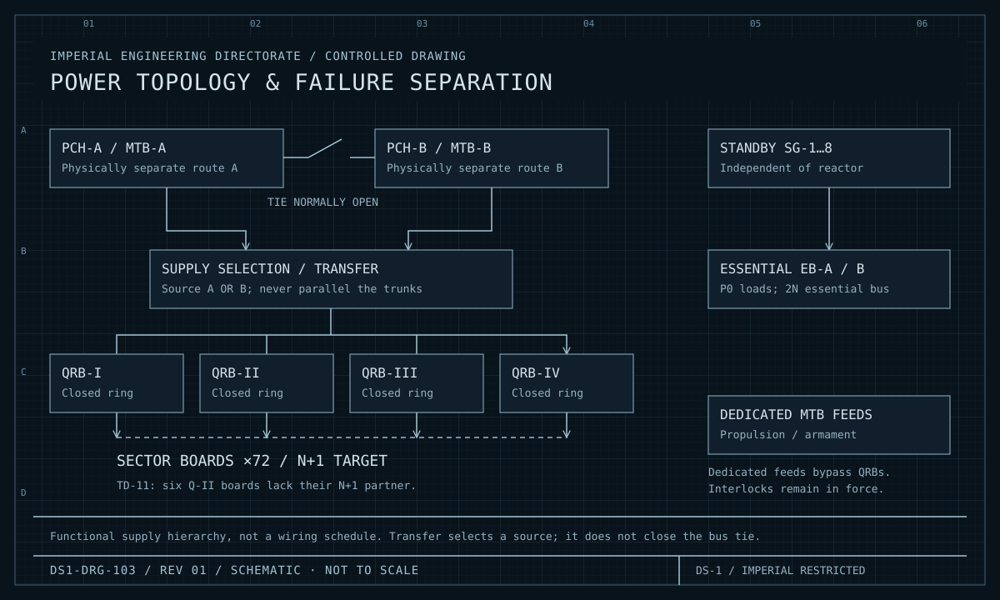
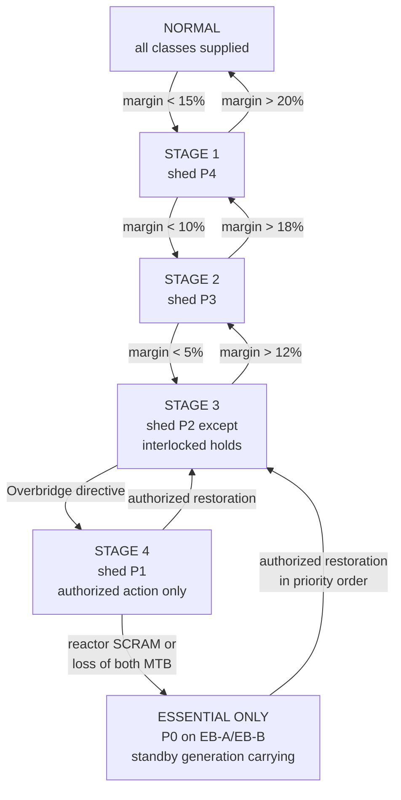

| Document ID | Classification | System | Document Owner | Status |
|---|---|---|---|---|
| `DS1-ENG-021` | IMPERIAL RESTRICTED | DS-1 Orbital Battle Station | Power Systems Authority | Operational / Controlled Document |

ACCESS: AUTHORIZED ENGINEERING PERSONNEL ONLY &middot; Unauthorized access will be logged and escalated to Sector Security Command.

# Power Distribution

## 1. Purpose and Scope

Power Distribution carries converted output from the Primary Conversion Halls to
every load on the platform, maintains supply to loads that may not lose it, and
sheds loads that may in a governed order.

**In scope:** main trunk buses, quadrant ring buses, sector distribution boards,
the essential and non-essential buses, the standby generation set, dedicated
feeders, and the load-shed governance.

**Out of scope:** generation ([Power Generation](power-generation.md)); loads
themselves.

## 2. Decomposition

<figure class="blueprint" markdown>

<figcaption>DS1-DRG-103 · Power topology & failure separation · Rev 01 · Schematic, not to scale</figcaption>
</figure>

Trace the two trunk routes independently. The open tie preserves failure separation; standby generation supports the essential bus.

<figure class="blueprint" markdown>

<figcaption>DS1-DRG-004 &middot; Power Distribution Single-Line Diagram &middot; Rev 4.2</figcaption>
</figure>

| Element | Designation | Count | Redundancy | Zone |
|---|---|---|---|---|
| Primary Conversion Halls | `PCH-A`, `PCH-B` | 2 | 2N | Z1 |
| Main Trunk Bus | `MTB-A`, `MTB-B` | 2 | 2N, physically segregated routes, tie **normally open** | Z1 |
| Quadrant Ring Bus | `QRB-I`…`QRB-IV` | 4 | Closed ring, directionally protected | Z1 |
| Sector Distribution Board | `SDB-<sector>` | 72 | N+1 per sector | Z1/Z2 |
| Essential Bus | `EB-A`, `EB-B` | 2 | 2N + independent standby generation | Z1 |
| Non-Essential Bus | `NEB` | 1 | N, sheddable | Z1 |
| Standby Generation | `SG-1`…`SG-8` | 8 | N+2, isolated from the reactor | Z1 |
| Dedicated feeders | Propulsion, Armament charge | 2 | N, interlocked | Z1 |

### Why the bus tie is normally open

A closed tie makes `MTB-A` and `MTB-B` one bus with one failure domain, which
defeats the 2N arrangement. The tie exists solely to allow a planned transfer
during maintenance, under a declared window, with the readiness reduction
published in advance. **Closing the tie outside a declared window is a
non-conformance and is alarmed as such.**

## 3. Interfaces

| ID | Peer | Direction | Content |
|---|---|---|---|
| `IX-GEN` | Power Generation | In | Converted output at the conversion halls |
| `IX-PWR` | All systems | Out + telemetry in | Supply, plus supply-state and consumption telemetry |
| `IX-CMD` | Command and Control | In | Load-shed directives, transfer directives, tie operation |
| `IX-TLM` | Command and Control | Out | Bus state, breaker positions, load by priority class |

## 4. Operating Modes and Degradation

### Load Priority Classes

| Class | Loads | Sheddable |
|---|---|---|
| `P0` | Life support plant, pressure boundary control, Command and Control, Authorization Service | **Never** |
| `P1` | Sensors, communications, sector control nodes, medical | Only under `LSD-1` stage 4 |
| `P2` | Propulsion, armament charging, defensive systems | Under directive |
| `P3` | Habitation and hotel loads, internal transit above minimum | Automatic |
| `P4` | Fabrication, workshops, recreation, welfare | Automatic, first |

### Load Shed Directive `LSD-1`

Shedding is staged and automatic. Each stage is entered on a measured condition,
not on a judgement.

Stages 1 to 3 are automatic and reversible without human action. Stage 4 requires
an Overbridge directive — shedding sensors and communications is an operational
decision, not an electrical one. Restoration from `ESSENTIAL ONLY` is always
authorized and always in priority order; there is no bulk restore.

### Degradation Summary

| Failure | Behaviour | Quality scenario |
|---|---|---|
| One `SDB` | Sector transfers to its `N+1` partner; no load lost | — |
| One `QRB` | Sectors cross-feed from the adjacent ring; `P3`/`P4` shed in that quadrant | [QS-01](../architecture/quality-requirements.md#qs-01-loss-of-a-quadrant-ring-bus) |
| One `MTB` | Whole-platform transfer to the surviving trunk; `LSD-1` stage 2; tie remains open | [QS-01](../architecture/quality-requirements.md#qs-01-loss-of-a-quadrant-ring-bus) |
| Both `MTB` | `ESSENTIAL ONLY`; standby generation carries `P0` | — |
| Reactor `SCRAM` | `ESSENTIAL ONLY`; standby generation carries `P0` for hours to days | — |
| Standby generation | Reduced margin on `EB`; `P1` restrictions apply immediately | — |

## 5. Redundancy and Failure Domains

| Pair | Separated by |
|---|---|
| `MTB-A` / `MTB-B` | Different structural routes through opposite hemispheres |
| `EB-A` / `EB-B` | Different quadrants, different conversion halls |
| `SDB` pairs | Different `Z1` compartments within the sector |
| `SG-1…8` | Distributed across four quadrants, two per quadrant |
| Standby generation / reactor | **No shared dependency of any kind** — this is the point of the arrangement |

## 6. Observability

| Signal | Class | Interval |
|---|---|---|
| Breaker position, every governed breaker | State | 200 ms |
| Bus tie position | State | 200 ms; **any closure outside a declared window alarms immediately** |
| Load by priority class, per quadrant | Measurement | 1 s |
| Supply margin | Measurement | 1 s; drives `LSD-1` staging |
| Shed and restore actions | Event | Push, with stage and cause |
| Standby generation availability | State | 10 s |

## 7. Maintenance

- Ring bus maintenance is one quadrant at a time, with cross-feed proved before
  isolation and a declared readiness reduction.
- Trunk bus maintenance requires the tie to be closed for the duration, which is
  the only sanctioned reason to close it. The window is short, declared, and
  prohibited during any alert state.
- Standby generation is exercised monthly under load. An unexercised standby set
  is treated as unavailable.
- Essential bus work is single-side only. Both-side work is prohibited without
  Imperial Engineering Command approval, and has never been granted.

## 8. Known Deficiencies

| Ref | Deficiency | Impact | Status |
|---|---|---|---|
| `TD-11` | Six sector distribution boards in quadrant `Q-II` were commissioned without their `N+1` partner and remain single. | Those sectors have no distribution redundancy; a board fault takes the sector to `SAFE`. | Partners procured; installation blocked on window availability |
| `TD-12` | Consumption telemetry from `P4` loads is sampled at 60 s, too coarse for the sustainment forecast. | Contributes to the forecast accuracy shortfall in [QS-04](../architecture/quality-requirements.md#qs-04-sustained-operation-without-resupply) | Instrumentation upgrade approved |
